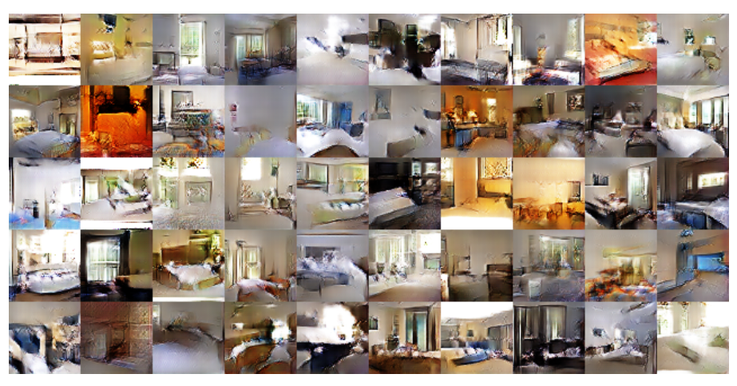
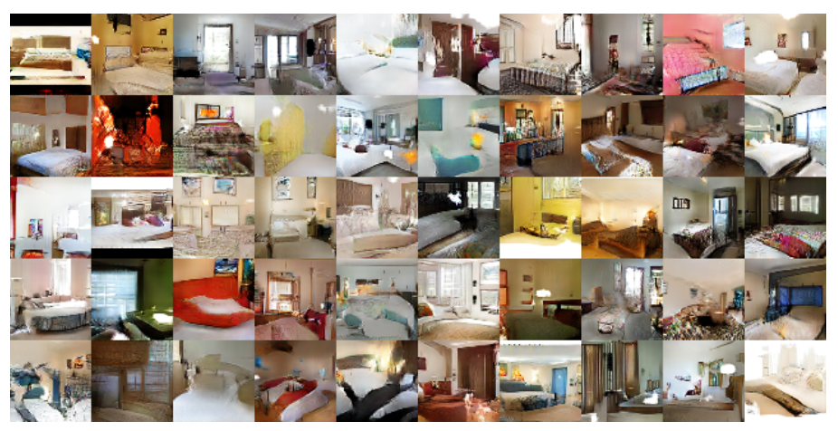
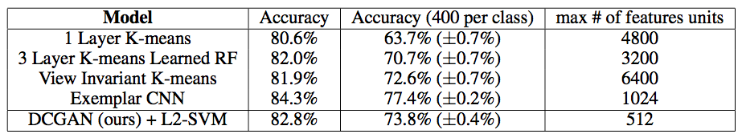
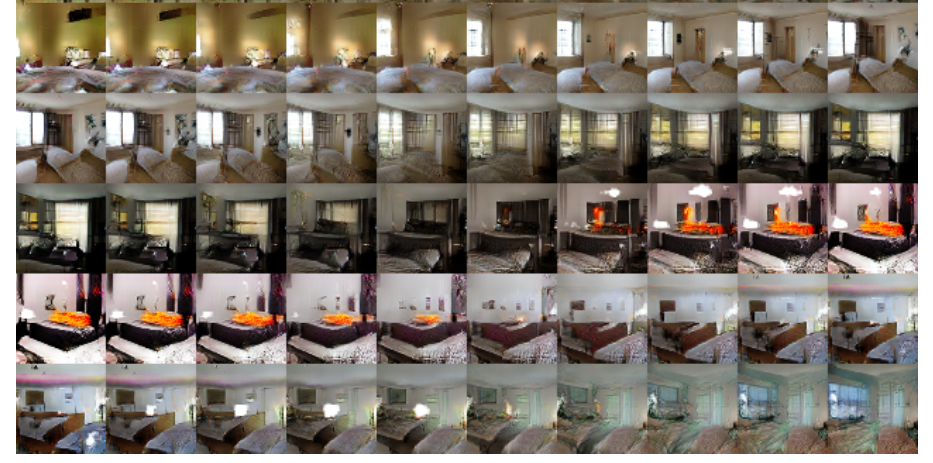
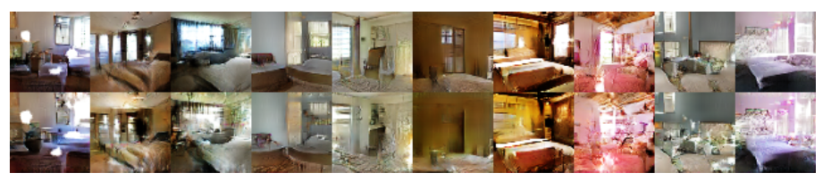
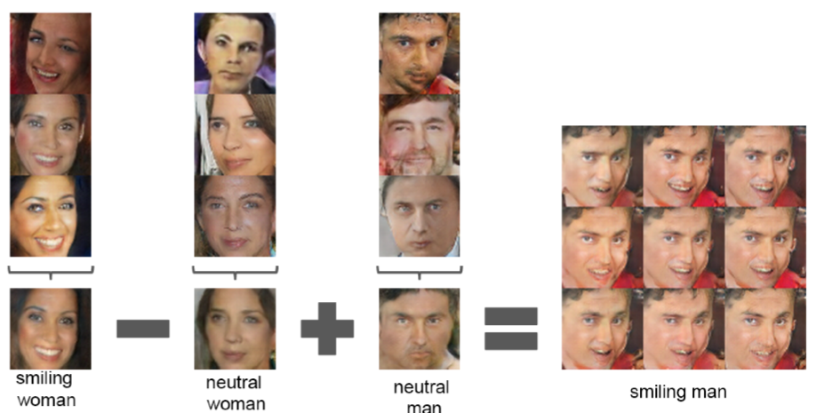
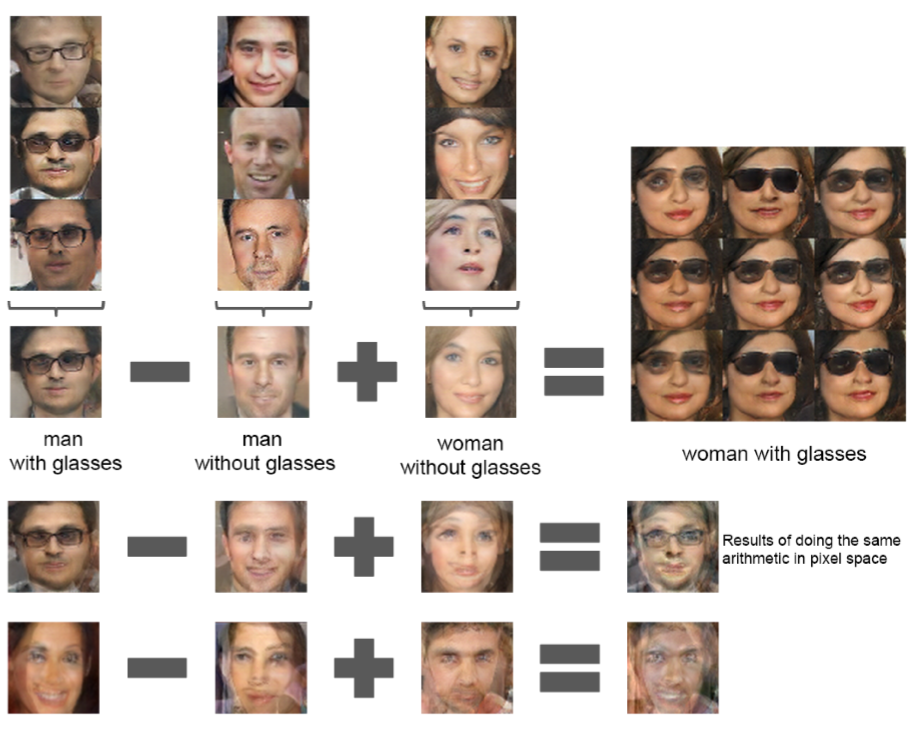

# 深度卷积对抗生成网络（DCGAN）

本文是参考文献[1]的论文笔记。

卷积神经网络在有监督学习中的各项任务上都有很好的表现，但在无监督学习领域，却比较少。本文介绍的算法将有监督学习中的CNN和无监督学习中的GAN结合到了一起。

> 在非CNN条件下，LAPGAN在图像分辨率提升领域也取得了好的效果。

与其将本文看成是CNN的扩展，不如将其看成GAN的扩展到CNN领域。而GAN的基本算法，可以参考[*对抗神经网络*](http://blog.csdn.net/stdcoutzyx/article/details/53151038)。

GAN无需特定的cost function的优势和学习过程可以学习到很好的特征表示，但是GAN训练起来非常不稳定，经常会使得生成器产生没有意义的输出。而论文的贡献就在于：

- 为CNN的网络拓扑结构设置了一系列的限制来使得它可以稳定的训练。
- 使用得到的特征表示来进行图像分类，得到比较好的效果来验证生成的图像特征表示的表达能力
- 对GAN学习到的filter进行了定性的分析。
- 展示了生成的特征表示的向量计算特性。

# 模型结构

模型结构上需要做如下几点变化：

- 将pooling层convolutions替代，其中，在discriminator上用strided convolutions替代，在generator上用fractional-strided convolutions替代。
- 在generator和discriminator上都使用batchnorm。
	- 解决初始化差的问题
	- 帮助梯度传播到每一层
	- 防止generator把所有的样本都收敛到同一个点。
	- 直接将BN应用到所有层会导致样本震荡和模型不稳定，通过在generator输出层和discriminator输入层不采用BN可以防止这种现象。
- 移除全连接层
	- global pooling增加了模型的稳定性，但伤害了收敛速度。
- 在generator的除了输出层外的所有层使用ReLU，输出层采用tanh。
- 在discriminator的所有层上使用LeakyReLU。

DCGAN的generator网络结构：

其中，这里的conv层是four fractionally-strided convolution，在其他的paper中也可能被称为是deconvolution.

# 训练细节

- 预处理环节，将图像scale到tanh的[-1, 1]。
- mini-batch训练，batch size是128.
- 所有的参数初始化由(0, 0.02)的正态分布中随即得到
- LeakyReLU的斜率是0.2.
- 虽然之前的GAN使用momentum来加速训练，DCGAN使用调好超参的Adam optimizer。
- learning rate=0.0002
- 将momentum参数beta从0.9降为0.5来防止震荡和不稳定。

# LSUN效果图

经过一次循环的训练(online learning)和收敛后得模型得到的效果分别如下：

这表明了DCGAN不是通过记忆训练数据来生成/过拟合高质量的图片。

# DCGAN capabilities验证

为了验证DCGAN的特征表示的有效性，将特征表示输入到L2-SVM中，并将分类结果与其他的无监督学习算法进行对比。

为了做到这一点，使用在ImageNet-1K上训练得到的generator，使用所有层的所有CNN特征作为输入，将每一层的CNN特征使用max-pooling的方式降到4×4，然后展开，形成一个28672维的向量，输入到L2-SVM中。

Mnist数据集上的效果对比：

SVNH数据集上的对比：

# 漫游隐空间

通过慢慢的调整初始向量来探索隐空间是如何影响最终图片的生成的。这样，既可以探索图片特征是如何折叠到隐空间的，又可以判断这些图片是由于真正学习到了语义特征还是只是记住了图片（如果有sharp的变化）。

由上图，可以看到一些逐渐的变化，比如第六行中，逐渐有了一个窗户。第四行中，电视逐渐消失。

# Discriminator Filter

通过分析filter，我们可以看到，在对房屋特征的学习中，GAN确实学习到了床、窗口等特征。

左侧是随机filter，右侧是学习到的filter，可见，右侧的filter还是有意义的。

# Semantic Mask

在隐空间上，假设知道哪几个变量控制着某个物体，那么僵这几个变量挡住是不是就可以将生成图片中的某个物体消失？

论文中的实验是这样的：首先，生成150张图片，包括有窗户的和没有窗户的，然后使用一个逻辑斯底回归函数来进行分类，对于权重不为0的特征，认为它和窗户有关。将其挡住，得到新的生成图片。

# Vector Arithmetic

类似于word2vec，图像是不是也有类似的特点，可以在隐空间里进行加减法来得到新的图像？

实验表明，使用单张图片的表示并不稳定，使用三张图片会比较稳定。

可以看到，单张图片并不稳定，而三张图片则可以学到表情和墨镜等特征。

更甚者，可以学到一个稳定的向量，来进行某种变换，比如，方位变换。

# 总结

这篇paper的主要贡献看似简单，但其实工作量很大，充分展现出作者在调参大法上的卓越功力。

但我觉得，更大的贡献在于作者对于效果的研究方式，生成模型很难来区分好与坏，而本paper通过探索隐空间，分析网络，比较特征表现能力等一系列手段，证明了DCGAN算法确实是一个强大的算法。

# Reference

[1]. Unsupervised Representations Learning With Deep Convolutional Generative Adversarial Networks