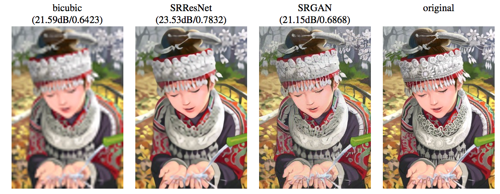
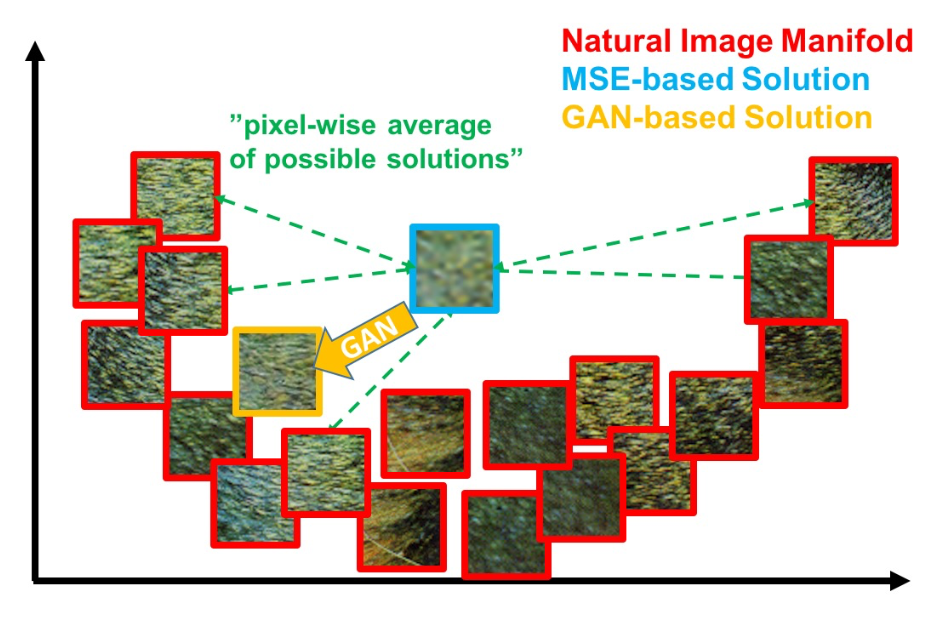
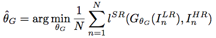
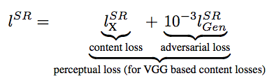
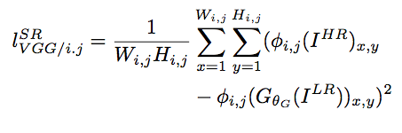
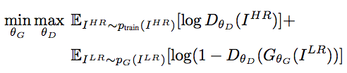
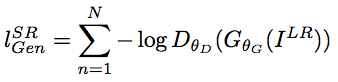
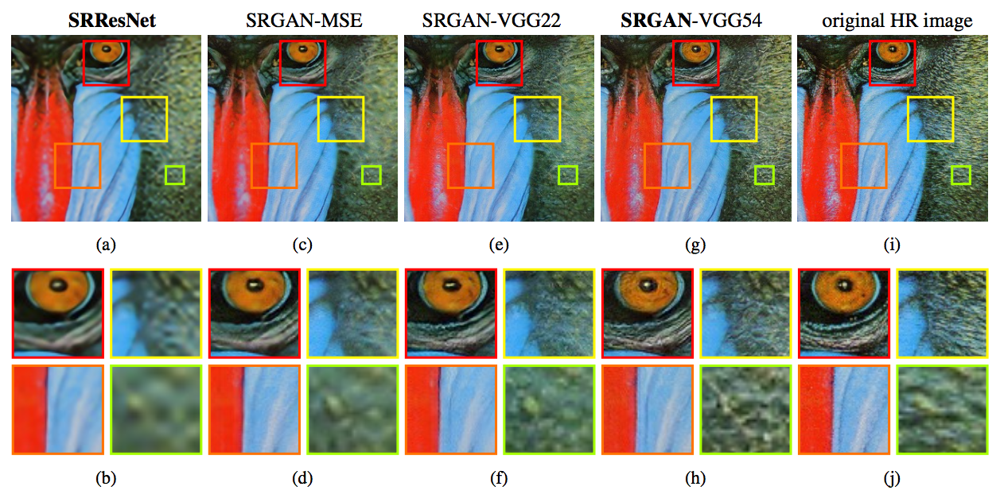

# GAN图片超清

GAN出现以来，逐渐向各种视觉任务渗透，本文介绍GAN在图像高清化上的应用。

一直以为，CNN出现以后，经历过如下几种进化，

- 向更深更广进化
- 结构变化，出现了Inception和ResNet变种
- Image style transfer，贡献了perceptual loss
- Pixel CNN，递归神经网络向CNN的渗透
- GAN，对抗神经网络。提供了一种framework可以让生成模型借到监督学习的东风。

而本文，则介绍了一种集大成算法，除了Pixel CNN外，其他的招数都使用上了的算法。且是在大倍率（4x)上得到了比较好的效果。

# Pixel MSE的覆灭

作为一个生成模型，图像高清化本质上没有一个绝对的标准。而最直观的方法，就是Pixel-wise的MSE，即ground truth和生成的图像按照像素计算平方误差。

这样就有一个很尴尬的场面，即得分最高的是三次插值函数，但效果却是最差的。

究其原因，Pixel MSE更倾向于寻找一个平滑的图片，如下图所示，Pixel的MSE在流行空间里找到的是均值，而GAN则可以找到更符合流行分布的图片。

# GAN和Content 损失函数

取代Pixel-MSE的损失函数如下：

其中content loss是指在VGG训练好的模型上提取出的特征上做平方差计算

而adversarial loss则是由于GAN框架的引入。

# GAN引入

所谓的GAN其实理论很简单，即一个生成网络和一个分类网络相互对抗，在图片高清问题中则是，生成网络生成超清图片，越像真是图片越好，而分类网络负责把生成的图片和真实图片进行分类，分类准确率越高越好。

GAN的目标函数如上，训练D时，要最大化目标函数，即最大化分类准确率。训练G时，要最小化目标函数，即尽量生成更好的图像，让分类准确率降低。

生成网络G和分类网络D结构如下：

- 在生成网络中，引入了residual blocks和skip-connection。
	- B个residual block
		- 卷积层，64个3x3的卷积核
		- BN
		- ReLU
		- 卷积层，64个3x3的卷积核
		- BN
		- Eelement-wise相加
- 分类网络
	- LeakyReLU
	- avoid max-pooling
	- 8层卷积，卷积核从64以2倍的速度增长到512
	- 最后的512卷积后有2个全连接层

为了更好的进行梯度下降，在GAN的loss中，使用

# 效果对比

- SRResNet: 纯生成网络
- SRGAN-MSE：GAN loss和pixel-wise MSE
- SRGAN-VGG: 使用VGG的某两层去做content loss。

# 参考文献

[1].Ledig C, Theis L, Huszár F, et al. Photo-realistic single image super-resolution using a generative adversarial network[J]. arXiv preprint arXiv:1609.04802, 2016.