# 基于MRF和CNN的图像生成

本文是参考文献[1]的论文笔记。

# 引入

MRF算法，全程马尔科夫随机场，所谓的马尔科夫特性，就是当前变量的值只和距离最近的变量有关系。这方面最简单的应用是语言模型方面。MRF应用的图像生成上时，会使用最近邻算法寻找最相似的patch来进行生成。

而图像生成领域，在[2]的领导下，诞生了一系列基于CNN特征的生成算法。但基于CNN的算法也存在问题，即只有pixel级别的相关性被考虑了进来，而空间布局的限制则没有被考虑进来。

论文将MRF和CNN结合起来，把[2]的Gram矩阵用MRF Loss进行了替代。即能利用CNN抽象特征的提取能力，又能利用MRF的空间布局限制，提高了生成图像的质量。

# 方法

## 变量

- xs: 风格图片
- xc: 内容图片
- x: 待生成的图片
- Φ(x): x的feature map
- Ψ(Φ(x)): 所有从 Φ(x)抽取出的patch

## MRF损失函数

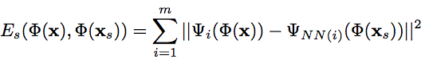

由公式可知，待生成图像中的MRF Loss是由各个patch的损失值加起来的。而每个patch的损失值则是该patch A与在风格图像中的最接近A的patch的欧式距离，该损失是基于feature_map的。

而最接近则是用NN(i)来计算的。

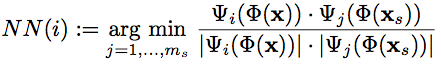

这个计算过程看似和CNN格格不入，会使得CNN不能用反向传播的形式求导图像。但可以用一种巧妙的方法将其转换为CNN支持的方式，后续会介绍。

## 内容损失函数

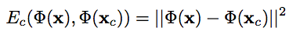

和[2]中的方法类似，计算待生成图像和内容图像在网络某层的feature_map上的欧氏距离。

## Regularizer

为了保证平滑，添加平方梯度的regularizer项。

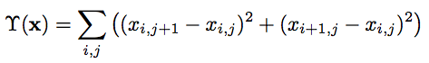

## Loss

总的损失函数即上述几个的加权和：

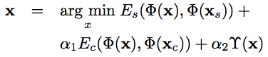

# 实现细节

## basic设置

- 19层的VGG Net
- x随机初始化
- MRF Loss使用relu3\_1和relu4_1
- 内容损失使用relu4_2

## MRF实现

为了将MRF的损失函数变得可以利用卷积的反向传播，论文做法如下：

1. 从relu3\_1和relu4_1中抽取3×3的patch，stride=1来密集的抽取patch。
2. patch matching(即NN(i))使用多余的卷积层来做，上一步抽取的每一个patch都可以作为卷积层filter，这样形成了一层卷积
3. 对于待生成图像的每一个query patch，和上一层卷积进行计算，最匹配的获得最大的激活值。

## multi-resolution

在实现过程中，实现了金字塔式的清晰度计算方法。如下：

1. 构建了一个图像金字塔，不停的以倍数2缩放，直到最长边的长度小于64为止。
2. 从低分辨率开始，为之训练得到生成图像。
3. 然后将上一步的生成图像放大2倍，作为下一个分辨率的生成图像的初始值。

## multi-copy

为了避免内容图和风格图的视野和尺度的影响，对style Image做了多种变化。

- 多尺寸
- 多旋转

一起加入到Loss计算中。

# 分析

下面三个分析来证明CNN特征的有效性和MRF的有效性。

## Neural Matching

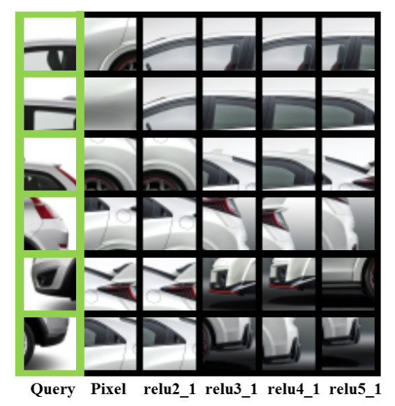

高层特征找相似patch比pixel要好。

## Neural Blending

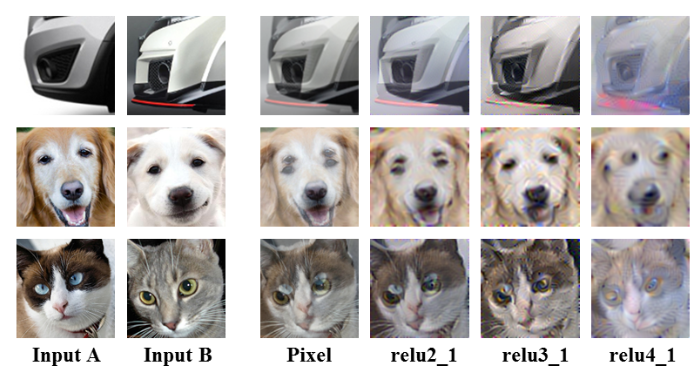

高层特征的混合比pixel要好，但太高层或太底层也不稳定。

## MRF大法

比较MRF损失添加前和添加后的合成结果，

上面一行是添加了MRF的，下面则是没有添加的。由于上面那行和风格图像中的patch几乎没区别，就没有画。

# 效果图

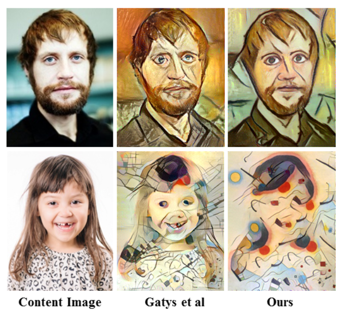
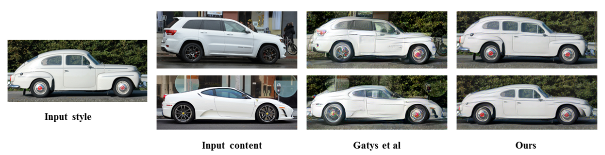
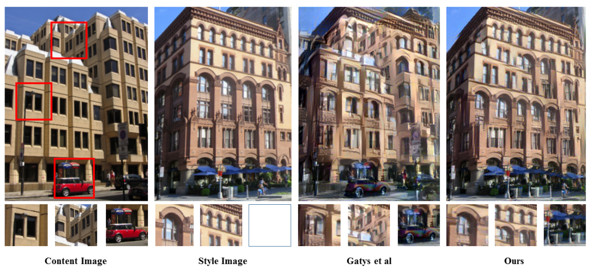

## Limit

当然，MRF的方法也有限制，那就是只在内容图像中的patch和风格图像中的patch可以吻合的比较好的时候才会有效。否则，那就会倾向于把整幅图都变化了。如

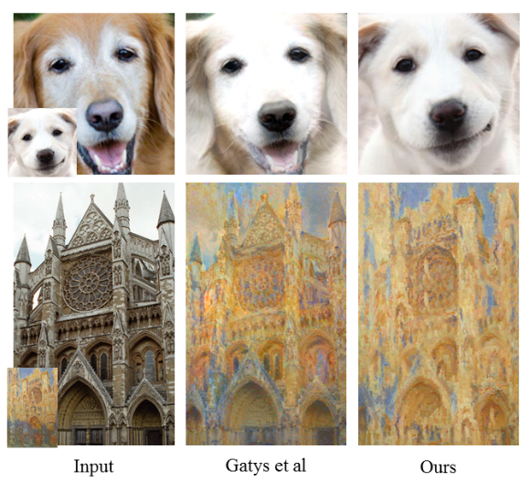

# 总结

- Gram矩阵非常tricky，本文的方法则证明了Gram矩阵并非唯一的方法。
- patch的思维可以应用到某些特定问题上。
- 图像分辨率金字塔和MRF的CNN化等技术很好用。

# 参考文献

1. Combining Markov Random Fields and Convolutional Neural Networks for Image Synthesis.
2. [图像风格转换](http://blog.csdn.net/stdcoutzyx/article/details/53771471)