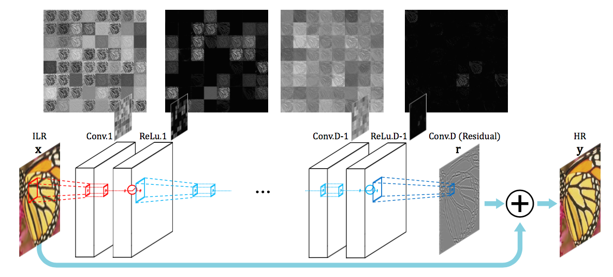
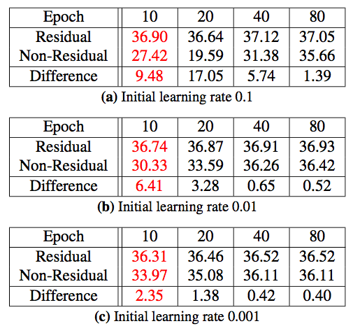
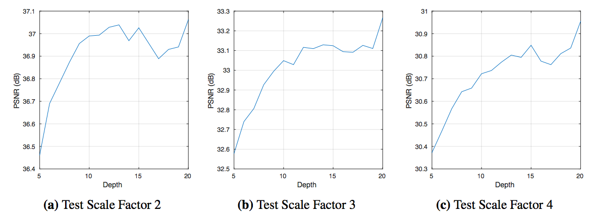
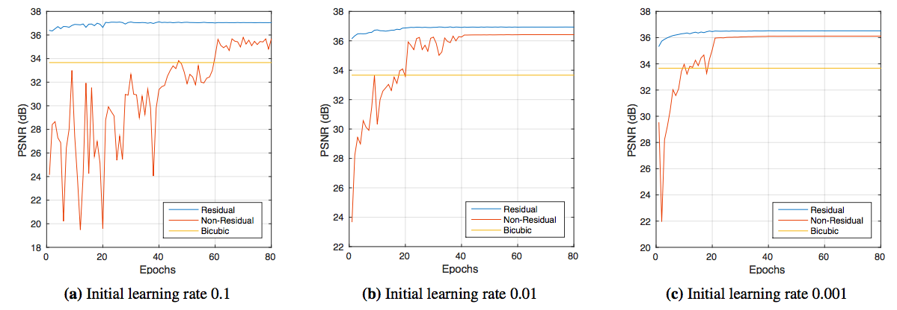
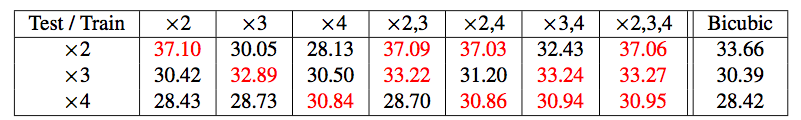

# 深度卷积下的精确图像高清化

SRCNN已然将深度学习应用到了图像高清化，但是它有三大缺点，

- 因为层数少，所以导致每个结果像素所依赖的上下文像素少，即视野域比较小。
- 训练收敛太慢
- 只支持一种scale

为了解决这三个问题，本文针对各个问题采用了对应的解决办法。

# 更深的模型

虽然SRCNN中得到了更深的模型不能适用于高清化问题的结论，但是本文还是在更深的模型上得到了比较好的效果。

- 除了第一层和最后一层外，都是64个3x3x64的。第一层作用在输入图像上，最后一层是一个3x3x64的核。
- 使用zero padding来解决图像变小的问题，使输入和输出保持同等大小。
- 使用skip-connection将输入图像加到学习到的residual结果上，得到最终高清图像。

# 训练

- Residual Learning，SRCNN必须在网络中保存图像的全部信息，这样，就需要Long-term的记忆来恢复整个图像，如此，vanishing/exploding会变得十分重要。而如果只需要进行细节估计，那么训练会变得快很多，结果也会好很多。
- 高学习率。SRCNN之所以会失败，是因为学习率太低，学了1周都没有效果。但高学习率也会导致vanishing/exploding问题。所以要和Adjusted Gradient Clipping一起使用。
- 梯度截断。动态的进行梯度截断，梯度区间为[-θ/γ, θ/γ]。

# 多尺度

为每一个尺度都建立一个独立的模型是不智的。一个比较直接的方法是在训练的时候放上各种各样的数据。

# 实验结果

不同初始化学习率下残差网和非残差网在不同迭代次数上的区别。

不同尺度增长下网络模型随深度的变化的效果变化。

残差网和非残差网随迭代次数的变化而变化的趋势。可以看到，残差网可以快速收敛并达到较好的效果。

使用不同尺度的数据集得到的模型在不同尺度数据集上的效果。

# 参考文献

[1].Kim J, Kwon Lee J, Mu Lee K. Accurate image super-resolution using very deep convolutional networks[C]//Proceedings of the IEEE Conference on Computer Vision and Pattern Recognition. 2016: 1646-1654.