# 递归像素生成高清图片

从一张低分辨率的图像得到一张高分辨率的图像，需要基于低分辨率图像推断出高清细节，这是典型的无中生有般的应用。而大规模数据和深度学习的存在，使得从大量图像中学习到这种推断能力成为可能。本文介绍了2017年2月份新出的一片文章所做的工作。

# 问题

从一张低分辨率的图像生成高分辨率的图像，现在的CNN已然可以生成足够高清的细节，但是，存在的问题在于，一张低分辨率图像可能对应多个高分辨率图像。

假如我们把低分辨率图像中需要高清化的部分分成A,B,C,D等几个部分，那么A可能对应A1,A2,A3,A4，B对应B1,B2,B3,B4，以此类推。假设A1,B1,C1,D1对应一张完美的高清图片。那么现有的算法可能生成的是A1,B2,C3,D4这样的混搭，从而导致生成的高清图像有了模糊。

# 数学定义

- x: 低分辨率图片
- y: 生成的高分辨率图片
- y*: 真实的高分辨率图片
- θ: 要学习的参数
- pθ(y|x): 给定参数和低分辨率图片x，生成高分辨率图片y的概率

数据集D:

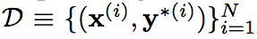

为了求得θ，使用最大似然概率的方法使得当前数据集D出现的概率最大。
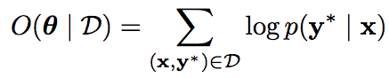

# Independent Failure

为了验证上述问题的存在，论文设想了一种极端情况。

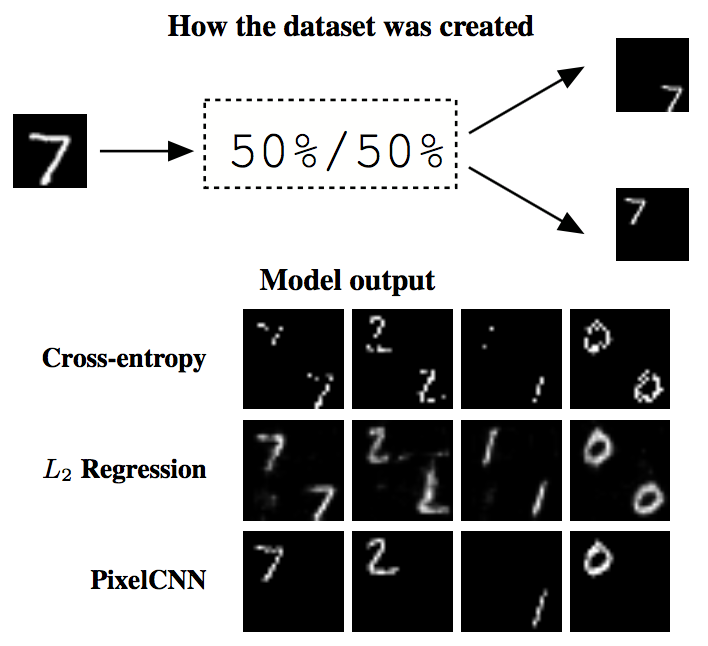

如上图所示，为了简便起见，基于MNist数据集生成一个新的数据集，生成方法如下，将MNIST数据集中的图片A长宽各扩大两倍，每张图片可以生成两张图片A1和A2，A1中A处于右下角，A2中A处于左上角。

把原图当做低分辨率图片，生成的图当成高分辨率图片。使用现在的方法进行训练，得到的模型，在生成图像的时候，会产生上图下半部分的情况。即每个像素点可能等概率的投射到左上部分和右下部分，从而导致生成的图片是错误的。而引入Pixel CNN后，像素之间产生了依赖关系，这种情况则不会发生。

# Pixel CNN引入

为了解决上述问题，需要在生成图像的时候引入先验知识。画家在拥有了人脸的知识之后，就可以画出令人信服的高清细节。

而在图像超清中，将要引入的则是让像素之间有相互依赖的关系，这样，就可以保证不同的部分，其高清版的选择是一致的。

模型架构如上图。其中conditioning network是一个将低分辨率图像生成高分辨图像的网络，它可以像素独立的生成高清图像。

而prior network则是一个Pixel CNN组件，它用来增加高清图像的细节，使之看起来更加自然。

所谓的Pixel CNN组件，则是让像素的生成除了考虑低分辨率图像上的数据之外，还考虑之前生成的像素。

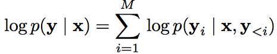

将两种模型分别定义：

- Conditioning Network

	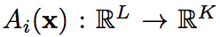

- Prior Network

	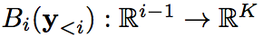
	
将两种模型的的输出概率使用softmax混合起来，就得到了最后的目标函数。

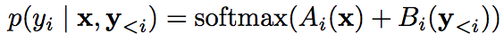

取log后，得到

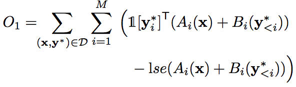

其中，lse(.)是softmax函数分母部分取log得到。

在实验过程中，发现上述目标函数会倾向于忽略conditioning network，因为Pixel之间的关系太强了。为了改正这个问题，在目标函数中添加一下来强制训练conditioning network。

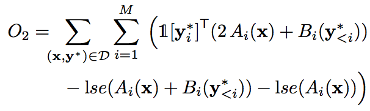

网络都训练好以后，就可以生成高清图像了，生成过程为从左上角开始，得到每个像素的概率分布，按照概率分布进行采样，得到当前像素值后，再去生成下一个像素。

还有一种可以称为greedy decoding，即每次选择一个拥有最大概率的像素值，

为了对生成过程进行控制，还采用了tempered softmax。所谓的tempered softmax，是对softmax中的logit进行指数乘法，然后再归一化。

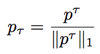

# 效果

将本文的方法和其他方法进行对比：

- Regression: independent L2 regression
- NN: Nearest Neighbors Search.

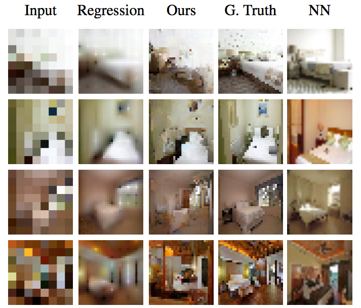
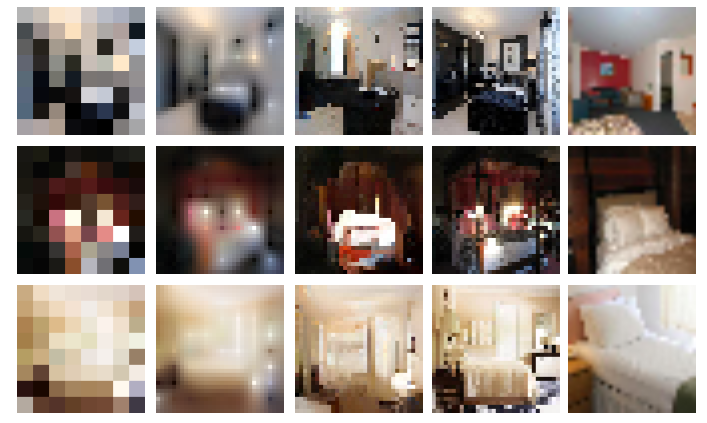

# 参考文献

[1].Dahl R, Norouzi M, Shlens J. Pixel Recursive Super Resolution[J]. arXiv preprint arXiv:1702.00783, 2017.

