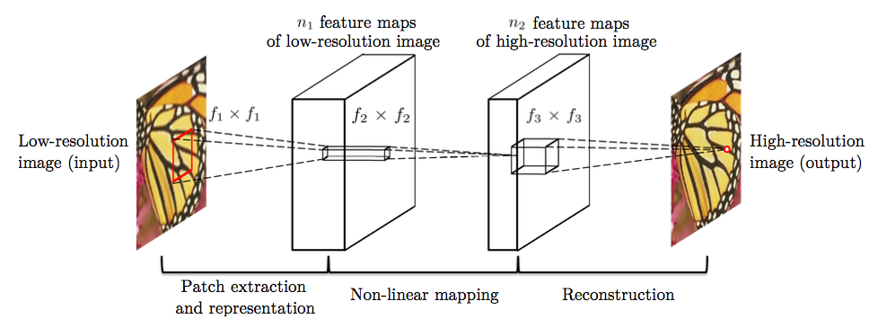
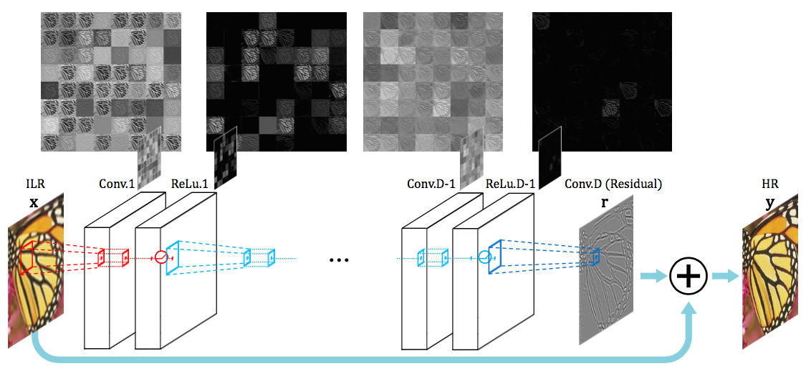
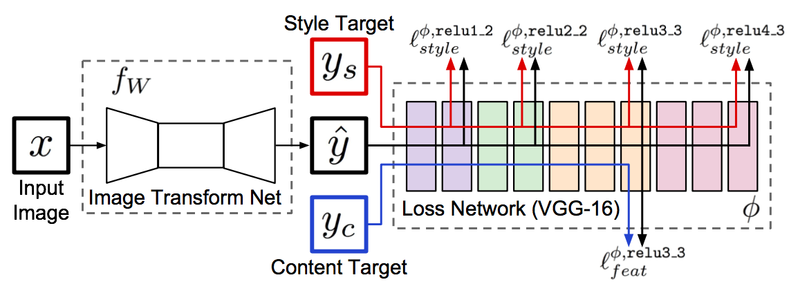
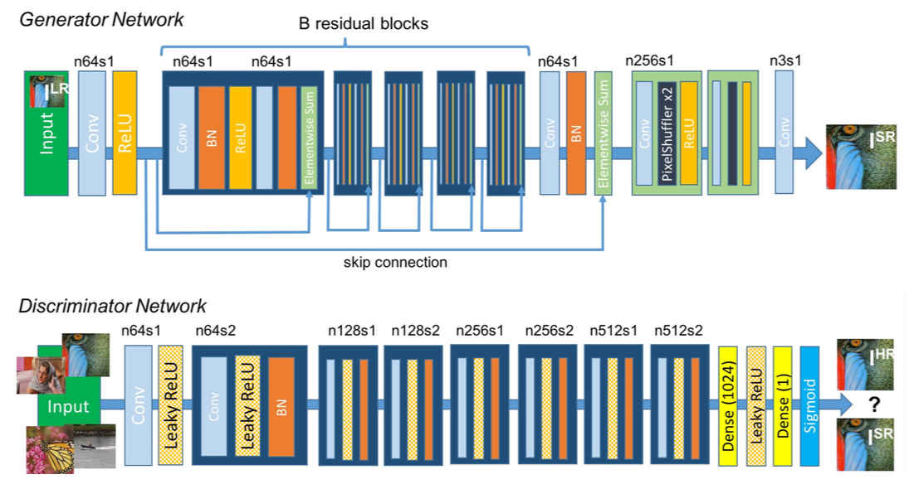
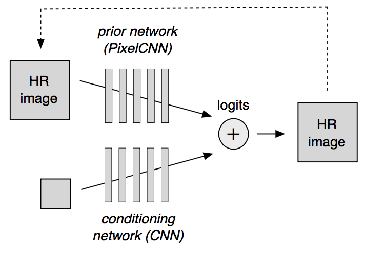

# 看的“深”，看的“清”

得益于硬件的迅猛发展，短短数年间，手机已更新了数代，老手机拍下的照片在大分辨率的屏幕上变得模糊起来。同样的，分辨率的提升使得网络带宽的压力骤增。如此，图像超清化算法就有了用武之地。

存放多年的老照片，使用超清算法变得细节栩栩如生。网络传输，将图像压缩然后再用超清化算法复原便可大大减少传输量。

而传统的几何手段如三次插值，传统的匹配手段如碎片匹配，在应对这样的需求上皆有心无力。

深度学习的出现使的算法对图像的语义级别的操作成为可能。本文即是介绍深度学习技术在图像超清问题上的最新的研究进展。

深度学习最早的兴起是源于图像，其主要处理图像的技术是卷积神经网络，关于卷积神经网络的起源业界公认是Alex在2012年的ImageNet比赛中的煌煌表现。虽方五年之久，却已是老生常谈。因而卷积神经网络的基础细节本文不再赘述。在下文中，使用CNN（Convolutional Neural Network）来指代卷积神经网络。

CNN出现以来，产生了很多研究热点，但最令人印象深刻的五个热点是：

- 深广探索，VGG网络的出现标志着CNN在深度和广度上有了初步的突破。
- 结构探索，Inception及其变种的出现进一步增加了模型的深度。而ResNet的出现则使得深度学习的深度变得“名副其实”起来，可以达到上百层甚至上千层。
- 内容损失，图像风格转换是CNN在应用层面的一个小高峰，涌现了一批以Prisma为首的小型创业公司。但图像风格转换在技术上的真正贡献却是通过一个预训练好的模型上的特征图，可以在语义层面生成图像。
- Pixel CNN，将依赖关系引入到像素之间，是CNN模型结构方法的一次比较大的创新，用于生成图像，效果最佳，但失之于效率。
- 对抗神经网络（GAN），虽然这是针对机器学习领域的架构创新，但其最先应用却是在CNN上，通过对抗训练，使得生成模型能够借用监督学习的东风进行提升，将生成模型的质量提升了一个级别。

这五个热点，在图像超清这个问题上都有所体现。下面会一一为大家道来。

## CNN的第一次出手


图像高清问题的特点在于，低分辨率图像和高分辨率图像中很大部分的信息是共享的，基于这个观点，CNN以前的解决方案是使用一些特定方法如PCA、Sparse Coding将低分辨率和高分辨率图像都变为特征表示，然后将特征表示做映射。

基于传统的方法结构，CNN也将模型划分为三个部分，即特征抽取，非线性映射和特征重建。但由于CNN的特性，三个部分的操作都可以使用卷积完成。因而，虽然针对模型结构的解释与传统方法类似，但CNN却是可以同时联合训练的统一体。

不仅在模型解释上可以看到传统方法的影子，在具体的操作上也可以看到。在这上述模型中，需要对数据进行预处理，抽取出很多patch，这些patch可能互有重叠，但Patch取合集便是整张图像。而上述的CNN结构是应用到这些Patch而不是整张图像上，得到所有图像的patch后，将这些patch组合起来得到最后的高清图像，重叠部分则取均值。

## Accurate CNN


上述方法虽然效果远高于传统方法，但是却有若干问题：

- 训练层数少，没有足够的视野域
- 训练太慢，导致没有在深层网络上得到好的效果
- 不能支持多种倍数的高清化。

针对上述问题，本算法提出了采用更深的网络模型，但为了克服之前的算法的问题，采用了三种技术进行解决。

 
第一种技术是Residual学习，CNN是端到端的学习，如果像上一个方法那样直接学习，那么CNN需要保存图像的所有信息，需要在恢复高清细节的同时记住所有的低分辨率图像的信息，如此，就对梯度十分敏感，容易造成梯度消失或梯度爆炸等现象。而图像超清问题中，CNN的输入图像和输出图像中的信息很大一部分是共享的。Residual学习正是只学习高清细节信息的算法。如上图所示，CNN的输出加上原始低分辨率图像得到高分辨率图像，即CNN学习到的是高分辨率图像和低分辨率图像的差。如此，CNN承载的信息量小，更容易收敛的同事还可以达到比no-residual网络更好的效果。

高分辨率图像之所以能够和低分辨率图像做加减法，是因为，在数据预处理时，将低分辨率图像使用插值法缩放到与高分辨率图像同等大小。于是虽然图像被称之为低分辨率，但其实图像大小高低分辨率图像是一致的。

第二种技术是高学习率，在CNN中设置高学习率通常会导致梯度爆炸，因而在使用高学习率的同时还使用了自适应梯度截断。截断区间为[-θ/γ, θ/γ]，其中γ为当前学习率，θ是常数。

第三种技术是数据混合，最理想化的算法是为每一种倍数分别训练一个模型，但这样极为消耗资源。因而，同之前的算法不同，本技术将不同倍数的数据集混合在一起训练得到一个模型，从而支持多种倍数的高清化。

## Perceptual Loss

在之前，使用CNN来解决高清问题是将CNN生成模型产生的图像和实际图像以像素为单位计算损失函数（一般为欧式距离），以此为损失函数得到的模型捕捉到的只是像素级别的规律，其泛化能力相对而言比较弱。

而Perceptual Loss，则是指将CNN生成模型和实际图像都输入到某个训练好的网络中，得到这两张图像在该训练好的网络上某几层的激活值。在激活值上计算损失函数。
由于CNN能够提取高级特征，那么基于Perceptual Loss的模型能够学习到更鲁棒更令人信服的结果。


 
上图即为Perceptual Loss网络，该网络本是用于快速图像风格转换。在这个结构中，需要训练左侧的Transform网络来生成图像，将生成的图像Y和内容图像与风格图像共同输入进右侧已经训练好的VGG网络中得到损失值。而如果去掉风格图像，将内容图像变为高清图像，将输入改为低分辨率图像，那么这个网络就可以用于解决图像超清问题了。

## 对抗神经网络（GAN）


对抗神经网络称得上是近期机器学习领域最大的变革成果。其主要思想是训练两个模型G和D，G是生成网络而D是分类网络，G和D都用D的分类准确率来进行训练。G用于某种生成任务，比如图像高清化或图像修复等，G生成图像后，将生成图像和真实图像放到D中去进行分类。训练过程是保持G不变，训练D使分类准确率提升；保持D不变训练G使分类准确率下降，直到平衡。GAN框架可以使得无监督的生成任务可以利用到监督学习的优势来进行提升。

基于GAN框架，只要定义好生成网络和分类网络，就可以完成某种生成任务。

 
而将GAN应用到图像高清问题的这篇论文，可以说是集大成之作。生成模型层次深且使用了residual block和skip-connection；在GAN的损失函数的基础上同时添加了perceptual 损失。

GAN的生成网络和分类网络如上图，其中，生成网络自己也可以是一个单独的图像超清算法。论文中分析了GAN和non-GAN的不同，发现GAN主要在细节方面起作用，但无法更加深入的解释。无法解释性也是GAN目前的缺点之一。

## Pixel CNN

上面的GAN虽然能够达到比较好的效果，但是由于可解释性差，难免有套用之嫌。

其实，对于图像高清这个问题来说，有一个关键性的问题，那就是一张低分辨率图像可能对应着多张高清图像。那么问题来了。

假如我们把低分辨率图像中需要高清化的部分分成A,B,C,D等几个部分，那么A可能对应A1,A2,A3,A4，B对应B1,B2,B3,B4，以此类推。假设A1,B1,C1,D1对应一张完美的高清图片。那么现有的算法可能生成的是A1,B2,C3,D4这样的混搭，从而导致生成的高清图像有了模糊。

为了验证上述问题的存在，设想一种极端情况。


为了简便起见，基于MNist数据集生成一个新的数据集，生成方法如下，将MNIST数据集中的图片A长宽各扩大两倍，每张图片可以生成两张图片A1和A2，A1中A处于右下角，A2中A处于左上角。

把原图当做低分辨率图片，生成的图当成高分辨率图片。使用现在的方法进行训练，得到的模型，在生成图像的时候，会产生上图下半部分的情况。即每个像素点可能等概率的投射到左上部分和右下部分，从而导致生成的图片是错误的。而引入Pixel CNN后，像素之间产生了依赖关系，这种情况则不会发生。

为了解决上述问题，需要在生成图像的时候引入先验知识。画家在拥有了人脸的知识之后，就可以画出令人信服的高清细节。

而在图像超清中，将要引入的则是让像素之间有相互依赖的关系，这样，就可以保证不同的部分，其高清版的选择是一致的。


 
模型架构如上图。其中conditioning network是一个将低分辨率图像生成高分辨图像的网络，它可以像素独立的生成高清图像，如同GAN中的G网络，Perceptual Loss中的Transform Net。

而prior network则是一个Pixel CNN组件，它用来增加高清图像像素间的依赖，使像素选择一致的高清细节，从而看起来更加自然。

那么Pixel CNN是如何增加依赖的呢？在生成网络的时候，Pixel CNN以像素为单位进行生成，从左上角到右下角，生成当前像素的时候，会考虑之前生成的像素。

而将prior network和conditioning network的混合，则是在Pixel CNN生成图像的时候，除了考虑前面生成的像素，还需要考虑conditioning网络的结果。

## 参考文献

1.	Dong C, Loy C C, He K, et al. Image super-resolution using deep convolutional networks[J]. IEEE transactions on pattern analysis and machine intelligence, 2016, 38(2): 295-307.
2.	Kim J, Kwon Lee J, Mu Lee K. Accurate image super-resolution using very deep convolutional networks[C]//Proceedings of the IEEE Conference on Computer Vision and Pattern Recognition. 2016: 1646-1654.
3.	Johnson J, Alahi A, Fei-Fei L. Perceptual losses for real-time style transfer and super-resolution[C]//European Conference on Computer Vision. Springer International Publishing, 2016: 694-711.
4.	Ledig C, Theis L, Huszár F, et al. Photo-realistic single image super-resolution using a generative adversarial network[J]. arXiv preprint arXiv:1609.04802, 2016.
5.	Dahl R, Norouzi M, Shlens J. Pixel Recursive Super Resolution[J]. arXiv preprint arXiv:1702.00783, 2017.

