# 神经网络结构搜索之一

深度学习在2010年燃起来以后，较大的革新集中出现在网络结构上。例如，在图像领域，出现了AlexNet, VGG, GoogNet, Inception系列，Res-Net，DenseNet和MobileNet等不同的卷积神经网络；在文本处理领域，出现了RNN，GRU，LSTM等不同的循环神经网络结构。再加上在不同的网络结构中的调参（层数，每层的单元数，卷积核的大小，卷积核的stride的大小等等）。最终使得找到一个好的神经网络结构是人力所难以得到的，因而深度学习的斗士们亲切的将深度学习称之为“炼丹术”。

正如人类历史中任何大量耗费人工的产业一样，当积累到一定阶段，人类的智慧就开始考虑将其自动化。调参也是一样。于是，在网络结构这一个方向，“炼丹术士”们看到了一丝曙光。

既然“寻找最优的网络结构”这枚钉子已经备好，那么该怎么去找最优的结构呢？

首先，需要先定义搜索空间，即网络结构的全集，全集确定下来才可以从全集中找到最优的。
在确定了全集之后，理论上最优网络结构已经确定，只要使用暴力的方法把每个可能的模型都跑一边，而这显然因为太耗时而变得不可能。所以，第二我们需要一种启发式方法，可以帮助我们找出比较好的模型的特点，然后预测出最优的模型是什么。

所以，接下来，我们首先解释如何表示和生成网络结构，然后，在来看如何调整启发式方法，使得生成的模型越来越好。

# 网络结构的表示

首先，我们以卷积神经网络为例（循环神经网络后面会讲），来看看网络结构如何表示。以最简单的只有卷积层的卷积神经网络为例。

每个卷积层的参数有5个：

- 卷积核数目
- 卷积核高度
- 卷积核宽度
- 卷积核stride高度（stride的意义是卷积在图像上划过时的步长）
- 卷积核stride宽度

那么，一个N层卷积神经网络就可以用N个上述五元组来表示。

# 控制器

名词解释：在这里，控制器就是用来进行网络搜索的启发式方法，能够生成网络结构。

因为神经网络是层级结构，所以N层神经网络是以N-1层神经网络为基础的。那么我们可以将网络结构生成建模成一个序列问题，即按层去预测网络结构。而目前深度学习领域解决序列问题的方法是循环神经网络——RNN。

如下图所示，使用RNN生成一层网络结构的五个参数。

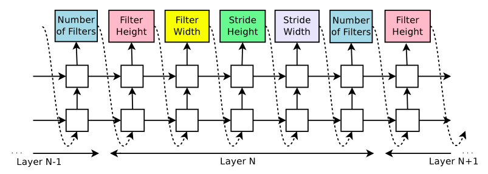

可以看到，在RNN中，每五个输出组成一层神经网络。而上一步的输出是下一步的输入，这样保证了RNN是基于前面N-1层所有的参数信息来预测第N层的参数。

而RNN的输出则是softmax输出，例如，对于卷积核高度，我们可以限定输出值为[1,3,5,7]四个数，而RNN的输出是这四个数上的概率分布。

# 求解

对于上一节描述的RNN模型，如何求解呢？

大家知道，RNN也是用反向传播来求解的，那么在这个问题上，如何进行反向传播呢？要解决这个问题，我们需要让控制器获得反馈。这个反馈是当然是指生成的网络的好坏程度了？ 那么又如何获得网络结构的好坏程度呢？ 这就需要我们把该网络结构训练一遍，用得到的准确率来作为反馈。

所以，这个问题可以建模成下图：

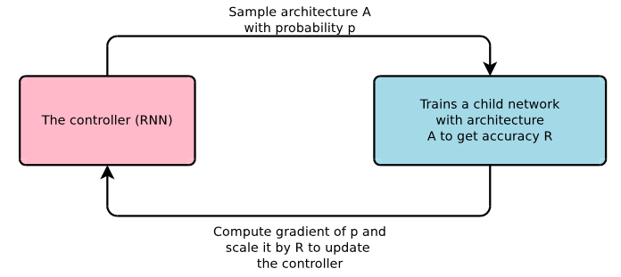

即需要与外界进行交互来获取生成网络结构的准确率。用准确率来作为网络的衡量标准。那么我们对RNN的目标函数的设定是：

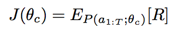

即目标函数是生成的网络结构的准确率，我们需要最大化这个准确率，即公式中的R。
但是生成网络结构的准确率对于RNN来说是无法直接求导的，因为它没有和RNN的softmax联系起来。那么，如何将它们联系起来呢？

一个非常直观朴素的想法就是我们希望网络结构的准确率越高，那么控制器生成这个网络结构的概率越大。

于是就得到

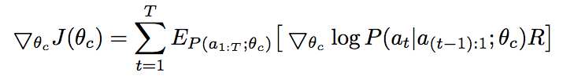

R为生成网络结构的准确率，P为生成该网络结构的概率。但是因为计算资源的限制，我们无法将所有可能的网络结构通通训练一遍（通通训练一遍也即是暴力算法）。因而，在这个公式下，我们使用采样的方法来拟合。

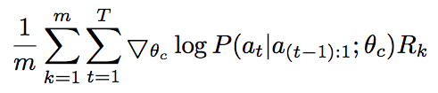

其中，m是采样出来的模型结构的数目，T是参数数目，上述公式计算了对于m个模型中的每一个模型，它的T个参数中每个参数的输出概率都与生成的模型结构的准确率挂钩。

因为准确率是都是正数，而这样对于反向传播的求导是不利的，因而对目标函数做了一点小小的修改:

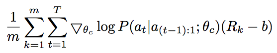

其中，b为之前训练的所有网络结构的exponential moving average，即按照时间前后用指数加权的平均值。

值得注意的是，本节中前三个公式的变化其实可以归纳到强化学习的框架中去。是强化学习中Policy Gradient的内容。具体的公式推导参考[2](https://zhuanlan.zhihu.com/p/21725498)

# 分布式求解

即使加入了控制器来启发式的搜索，仍然需要大量的计算。因而分布式训练是很必须的。分布式的框架如下：

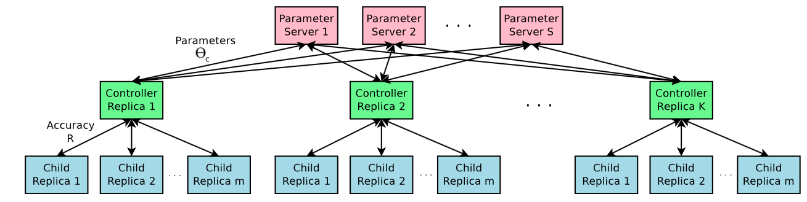

仍然是Parameter Server架构，我们复制K个控制器，它们的参数更新都回传到parameter server来同步。对于每个控制器，生成m个网络结构并且并行的进行计算。得到准确率用来对控制器进行梯度下降计算。

对于生成的网络结构，为了节约计算，在遍历数据集一定次数之后即停止训练。

# 更复杂的卷积神经网络

刚才我们只是对只有卷积层的卷积神经网络进行了网络结构的生成，而其实卷积神经网络中海油很多其他的结构，比如非常经典的Res-Net中使用的skip-connection结构，网络中的第N层除了和第N-1层连接外还可以和更低的层进行连接。

为了使刚才描述的框架能生成更复杂的卷积神经网络，可以在控制器中添加注意力机制。

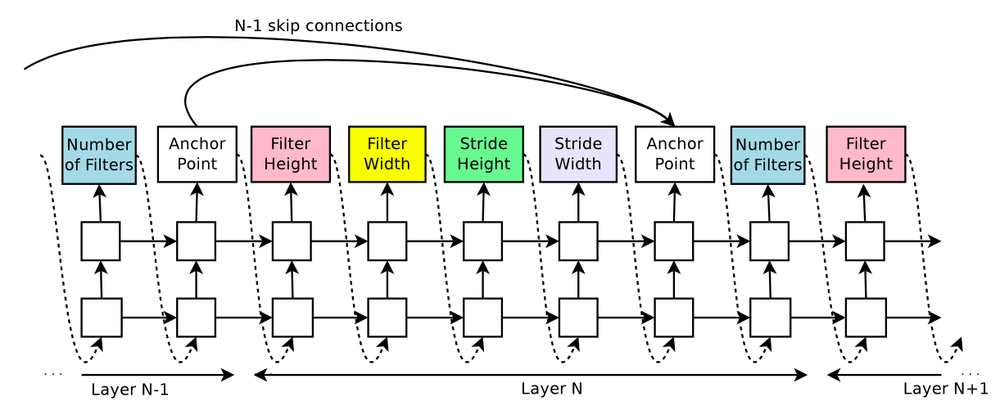

在每一层的预测值中插入一个锚点，第N层的锚点和前面N-1层的所有锚点都有一个连接，每一层的锚点有（层数-1)个输出，分别代表前面的每一层是否该作为当前层的输入。

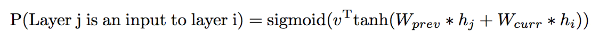

在这种情况下，因为不同的层的feature map的大小是不同的，当不同的层拼接到一起时，会有尺寸不兼容的情况，为了解决这个问题，对较小尺寸的feature map做padding处理。同时，加上另外两种处理：

- 如果锚点没有预测出任何输入，那么当前层使用输入的图像作为输入层。
- 在网络的最后一层，对于那些没做过输入的层，都连接到这个最后一层。

这样，控制器就支持了skip-connection。

当然，对于learning-rate，pooling，batchnorm层，控制器也可以稍作修改就支持。

# 循环神经网络结构生成

刚才所讲的都是生成卷积神经网络，那么对于循环神经网络，该如何生成呢？

正常的循环神经网络的每个cell有两个输入和一个输出，两个输入为xt和ht-1，输出为ht。
因而，我们使用控制器对两个输入和一个输出预测两个东西，即两个输入的拼接方式，和激活函数。

比如，如果预测两个输入的拼接方式为加，激活函数为tanh，那么就得到普通的RNN

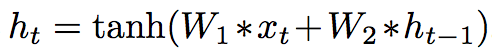

我们可以将两个输入复制多份，从而可以得到不同的输出（因为拼接方式和激活函数会不同）。不同的输出又可以使用两个输入一个输出的这种结构进行组合，得到新的值。其中，两个输入复制多份的那个份数被称之为“base N”。

在LSTM的结构中，还有另一个ct隐含变量，也可以用相同的方式加入到这种计算中来。

具体不在赘述，大家直接看论文中的图和解释即可.

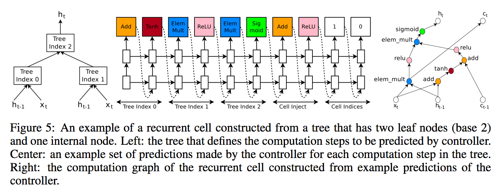
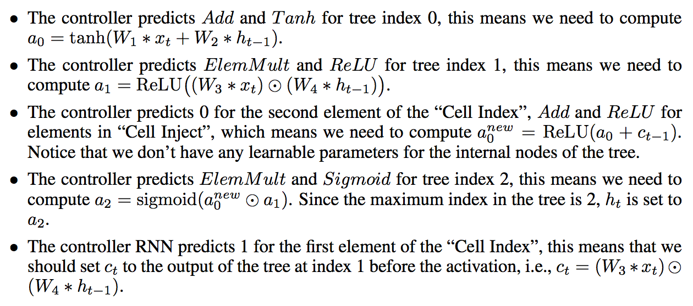

在这里比较有意思的是，使用循环神经网络来预测循环神经网络的结构。如果将生成好的循环网络结构再用作控制器，就成了自我升级和迭代了。

# 实验

## 实验设置

对于卷积神经网络，搜索空间如下：

- 卷积核高和宽：[1,3,5,7]
- 卷积核数目：[24, 36, 48, 64]
- 卷积核stride： [1,2,3] / [1]

对于控制器：

- 2-layer LSTM
- 35 hidden unit
- Adam 优化器
- learning_rate=0.0006
- Parameter server=20
- 控制器副本数目=100
- 控制器每次生成m个结构，m=8，即800个生成的网络结构同时在训练，同时使用800GPU。
- 生成的网络训练50 epoch

在train的过程中，逐步加深生成网络结构的深度，在Cifar-10上，每sample 1600次，就将深度加深2。

> 感觉这里的假设其实是在比较好的浅网络上加层能更大概率的得到比较好的深网络。

对于循环神经网络，使用：
- base=8
- learning_rate=0.0005
- 控制器副本数目=400.
- 当10个梯度累加起来的时候才做梯度下降。
- 生成的网络结构train 35 epoches
- 只是生成了RNN的cell结构，大网络结构使用两层结构，hidden unit数目动态调整至于medium baseline参数数目等同的状态。
- 反馈值不再是准确率，而是c/(perplexity*perplexity), c=80.
- 其他设置类似。

## 卷积神经网络最终结果

在得到最后的网络结构后，再对这个结构进行其他参数如learning_rate，weigh_decay, batch_norm的grid search，得到最优结果。

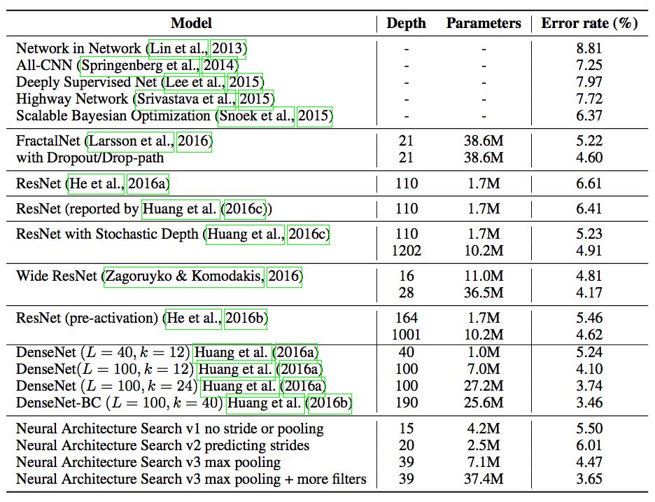

## 循环神经网络结果

做了grid search后，得到最右结果。

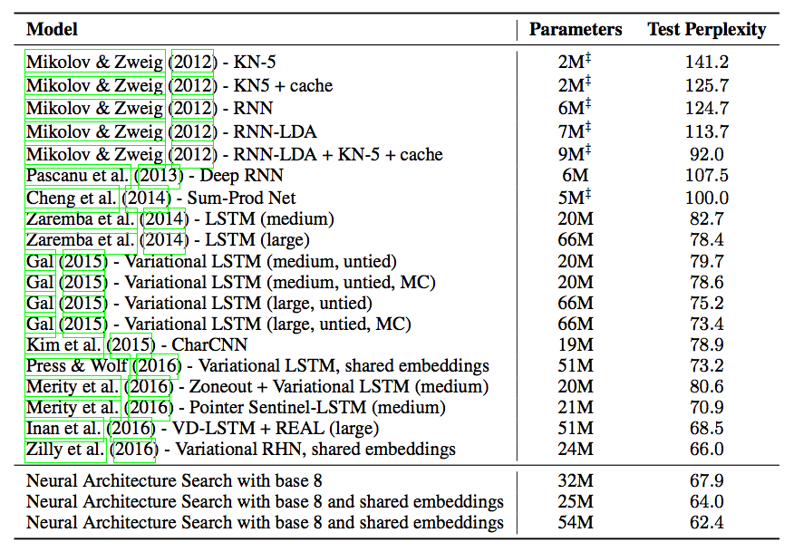

# 生成的网络结构

## 卷积神经网络

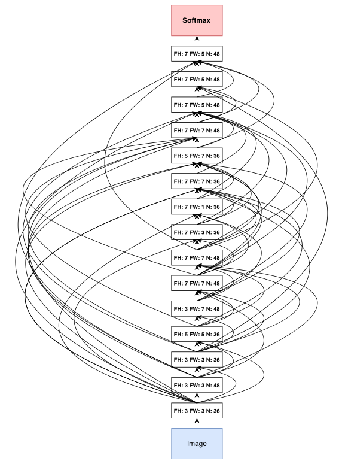

## 循环神经网络

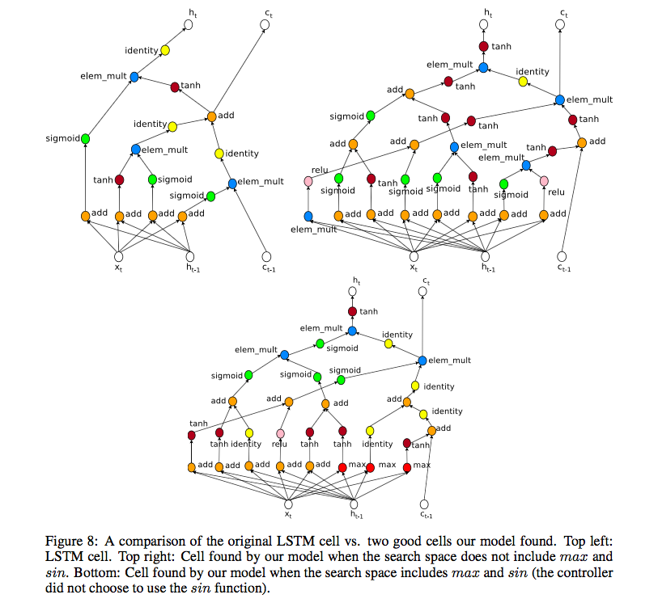

# 参考文献

- [1]. Zoph B, Le Q V. Neural architecture search with reinforcement learning[J]. arXiv preprint arXiv:1611.01578, 2016.
- [2]. [深度增强学习之Policy Gradient方法](https://zhuanlan.zhihu.com/p/21725498)