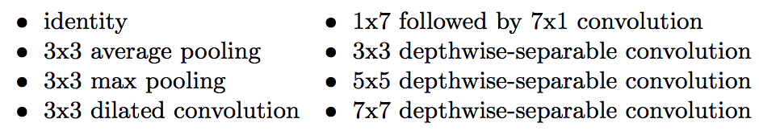
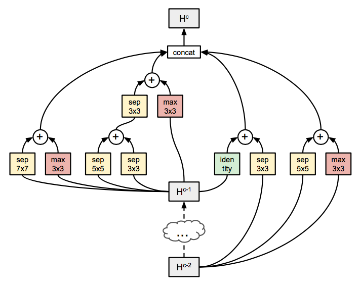
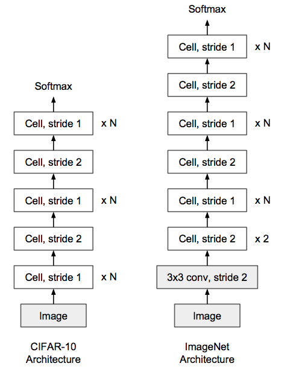
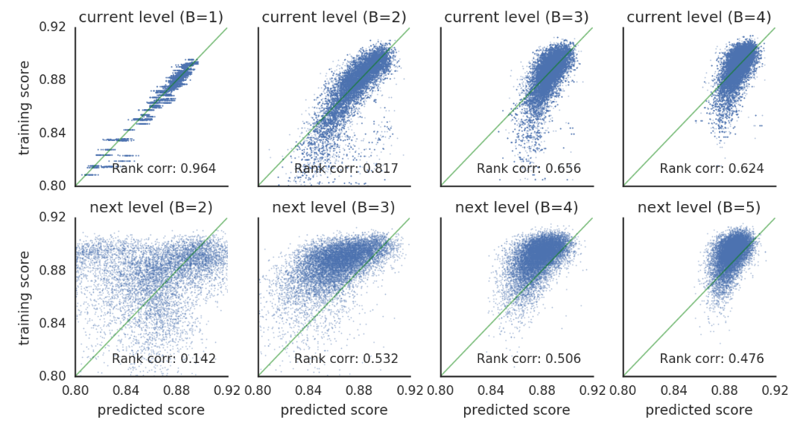
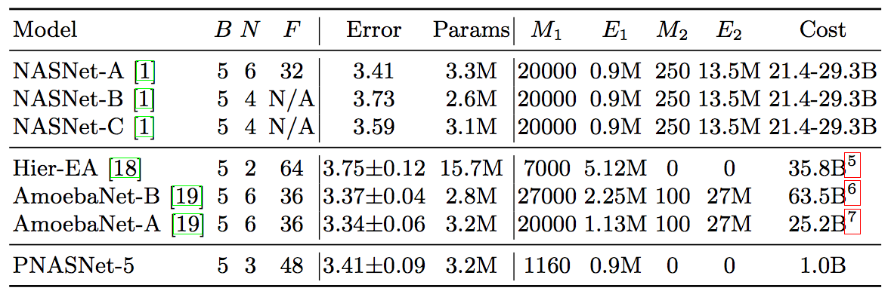
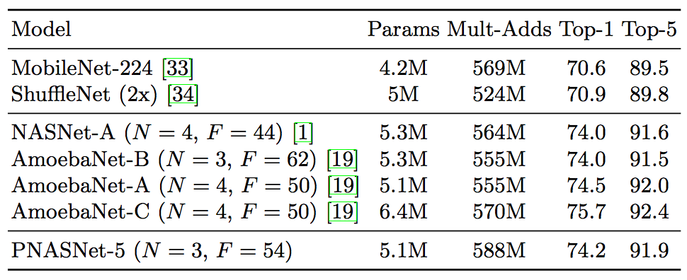
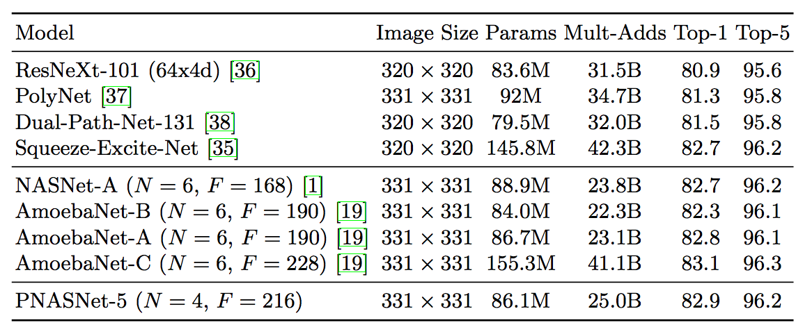

# 炼丹术的终结——神经网络结构搜索之三

本文是神经网络结构搜索系列的第三篇，在[第一篇](https://zhuanlan.zhihu.com/p/36301779)中，我们介绍了如何使用一个控制器(LSTM)来生成整个的神经网络结构，但由于过于耗时，在[第二篇](https://zhuanlan.zhihu.com/p/36301731)中，利用神经网络层次之间的结构重复性质，学习出两个特定的结构Normal Cell和Reduction Cell，从而降低了搜索空间。

但是，仍然的，虽然在[第二篇](https://zhuanlan.zhihu.com/p/36301731)中速度加快了很多，但是，对于cifar10数据集，仍然需要性训练20000个神经网络，即使并行在500个P100的GPU上，也还需要4天之久。

而本文中介绍的方法，仍然基于[第二篇](https://zhuanlan.zhihu.com/p/36301731)， 但相比于第二篇方法中的性能，本文介绍的方法训练的模型数目减小为五分之一，而总速度降低为八分之一。

主要采取的手段则是：

- 进一步降低模型的搜索空间
- 逐步的训练网络，从简单到复杂，而简单模型的训练比复杂模型要快很多。
- 使用启发式搜索来选择去要去训练的模型结构，这样就降低了需要训练的模型的数量。

# 降低搜索空间

本文采用的方法对[第二篇](https://zhuanlan.zhihu.com/p/36301731)中的搜索空间进行了进一步的缩减。

- Normal Cell和Reduction Cell统一称为Normal Cell，通过stride来控制Cell的输出是否会减半。
- 原来的13个operator缩减为8个，因为在之前的方法中，有五个完全没有用到过。
- 合并方法，原来是拼接和相加，而拼接在之前的方法中从未被用过，因而只用相加。

剩余的8个operator为：

在[第二篇](https://zhuanlan.zhihu.com/p/36301731)中，使用了递归方法来生成Normal Cell和Reduction Cell。递归步骤就是

- 从输入(前两层的输出)和中间状态中任选两个I1和I2
- 然后人任选两个操作O1和O2分别应用到I1和I2；
- 然后再将其组合(相加或拼接)。
- 将这个步骤重复五次，得到Normal Cell和Reduction Cell。

在本文的方法中，该生成方法仍然被使用。因而我们可以试着计算搜索空间大小。

对于第一次运行生成方法，只有两个输入，因而，选取两次，得到2x2种可能。有八种operator，选取两次，得到8x8中可能，因而第一次运行该方法的空间是22x82。而对于第二次运行生成方法，operator选择的可能性没有变化，但因为上一步有一个隐含状态输出，所以输入变成了3x3中可能。以此类推，五次运行生成算法的搜索空间是

依然很大！

# 从结构到网络

在讲后面的优化之前，先看一下如何将上面的结构组合成一个神经网络。

上面生成的结构如下图所示：

而将上面的结构复制几份，在某些份上将stride设为2，就可以组成一个神经网络

# 由浅及深训练网络

在上面的描述中，可以发现，Cell结构是五次运行生成算法得到的。[第二篇](https://zhuanlan.zhihu.com/p/36301731)中的方法是生成整个结构后再组成网络进行训练。

而在本文的算法中，不需要生成整个结构，在五次调用生成算法的过程中，每一步都可以组成网络进行训练。这样，在前几步中训练的网络还快于生成整个Cell结构后组成的网络。

# 启发式搜索

在上一步中，我们得到了由浅及深的模型生成过程。可知在模型结构的生成过程中，第一步，会有256(去掉对称后有136)个不同的结构。而第二步中，则会有256x576个候选。第三四五步会更多。启发式算法可以帮助我们筛选在下一步中需要训练的模型。

为了引出启发式搜索算法，我们先介绍我们需要的启发式搜索算法的性质：

- 可以处理变长输入，启发式搜索算法的输入为已经选择的生成步骤，即选择了什么输入，选择了什么operator等。
- 正相关，不要求预测得到的准确率多高，但求排序要对，即能得到好结果的结构排序靠前。
- 样本利用率高，我们的目标是训练尽可能少的网络结构，因而训练启发式搜索算法的数据则会很少。

有了这三个性质之后，算法基本可以确定，那就是LSTM。因而，在本文的算法中，LSTM被用在两个方面，一个是控制器，另一个是启发式搜索算法。

再有了启发式算法之后，可以直观的想到Cell结构是如何搜索出来的：

- 完全训练生成算法第一步的所有可能的候选(136个)
- 训练启发式搜索算法
- 对于生成算法的后面几步的每一步：
	- 取得所有候选结构
	- 预测候选结构在某数据集上的准确率，按照准确率排序。
	- 取出准确率最高的top-K模型结构，进行训练。
	- 训练启发式搜索算法

具体如下图所示：

# 实验

## 启发式搜索算法

上面一行是使用当前结构的训练数据，预测当前结构的排序好坏。下面一行是使用当前结构的训练数据，预测下一个结构的排序好坏。

可以看到，尽管只使用了当前已有结构的数据，在预测未来的结构上仍然可以达到好的效果。

## Cifar10 结果

M为需要训练的模型数目。E为每次训练模型需要的样本数目。MxE为训练所有模型总共训练使用的样本数目。

可以看到，虽然AmoebaNet-A得到了最好结果，但是就性能而言，PNASNet仍然是好的选择。

# ImageNet 结果

小网络结果（用于Mobile）

大网络结果

# 参考文献

1. Liu C, Zoph B, Shlens J, et al. Progressive neural architecture search[J]. arXiv preprint arXiv:1712.00559, 2017.

2. Zoph B, Vasudevan V, Shlens J, et al. Learning transferable architectures for scalable image recognition[J]. arXiv preprint arXiv:1707.07012, 2017.

3. Zoph B, Le Q V. Neural architecture search with reinforcement learning[J]. arXiv preprint arXiv:1611.01578, 2016.