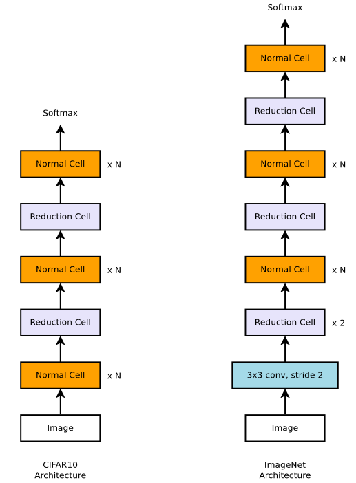
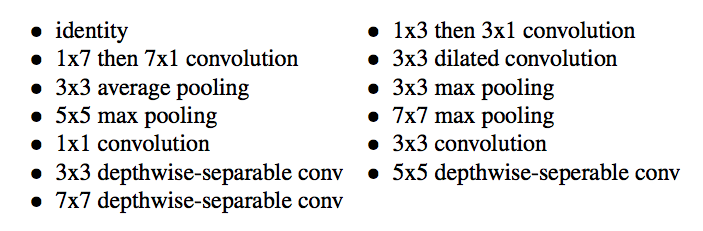
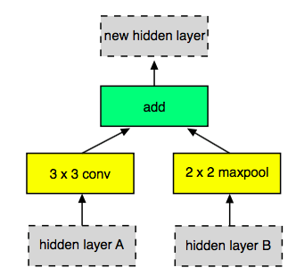
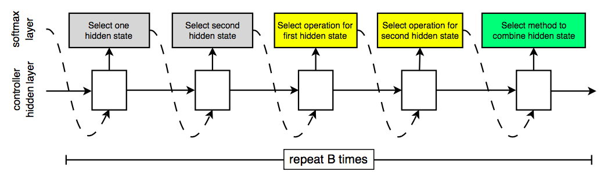
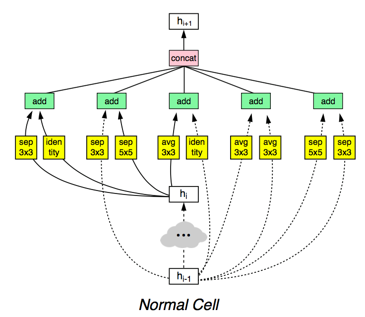
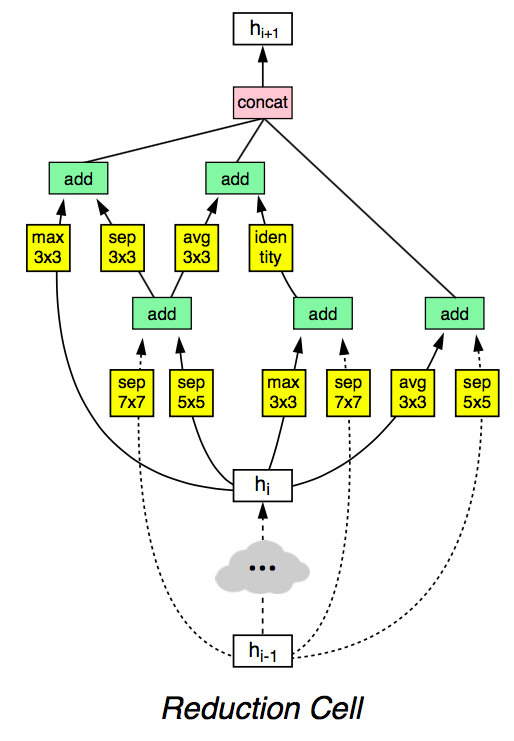
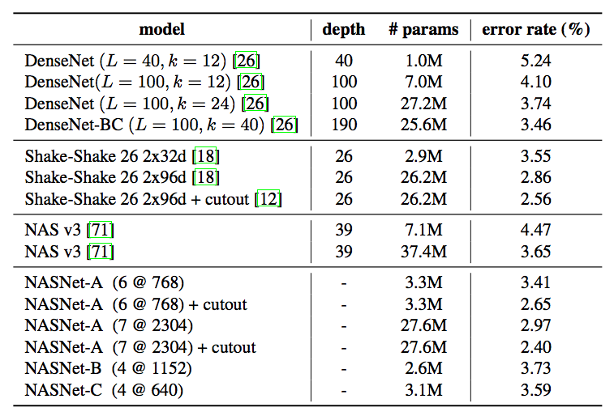
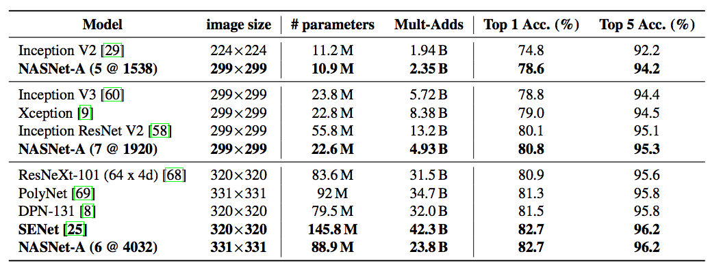

# 炼丹术的终结二——可迁移结构学习

[上一文](https://blog.csdn.net/stdcoutzyx/article/details/79875007)中介绍了如何用控制器（LSTM）搜索CNN网络和LSTM网络结构，从而生成出不逊于人类手工设计的网络结构。方法虽然已经work了，但是由于需要生成的参数很多，导致最后的网络结构的搜索空间非常的大，以至于非常耗时，在一个小的数据集上仍然需要800个GPU并行运算数天乃至一周之多。为了解决这个问题，文献[1]中提出了一种降低搜索空间的方法，使控制器能够更快的学到最优的网络结构。

需要注意的是，本文所探讨的要生成的神经网络是卷积神经网络。LSTM的网络设计并不在讨论范畴中，当然，LSTM仍然被用作控制器。

# 想法来源

在网络结构手工设计的时代，AlexNet，VGG，ResNet和Inception系列纷纷被设计出来，这些网络结构有一个共同的特点，那就是网络结构是层次性的，每层的结构都具有一定的相似性。因而，在这个基础上，自动学习的网络结构也可以是基于层的，设计出一个特定的结构来作为一层，然后将这个结构重复多遍，就得到一个完整的网络结构。

# 实现细节

基于上述的想法，首先，对之前的网络结构进行汇总分析可得，卷积神经网络的结构分为两个大类，一类是将输入的feature map等大小输出，即Normal Cell，另一类是将输入的feature map长宽各降低一半输出，即Reduction Cell。

有了这两个Cell之后，就可以得到一个完整的神经网络。如下图所示：

更具体的，每个Cell有更细致的微结构。从大的层面来看，Normal Cell和Reduction Cell都接受两个输入hi和hi-1。从小的层面看，Normal Cell和Reduction Cell中的子结构也是类似的，两个输入得到一个输出。但子结构的输入不一定是Cell的输入，也可能是中间状态。

在生成Cell结构的过程中，论文巧妙的将其递归的分成几步，每一步的操作都是一样的。具体的，生成Normal Cell和Reduction Cell的过程，就是将下面的过程重复B次，先验条件下，B=5。步骤如下：

1. 从hi和hi-1或上一步中得到的隐含状态中选择一个作为输入一。
2. 从从hi和hi-1或上一步中得到的隐含状态中选择一个作为输入二。（可以与第一个一样）
3. 从操作集合中选择一个操作应用在输入一上。
4. 从操作集合中选择一个操作应用在输入二上。
5. 选择一个方法将第三步和第四步的结果合并。

其中，第三步和第四步的操作集合如下：

第五步的操作有两个：

- element-wise addition
- concatenation

将上述步骤重复B次，其中每次称之为一个Block。每次生成的子结构如下：

每一个Block的生成如下：

在生成Cell最后的输出的时候，将所有没有用到的Hidden states拼接到一起，作为输出。

在生成最后的神经网络的时候，需要注意：

- 由之前的经验，每次使用Reduction Cell时，将filter数目翻倍。
- 由两个参数需要自己调整，一个是Normal Cell重复的次数N，还有一个是初始第一层的filter数目。

# 实验

经过学习，得到的最终的Normal Cell和Reduction Cell的结构如下：

## 实验结果

在cifar10上的实验结果如下：

在ImageNet数据集上的实验结果如下：

# 参考文献

[1]. Zoph B, Vasudevan V, Shlens J, et al. Learning transferable architectures for scalable image recognition[J]. arXiv preprint arXiv:1707.07012, 2017.