# ALBert: 轻量级Bert

本文是参考文献[1]的阅读笔记。

## 背景

近年来，预训练的趋势从学习embedding变成了学习整个网络，即word2vec到Bert的变迁。

另一个趋势则是大模型对最后的效果非常重要。而想要在真实的场景中使用，则需要小一些的模型，因而，知识蒸馏变得比较流行。

之前在卷积上，把层次加深到一定程度后如果没有结构上的创新（resnet等）就不能再进一步提升效果。与之类似，在Bert上，把模型大小调整到一定程度也无法再继续使效果变好，反而会变差。如下图所示：

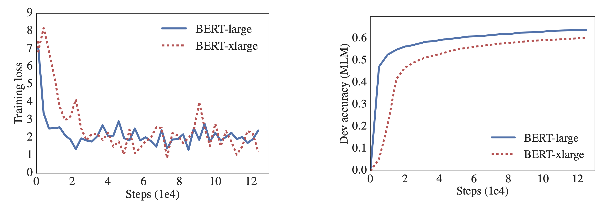
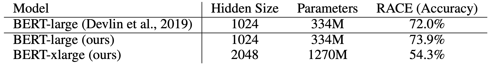

把hidden size从1024调整到2048会使得效果反而变差。

于是，论文提出了三种手段来提升效果：

- embedding矩阵分解
- 层次间的参数共享
- 损失函数添加句子顺序预测的loss

## embedding矩阵分解

原始的Bert，因为要做残差，所以每层的Hidden size都是一样的，同时也使得embedding size和hidden size一样。但是，因为词表比较大，Bert中用的是3w的word piece，这样会导致模型的参数中，embedding会占一大部分。

从模型的角度来说，embedding的参数学习的是上下文无关的表达，而Bert的模型结构则学习的是上下文相关的表达。在之前的研究成果中表明，Bert及其类似的模型的好效果更多的来源于上下文信息的捕捉，因而，embedding占据这么多的参数，会导致最终的参数非常稀疏。

因而，我们不用这么大的embedding size，而是用一个较小的size，但是这样就没法在第一层去做残差了。没有关系，我们可以用另一个参数矩阵来把embedding size投射到hidden size上来。即假设V是词表大小，E是embedding size，H是hidden size，那么原始的bert中E=H, 参数数目为VxH，而做了分解之后参数数据为VxE+ExH, 因为E远小于H，所以做了分解后这一部分的参数变少了很多。

## 层次间的参数共享

Bert的层次很深，至少在10层以上，这样，层次间的参数如果能共享的话，会使得参数量大大减少。

不仅如此，在共享了参数之后，会使得模型更加稳定，这方面的表现就是模型的每层的输入和输出之间的L2距离更小了。如下图所示：

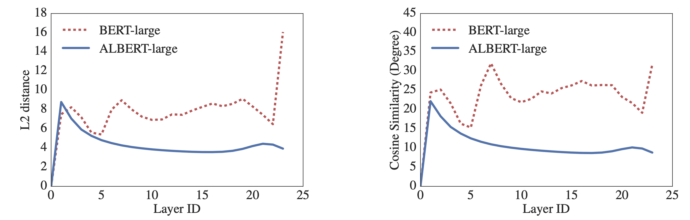

当然，关于参数共享，也有很多选项：

- 全部共享
- 只共享全连接层
- 只共享多头注意力层
- 不共享

## 句子顺序预测损失

在原始的bert中，除了masked language model之外，还需要学习下一个句子的预测，在这个任务中，正例是两个连续的句子AB，反例则是两个句子AC，其中C来自于另外的文章。

这个loss已经在很多论文中被怀疑无效或者可以提升了。在论文中，怀疑它不好的原因就是它太简单了。于是，论文设计了一个更难的任务，即两个连续的句子AB，判断它是正序还是逆序，即是AB还是BA。

## 实验设置

别的不说，两个重要的点是：

- sentence piece，见参考文献[2]
- ngram masking，见参考文献[3]

## 效果

ALBERT和Bert的比较如下图，可以看到，相同的设置，ALBert比Bert略差，但是参数量会减少一个量级。

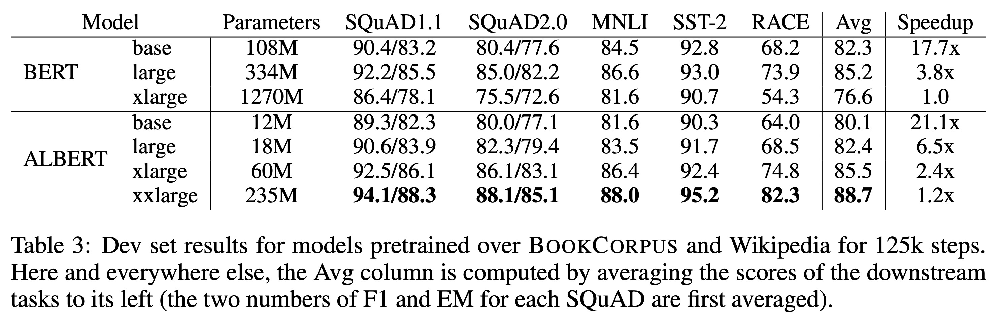

word embedding大小的影响如下图。
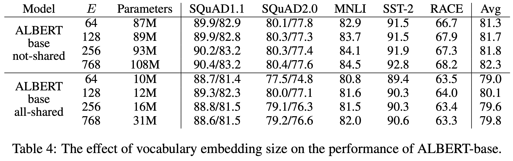

参数共享设置的影响如下图。
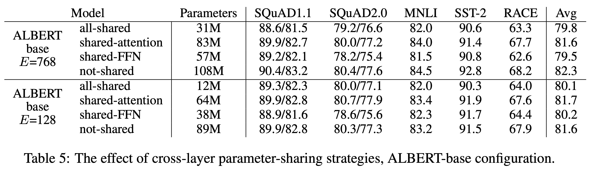

不同的句子损失的影响如下图
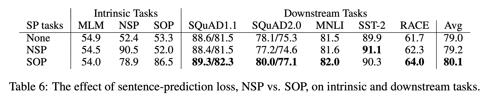

除了论文的创新点的实验之外，论文中还有很多其他的实验结果。比如模型层次数目的影响：
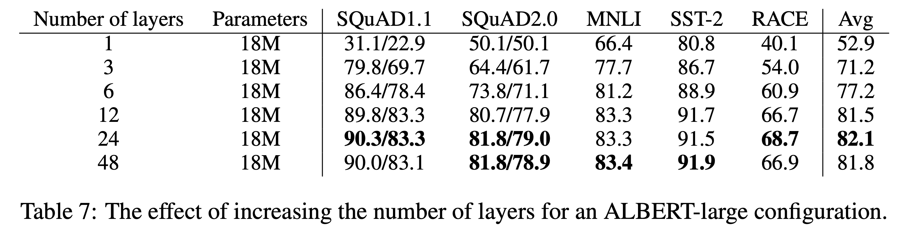

hidden size的影响：
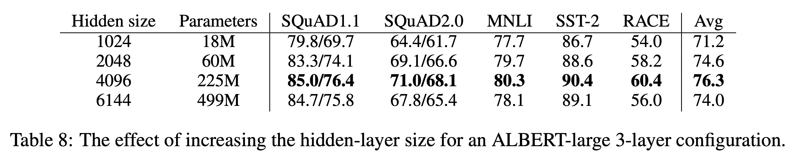

相同训练时间下，Bert-large和AlBert-xxlarge的效果
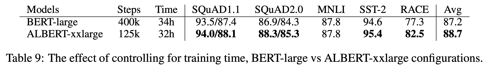

在共享了参数之后，加到12层即可，没有必要加到24层了。
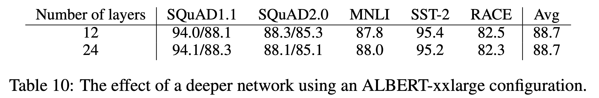

添加数据或者去掉dropout对模型训练的影响。
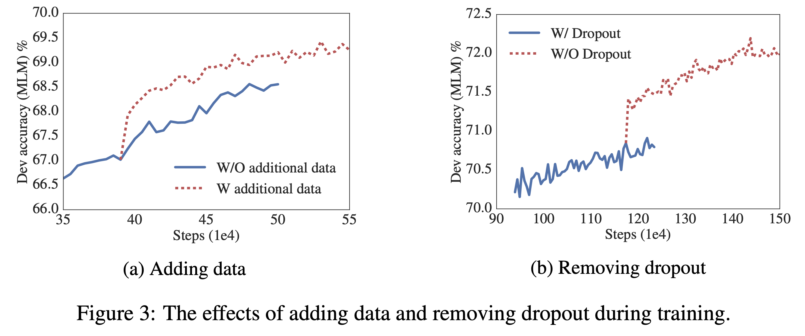

加入新数据的影响
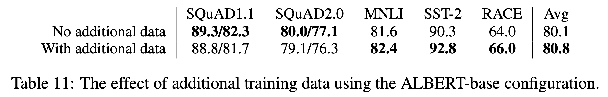

去掉dropout的影响。
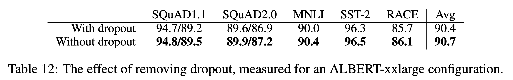

## 参考文献

[1]. Lan Z, Chen M, Goodman S, et al. ALBERT: A lite BERT for self-supervised learning of language representations[J]. arXiv preprint arXiv:1909.11942, 2019.

[2]. Taku Kudo and John Richardson. SentencePiece: A simple and language independent subword tokenizer and detokenizer for neural text processing. In Proceedings of the 2018 Conference on Empirical Methods in Natural Language Processing: System Demonstrations, pp.
66–71, Brussels, Belgium, November 2018. Association for Computational Linguistics. doi:
10.18653/v1/D18-2012. URL https://www.aclweb.org/anthology/D18-2012.

[3]. Mandar Joshi, Danqi Chen, Yinhan Liu, Daniel S Weld, Luke Zettlemoyer, and Omer Levy.
SpanBERT: Improving pre-training by representing and predicting spans. arXiv preprint
arXiv:1907.10529, 2019.
