# ENAS: 基于参数共享的高效网络结构搜索

本文是参考文献[1]的阅读笔记。

跟[Darts](https://zhuanlan.zhihu.com/p/93354509)类似，基于参数共享的网络结构搜索的目的也是为了减少网络结构搜索的计算量。而解决的方法也是不要独立的训练每个生成的网络，而是能省就省，把子网络中可以共享的参数拿出来共享，从而节省很多多余的训练。

## 用有向图表示循环网络结构

跟NAS算法中一样，ENAS中依然会有一个LSTM来作为controller，但是ENAS中会把网络结构用有向图来表示，Controller会决定有向图中的那条边被激活。所以，首先，怎样把网络结构用有向图表示？

有向图中有边和节点，其中，每个节点表示的是操作，每条边表示的是信息的流向。

以循环神经网络的cell为例，下图用有向图表示了一个循环网络的结构单元：

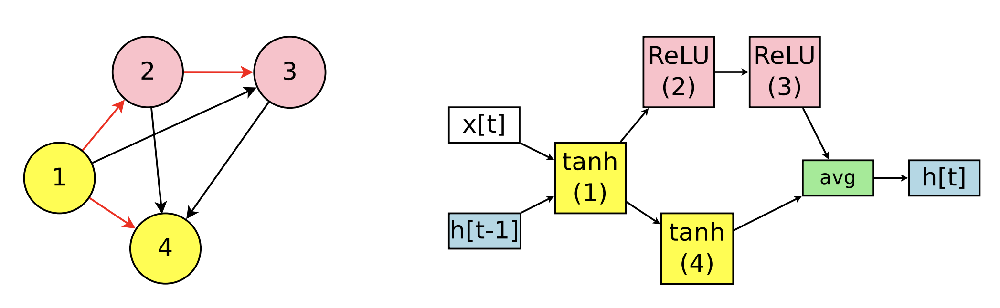

在图中，红线表示的网络结构。红线和黑线全部表示的则是整个搜索空间。在红线表示的结构单元中。x[t]和h[t-1]输入给节点1，节点1输入给节点2，节点2输入给节点3，节点1还输入给节点4，节点4和节点3的输出聚合得到了最后的输出。

而这个网络结构在controller上的输入输出则为：

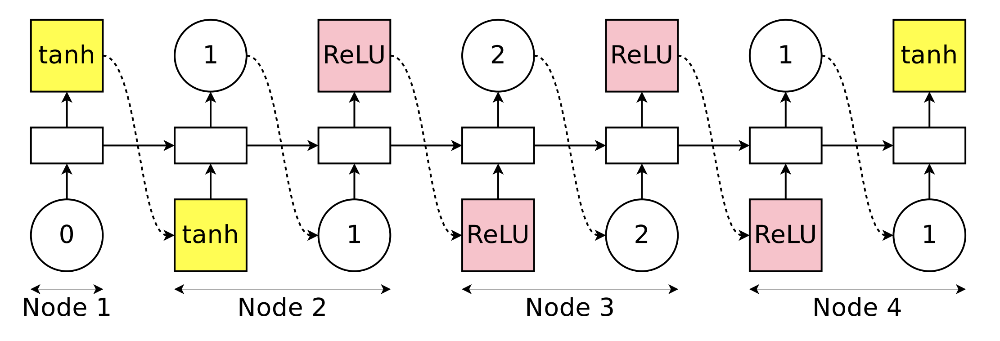

在从搜索空间采样生成具体的某个结构的时候，有两条规则，第一条是，在采样第N个节点时，前面N-1个节点的输出都可以被选择，因而，在搜索空间中，节点i要有指向节点i+1到节点N的N-i条边。第二条是，在结束时，没有被选择到的节点的输出需要聚合起来一起输出。

为了统一起见，还需要把输入也当成一个节点考虑进来，如下图：

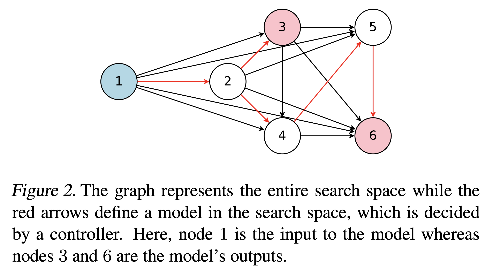

这里，假设搜索空间中有N个节点，且每个节点可以是四种操作。那么，搜索空间将会有4^N x N!中网络，如果N=12，那么搜索空间大小则为10^15个。

## 训练流程

在ENAS算法中，有两种参数，第一种是controller的参数，第二种是搜索空间里的共享参数。那么如何训练呢？

它们是交替训练的，首先训练的是用标准的反向传播训练共享参数；其次则是训练controller里的参数。

### 训练共享参数

在训练共享参数的时候，对于某个具体的参数而言，同时求解所有模型在这个参数上的梯度是不可能的，所以就采用了蒙特卡洛模拟的方法，采样出来N个模型，进行求解。

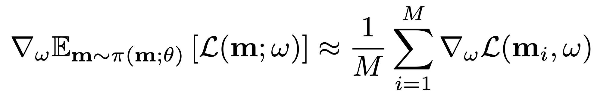

在实验中，发现M=1就足够了。

### 训练controller参数

采用的Adam优化器，Reward函数使用的是模型在验证集上ppl，共享参数的训练是在训练集，而controller用的反馈之所以用验证集上的，是因为我们要找的是泛化能力强的模型。

### 生成网络结构

有了控制器以后，就可以用控制器采样一个模型作为结果了。当然，也可以像NAS里面那样，采样若干个模型，用最好的那个。

## 用有向图表示卷积网络

跟循环网络的结构表示类似：

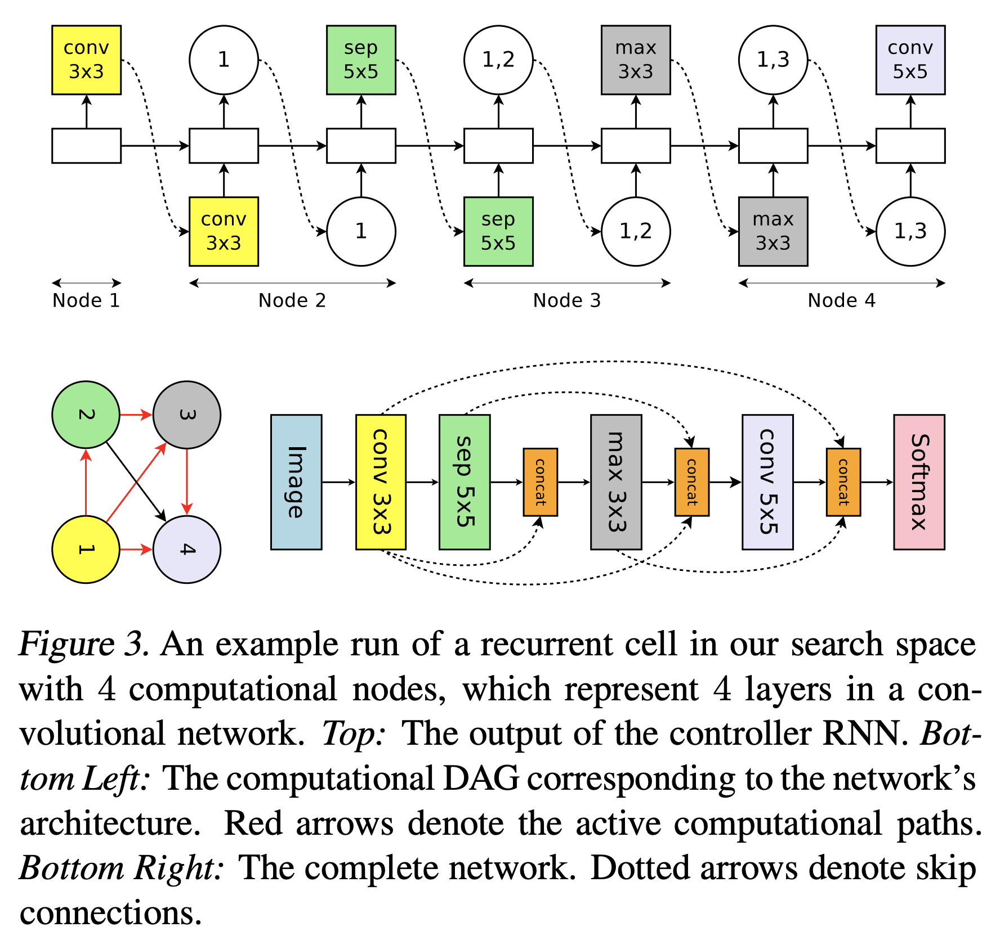

但跟循环网络不同的是，在卷积网络中，可能的操作是6种，每个操作的输入可能是1个或2个。因此，可能的网络结构的数目为6^L * 2^[n*(n-1)/2]个。当L=12的时候，可能的网络结构为1.6*10^29个。

## 用有向图表示卷积网络块

同样的，很多论文中选择不去采样整个卷积网络，而是去学习Normal Block和Reduction Block，

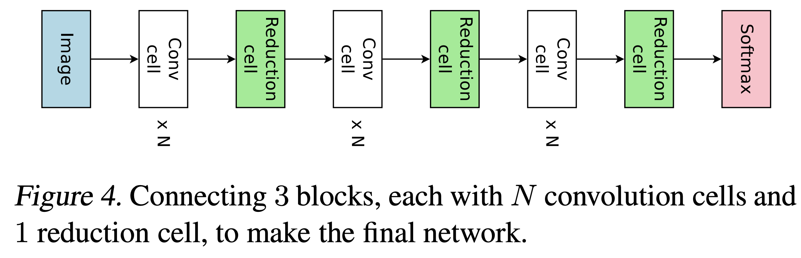

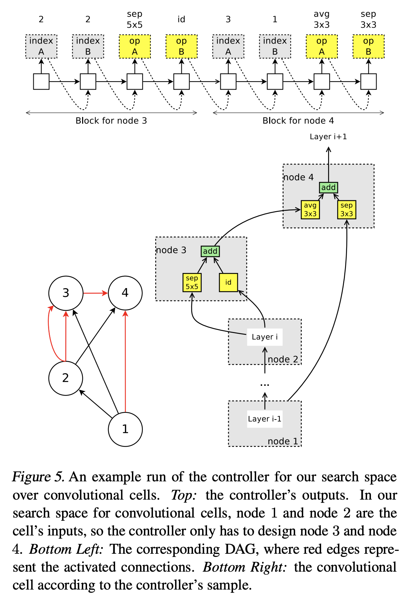

每个节点上可以是五种操作，因而Normal Cell和Reduction Cell的可能性分别是(5 x (B-2)!)^2，所以一共是(5 x (B-2)!)^4，如果B=7的话，那么搜索空间为1.3x10^11个。

## 实验结果

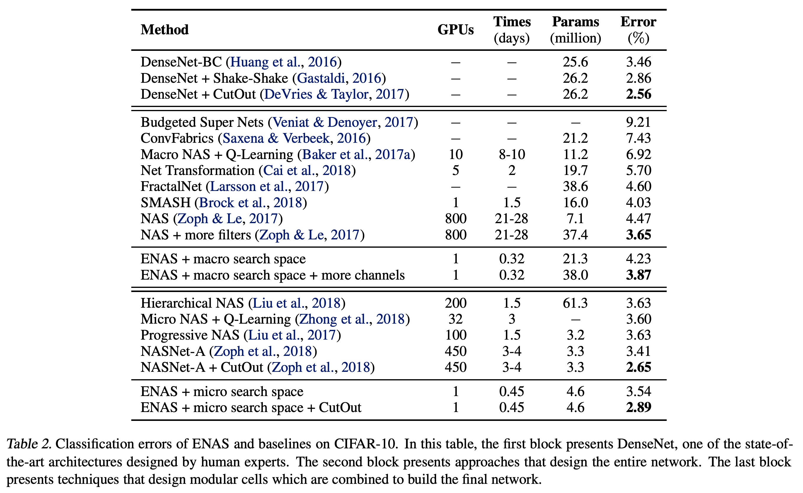
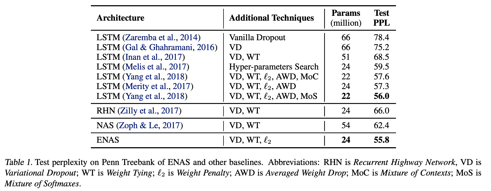

循环网络学到的结构
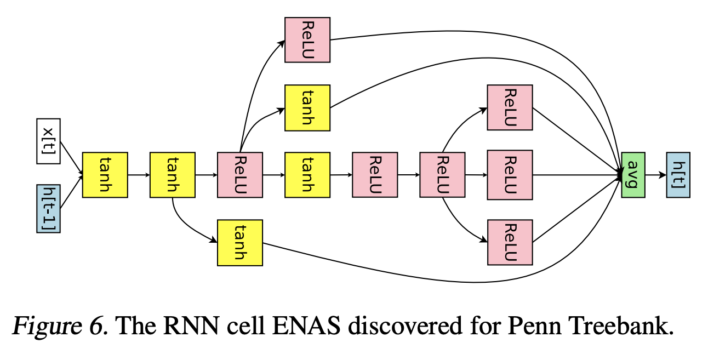

全卷积网络学到的结构
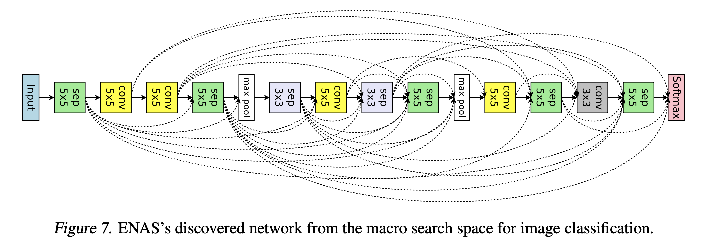

卷积块学到的结构

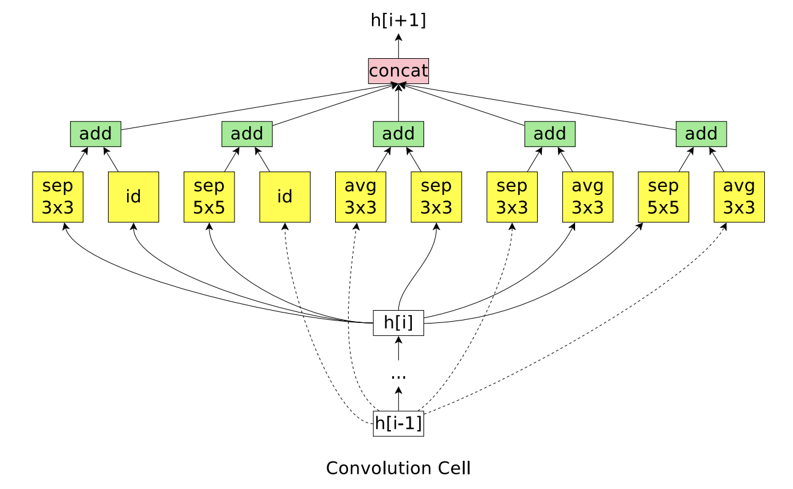

值得注意的是，上述学到的结构都是局部最优解，把里面的一个或多个操作给变化之后，结果会显著的变差。

## 参考文献

[1]. Pham, Hieu, et al. "Efficient neural architecture search via parameter sharing." arXiv preprint arXiv:1802.03268 (2018).
