# GPT & GPT-2

本文是参考文献[1]和[2]的阅读笔记。

GPT，全称是Generative Pre-training，顾名思义，就是预训练模型。

在GPT出现之前，通用的使用预训练的方式是word2vec，即学习词语的表达。而在GPT出现之后，通用的预训练方式是预训练整个网络然后通过fine-tune去改进具体的任务。

GPT出现之后，引发了Bert，XLNet等一系列的地震式改进。对NLP任务的影响十分深远。

## 预训练

关于预训练，流行的使用方法可以分成如下几类：

- 半监督学习：即先在没有标注的数据上学习词语或者字符的表达，然后将其当做特征输入给特定的任务进行学习。
- 无监督学习：在没有标注的数据上学习网络，作为特定任务的网络的初始化参数值。
- 辅助目标函数：将语言模型的目标函数作为具体任务的辅助项来增强学习的效果。

## GPT

GPT的思想简而言之，就是在没有标注的数据上进行网络学习，然后添加一层再去在具体的任务上做微调。

在未标注数据上的学习这一部分，需要学习一个语言模型，所谓的语言模型，就是依据前面的context，去预测下一个词。如下面的公式所示。

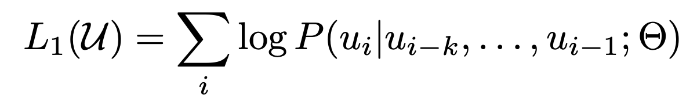

在学习语言模型的时候，GPT使用的是transformer，Transformer的出现时pre-train模型发生质变的关键因素，它的前任LSTM相较而言无法捕捉更长的语义信息。下图反映了语言模型从输入到输出的计算：

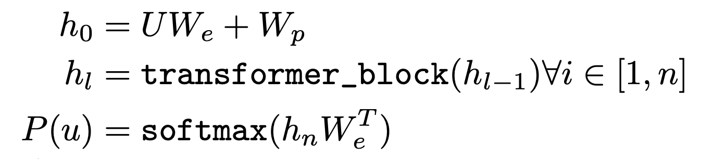

在得到了基于transformer的模型之后，针对具体的某个任务，假设输入和输出分别是x和y，那么我们在transformer的输出上再加一层：

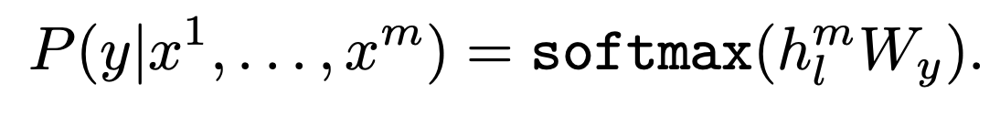

从而得到新的损失函数：

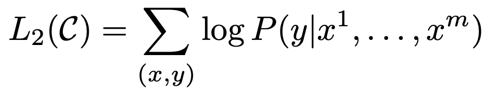

然后正如我们在预训练那一部分中所说，可以把语言模型的目标函数当做辅助目标函数来增强最终的效果

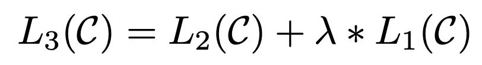

## GPT具体任务上的输入输出

GPT所能处理的是序列式任务，即输入是一个词语序列。然后GPT的输出是一个值。但是很多任务的输入输出并不符合这个格式，接下来我们来看下如何对具体的任务做改动：

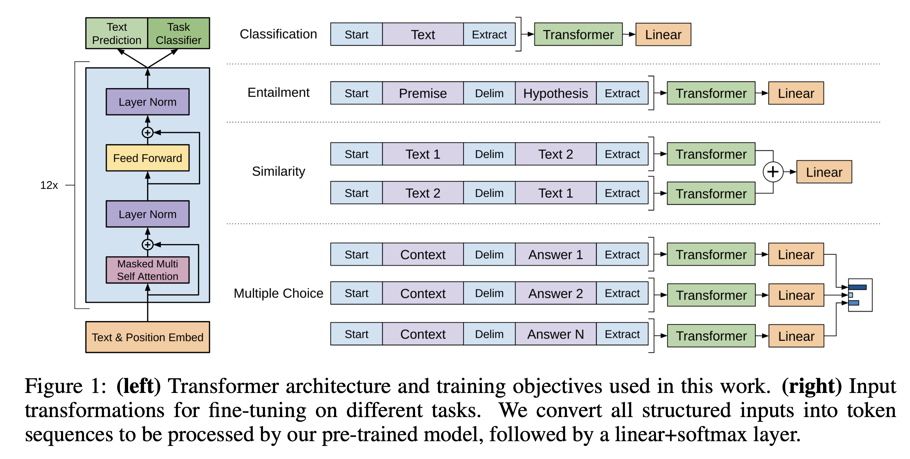

### Textual Entailment

这个问题的目标是判断两个句子是包含关系，还是矛盾关系或者中立关系。

对于这个问题，输入是两个句子，premise p和hypothesis h，如上图所示，p和h被拼接了起来，然后输入给transformer。

### Similarity

这个问题是判断两个句子是否相似。

对于这个问题，输入的两个句子，正向和反向各拼接一次，然后分别输入给transformer，得到的输出拼接在输入给下一层。

### Question Answer和Commonsense reasoning

对于这两个问题，输入都是一个document d，一个问题q，还有若干个答案answer。

对于这个问题，输入的d和q先拼接起来，然后这个拼接和每个answer都拼接起来，输入给transformer，得到的结果分别输入给一个全连接层，再得到的结果去进行softmax形成概率分布。

## GPT实验结果

GPT模型在几个问题上的结果分别如下：

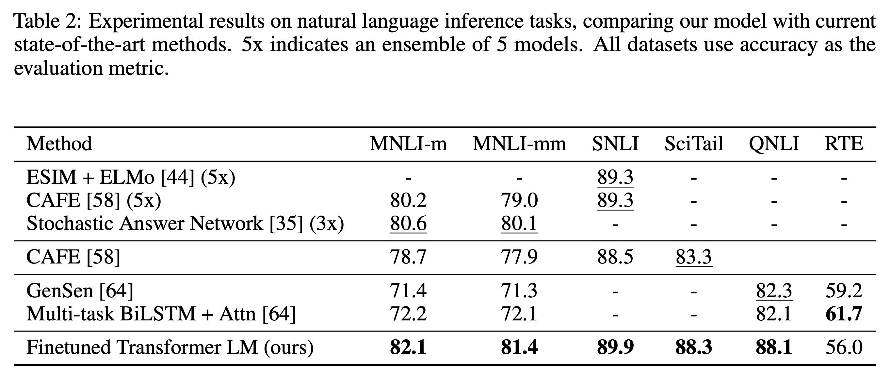

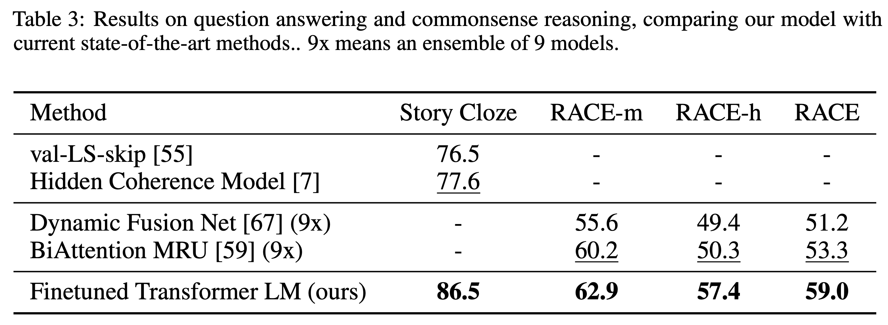

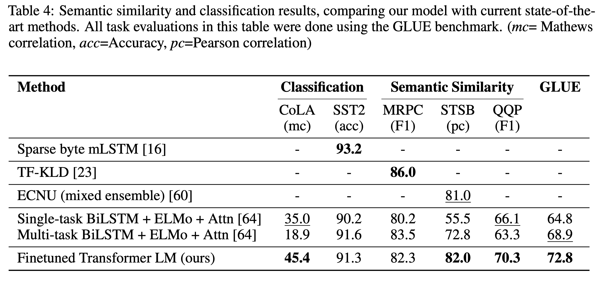

fine-tune的层次的影响，语言模型的预训练的影响还有ablation实验如下

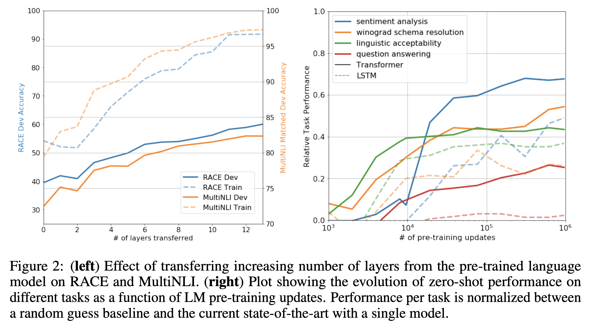

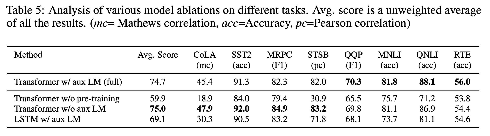

## GPT-2

相对于GPT而言，GPT-2使用的训练语料WebText更大。

WebText语料的构建过程：
- 从45M的链接中下载文本
- 去重
- 去除掉所有跟wikipedia有关的文本 (因为很多其他数据集都是基于wiki做的)。
- 得到40G的文本

相对于GPT而言，GPT-2的训练模型更大。如下图所示，最小的模型是GPT。

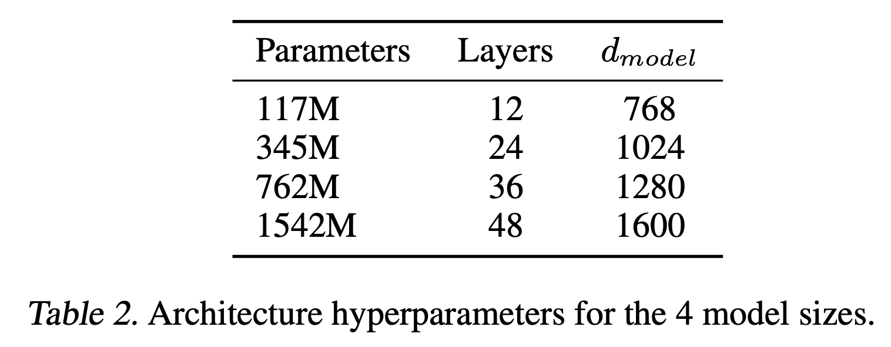

GPT-2论证了什么事情呢？对于语言模型来说，不同领域的文本相当于一个独立的task，而如果把这些task组合起来学习，那么就是multi-task学习。所特殊的是这些task都是同质的，即它们的目标函数都是一样的，所以可以统一学习。那么当增大数据集后，相当于模型在更多领域上进行了学习，即模型的泛化能力有了进一步的增强。

在下图中可以看到，使用在webtext上训练的模型，可以在7/8个训练语言模型的数据集上达到更好的效果。而且即便如此，GPT-2模型在webText上还没有完全拟合(即如果训练更长的时间，可以达到更好的效果)。

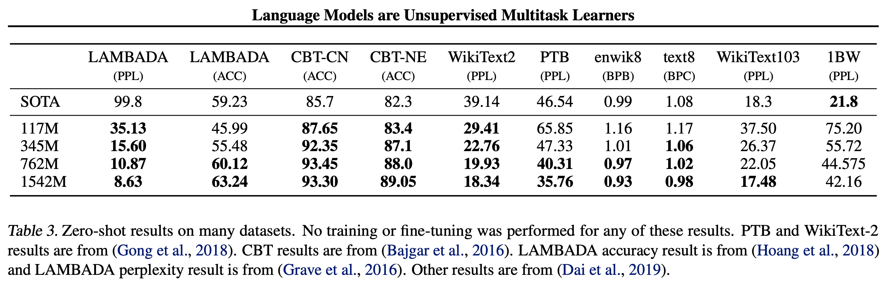

上图中的8个数据集基本上是跨领域的，可见，增大模型容量和训练数据大小带来的增益是多么可观。

## GPT-2 直接做下游任务

除了语言模型上的进展之外，GPT-2还首次尝试了直接用语言模型做下游任务，也就是不用在具体任务上的损失函数。这是如何做到的呢？

比如，如果是summarization任务，那么对于语言模型来说，我加一个新词TL;DR:, 改词前面是context，后面是摘要。那么语言模型遇到这个词后，就能推断出来，接下来要做抽摘要的工作了。

同理，对于translate任务，我们把数据做成 french sentence = english sentence，那么语言模型遇到=的时候，应该能推断出接下来是翻译任务。

虽然在这些任务上，GPT-2都没有达到SOTA的效果，但是效果也是相当可观的。表明了高容量模型在这个方向上的可能性。

## 参考文献

- [1]. Radford A, Narasimhan K, Salimans T, et al. Improving language understanding by generative pre-training[J]. URL https://s3-us-west-2. amazonaws. com/openai-assets/researchcovers/languageunsupervised/language understanding paper. pdf, 2018.

- [2]. Radford A, Wu J, Child R, et al. Language models are unsupervised multitask learners[J]. OpenAI Blog, 2019, 1(8).
