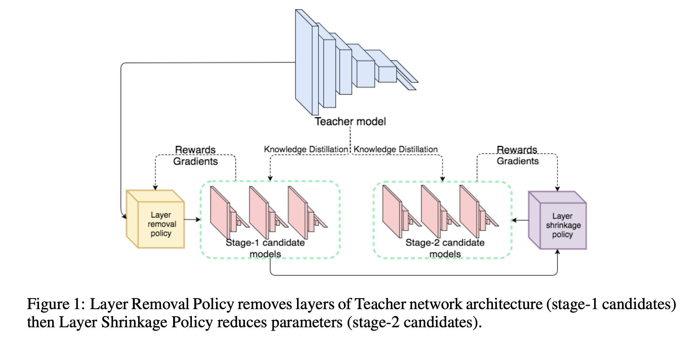
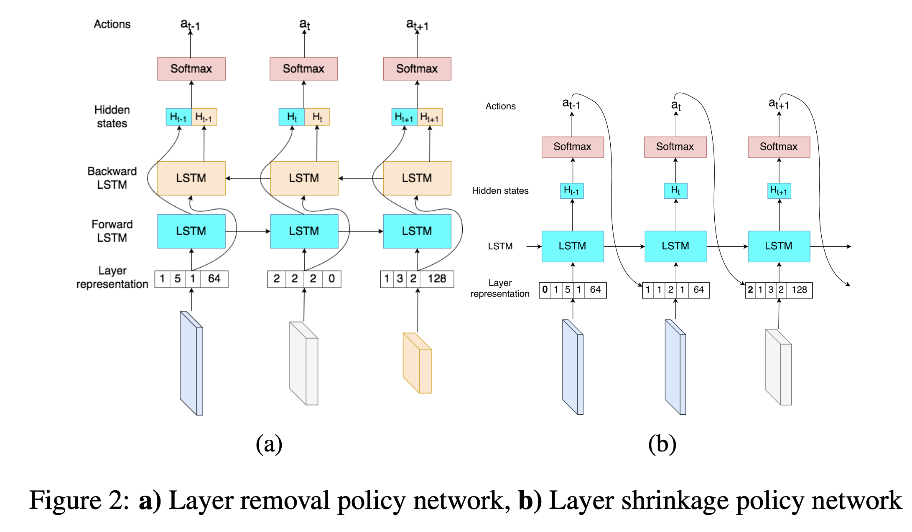
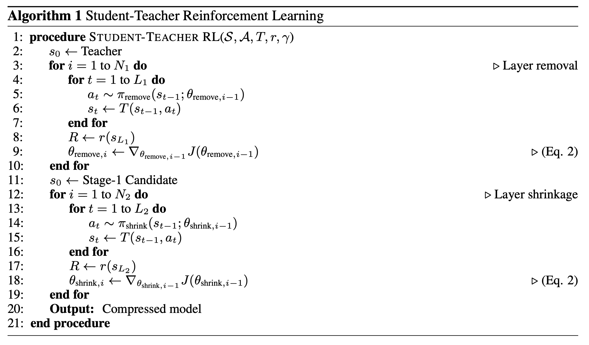
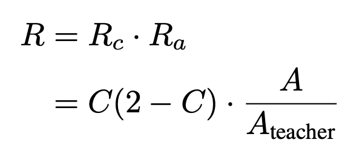
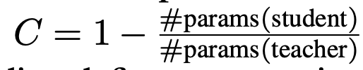
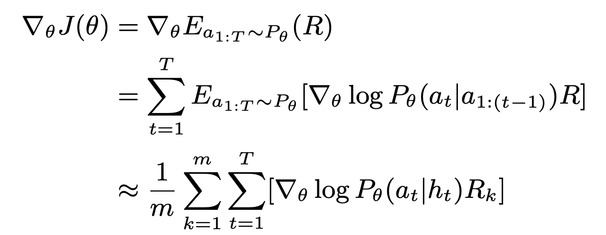
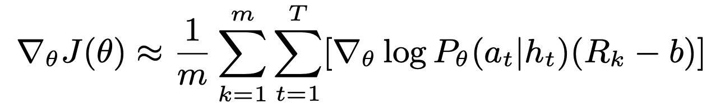
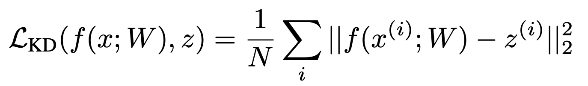
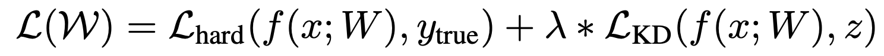
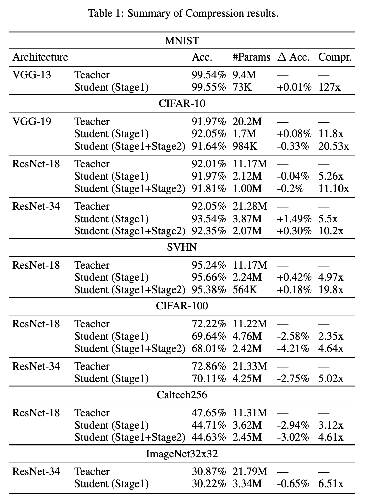

# 自动网络压缩

本文是参考文献[1]的阅读笔记。

现在的模型，为了达到更好的效果，尺寸往往越来越大，层次往往越来越多，这就导致了在很多设备上模型无法使用。

为了解决这种问题，出现了很多网络压缩算法，比如剪枝，模型量化等。知识蒸馏也是其中的一种。但是知识蒸馏也有缺点，那就是student模型仍然需要手工设计，设计的方法跟投硬币似的，听天命而已。

为了解决这个问题，论文将AutoML中的基于强化学习的网络结构搜索反着用。在teacher模型的空间内去学习一个小的student模型。

网络结构搜索的过程是不停的增加层次，扩大层次的宽度，这样的搜索空间很大。而网络压缩的搜索空间则很限定，就是teacher模型的大小，只能从teacher模型上去掉一些东西，因而在速度上，自动网络压缩将会比自动网络结构搜索要快很多。

## 马尔科夫决策过程

因为使用的是强化学习的方法，所以我们首先定义一个马尔科夫的过程。

M = {S, A, T, r, γ}

其中S是状态，即网络结构。A是对网络结构的操作，这里的A有两个操作，一种是移除某一层，一种是缩小某一层。T代表转移操作，即原状态s经过操作a后进入下一个状态s1。r是回报函数，即做了操作后会得到什么收益。γ是折扣系数，即多步以后的收益反映到当前步骤所乘以的系数，在这个问题中，折扣系数是1。

## 网络压缩

有了马尔科夫过程之后，我们先对网络做层次删减操作，然后再对删减后的网络做层次缩小操作。得到的新的小模型进行知识蒸馏学习，拿到得到的结果去计算回报。

整个过程如下图所示：

那么，强化学习中是如何控制层次删减和层次缩小的呢？在论文中，这两个的控制使用的是两个LSTM来实现。如下图

其中，左图用来控制某一层是不是该删除，输入是层次信息，包括层次类型，kernel size，stride，padding，output大小等，如果是残差连接的话，还有残差的起始层和结束层。这个网络有L步，L就是teacher模型的层次数目。每一步的输入就是从低到高的某一层，然后得到这个LSTM的所有输出后，我们把要删减的层次删掉，就得到了新的模型。

得到了网络删减后的模型后，就用右图去给这个新模型进行瘦身。这个网络的输入仍然是每一层的具体信息，所不同的是，输入还会拼接上上一步的输出。输出则是一个(0, 1)区间内的数字，表示要缩小的比例。同样的，得到了这个模型所有步的输出后，就可以对网络做缩小操作，又得到了新网络。

最后，在用知识蒸馏去学习这个新网络。得到的结果去计算回报函数。用回报函数去训练这两个LSTM控制器。需要注意的是，训练这两个LSTM的时候，只有最后一步的输出上是要去计算损失函数的。

整个过程如下面的算法流程所示：

## 回报函数

回报函数的设计如下：

其中C表示的压缩率，如下图

A表示的模型的准确率。

为什么是C(2-C)，这个函数在0-1之间是递增函数，表示压缩率越高越好。
而A/A(teacher)表示，student模型越接近teacher模型越好。

## 优化

优化的方法就是使用强化学习的策略梯度方法：

大家不要看到公式和强化学习就觉得很高深，这个公式也可以直白的解释，那就是对于回报高的方法，我们希望它的概率大。反之亦然。强化学习是给这个直白的解释用了一个数学框架去证明而已。

而为了加速训练，一般会采用一个小技巧，那就是减去一个之前结果的均值，让回报函数有正有负，正的是我们需要的，负的是我们不需要的。

## 知识蒸馏

这块其实很简单，就是让student模型去学习teacher模型的输出。在论文中，知识蒸馏的损失函数设置的是logits的均方差。

## 实验

在多种数据集上，甚至能达到比压缩前更好的效果

## 参考文献

[1]. Ashok A, Rhinehart N, Beainy F, et al. N2n learning: Network to network compression via policy gradient reinforcement learning[J]. arXiv preprint arXiv:1709.06030, 2017.
