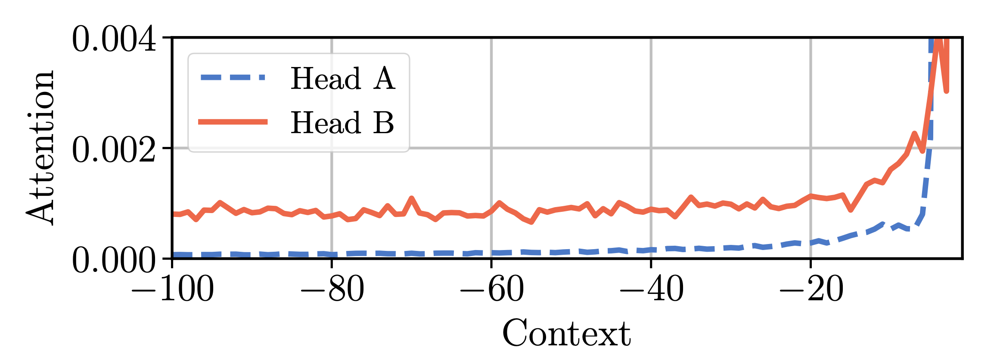
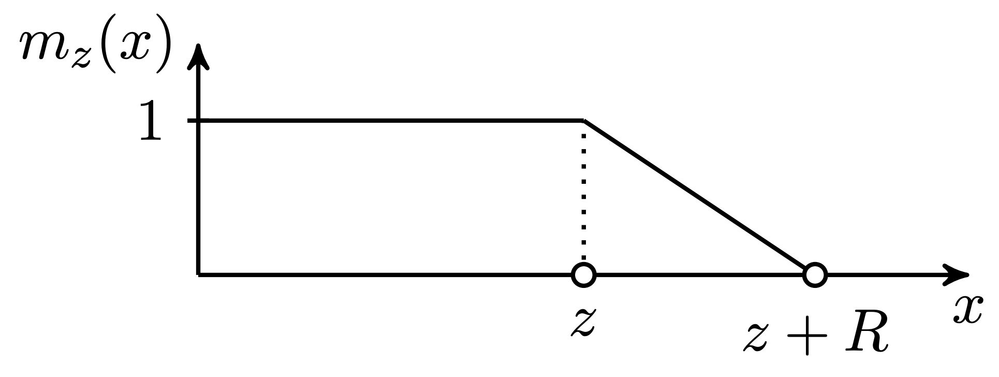
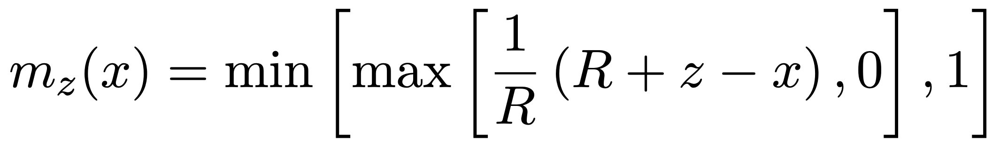
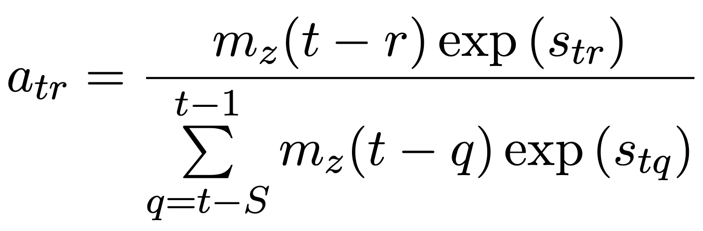
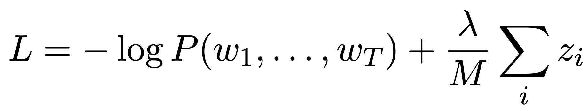
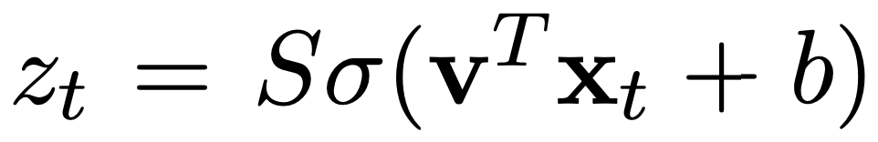
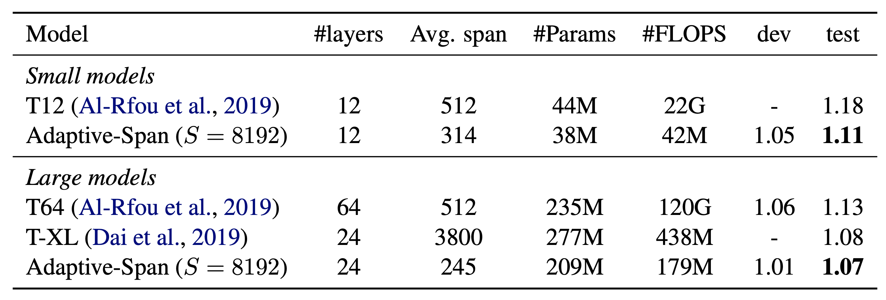
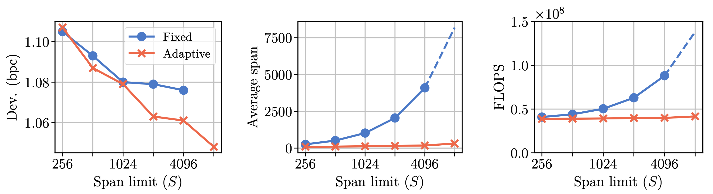
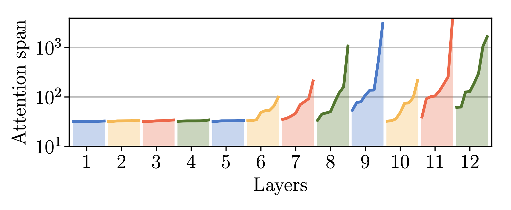

# Transformer之自适应宽度注意力

本篇文章是参考文献[1]的阅读笔记。

## 背景

相对于LSTM来说，Transformer几乎在所有的NLP任务上都能胜出。但是有一点，Transformer的时间复杂度是O(n^2)的，因为对于每一步，它都需要计算该步与之前的所有context的attention信息。但LSTM则是O(n)的复杂度。

这样的性质，使得Transformer在序列长度上很难扩展，基本上1k个token就是上限了。但对于字符级的语言模型来说，上千个token的输入并不是不常见。

所以论文提出了一种自适应宽度的方法，用了这种方法，可以使得输入长度大大扩展，达到了8k之长。

注意，在本文中，使用了文献[2][3]中的技巧。

## 动机

这个自适应的方法其实是来源于对不同head的观察，在普通的Transformer中，不同的head会学习到不同的attention其实宽度并不同，如下图所示：

headA关注到的是最近的20个，再往前的80个的权重很低。而HeadB关注到的则是全部的token。

因而，如果能有一种方法，使得我们能自动省略掉headA的不相干的计算，那么，就可以大大减少计算量。

## 实现

自适应宽度的实现借助了一个mask函数，函数公式和曲线图如下：

在计算attention的权重的时候，使用context和当前位置的距离来作为mask函数的输入。在学习过程中，z是需要学习的参数，对每个head，z都是不同的。attention权重的计算如下图：

在损失函数中，给z添加一个L1 penalization

作为扩展，我们也可以用网络的方式来学习z，即z是基于当前输入的一个输出。这种方式被称为动态宽度。

## 效果

效果，参数量和计算量之前的对比如下：

可以看到，相对于普通的Transformer来说，参数量并没有太大的降低，但是计算量却会有三四个数量级的减少。

随着input长度的增长，平均宽度，计算量的对比如下图：

可以看到，即使输入边长，计算量和平均的注意力宽度变化很小。

不同层次上的平均宽度如下：

可以看到，越是高层，attention的宽度越大。

另外，动态宽度和自适应宽度效果基本相似。不放图了。

## 参考

[1]. Sukhbaatar, S., Grave, E., Bojanowski, P., & Joulin, A. (2019). Adaptive Attention Span in Transformers. arXiv preprint arXiv:1905.07799.

[2]. Shaw, Peter, Jakob Uszkoreit, and Ashish Vaswani. "Self-attention with relative position representations." arXiv preprint arXiv:1803.02155 (2018).

[3]. Dai, Zihang, et al. "Transformer-xl: Attentive language models beyond a fixed-length context." arXiv preprint arXiv:1901.02860 (2019).
