# 纯注意力模型

本文是参考文献[1]的阅读笔记。

## 背景

可以在参考文章[2]中详细学习Transformer。本文下一部分也会对Transformer layer做简要介绍。

Transformer的出现使得NLP领域往前迈了一大步，这其中的功劳，就是Transformer中使用的多头注意力机制。

但是，在Transformer的每一个单元中，除了多头注意力机制之外，还有一个全连接层，全连接层在注意力层之后如下图所示

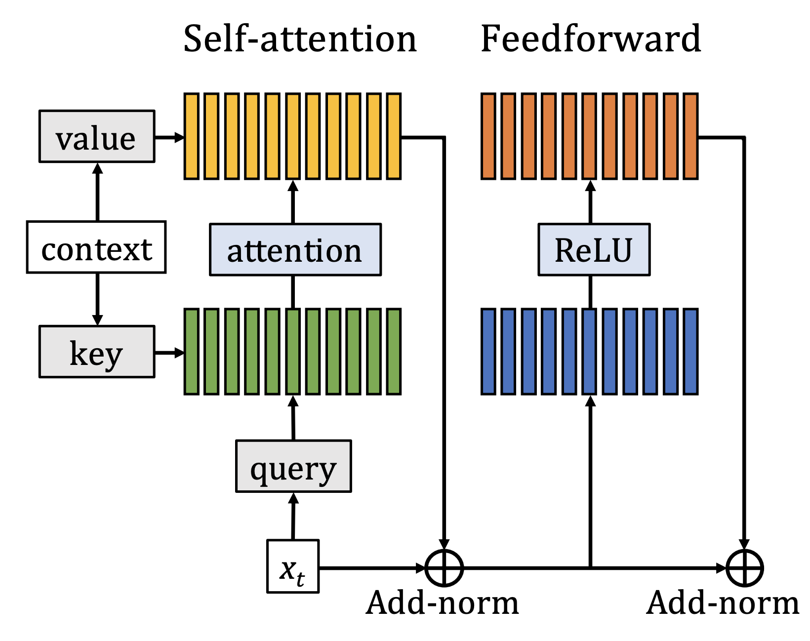

由于全连接层的参数量巨大，所以Transformer的效果好，可能不一定全是由注意力层带来的，全连接层也可能对最终的好效果有所帮助。

那么，可不可以去掉全连接层或者替代全连接层从而可以保持效果的同时降低参数量呢？这就是论文[1]的工作。

## Transformer层次

接下来我们先来简要介绍一下Transformer中每一个小层次单元的结构。结构如上图所示。具体步骤为：

1. context的信息可以转换为key和value
2. 然后对于输入x，先将其转换为query
3. 然后query和key去计算attention权重
4. 得到的权重将value组合起来得到结果矩阵
5. 结果矩阵经过add-norm得到输出
6. 再输入给全连接层
7. 再经过add-norm得到这个小结构的输出

在第一步，使用的公式如下：

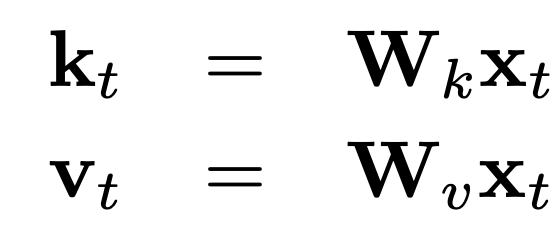

第二步和第三步使用的公式如下：
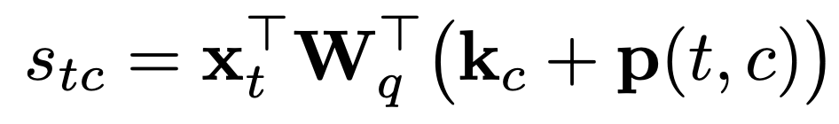

第四步公式如下
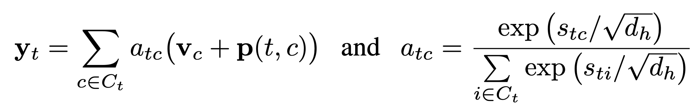

第六步公式如下：
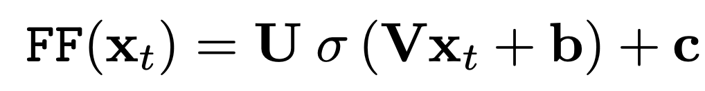

第五步和第七步的公式如下：
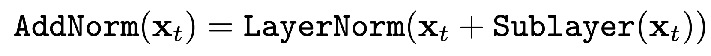

整个单元的公式如下：

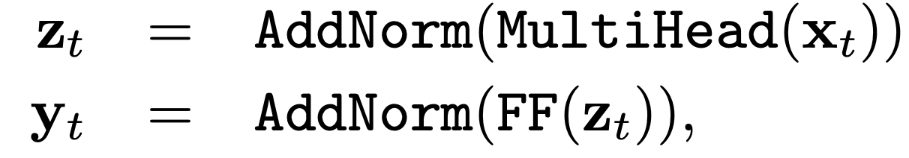

## 用attention替换全连接层

在计算全连接层FF(xt)的时候，我们使用的激活函数是relu，那么如果将激活函数替换成softmax，那么公式将变为

此时，有意思的事情是，我们发现这个操作跟上一部分第三四步计算attention权重的公式很像。这里的V和xt可以看成key和query，U可以看成value。

所以，我们可以把attention层+全连接层的结构替换为全部都是attention的结构，如下图：

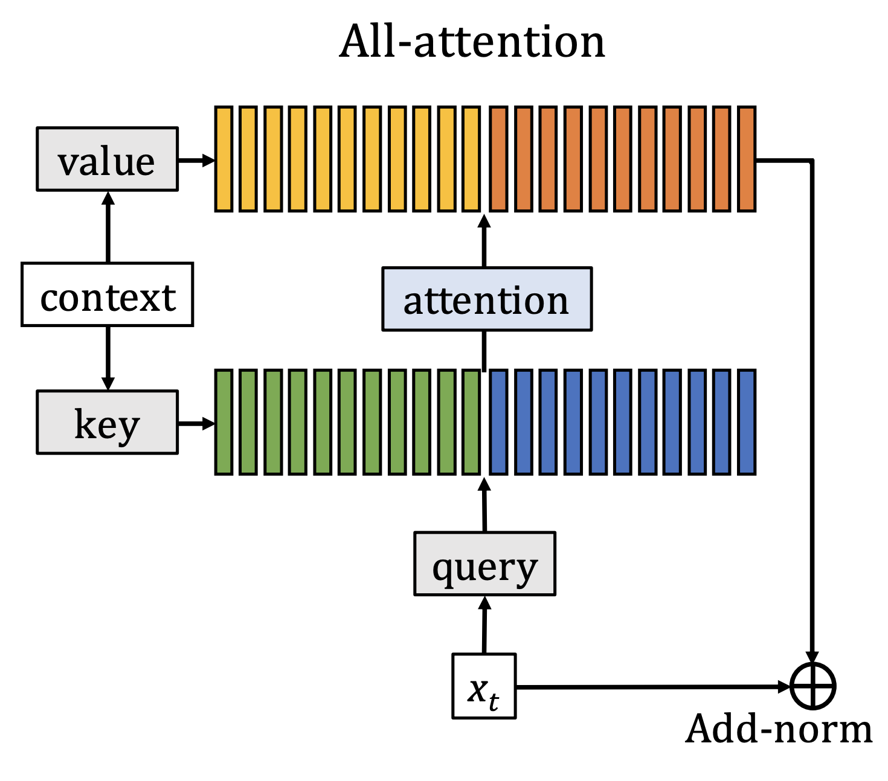

需要做的就是预定义N对矩阵，充当着key和value，然后对于输入x，可以按照多头注意力的方式去进行计算：

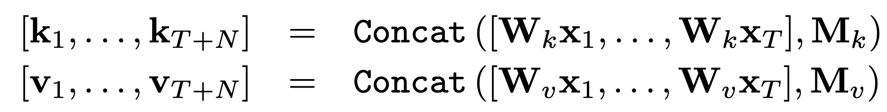
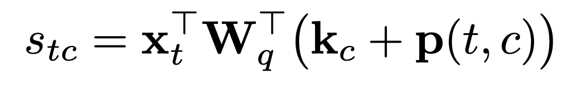
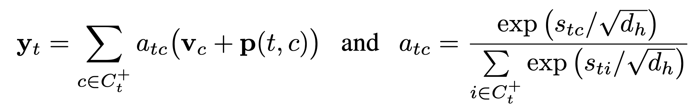

这里的N对矩阵是和输入无关，可以认为它们起的作用跟当初的全连接层中的参数矩阵起的作用一样。

因而，整个子结构就变成了：

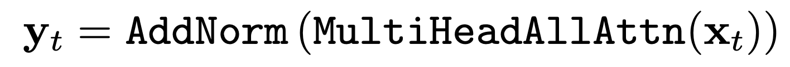

## 语言模型

试验过程中，对于使用transformer进行语言模型的建模中，还采用了几种技术：

- 相对位置编码
- 缓存(Transformer-xl)
- 自适应注意力宽度
- 自适应softmax

## 实验结果

在字符语言模型的效果如下：

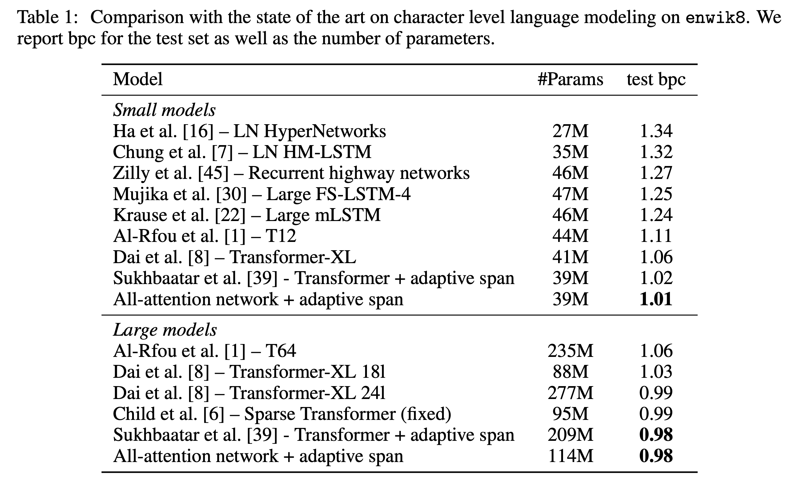

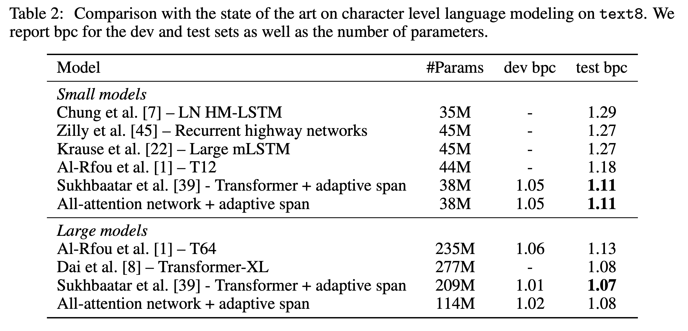

在word层次上的语言模型上的效果如下：

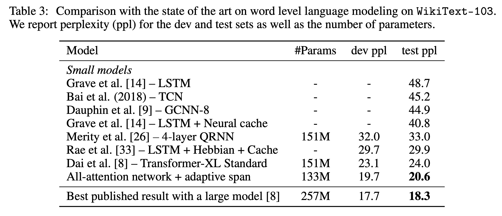

效果和预定义矩阵对的多少的关系如下
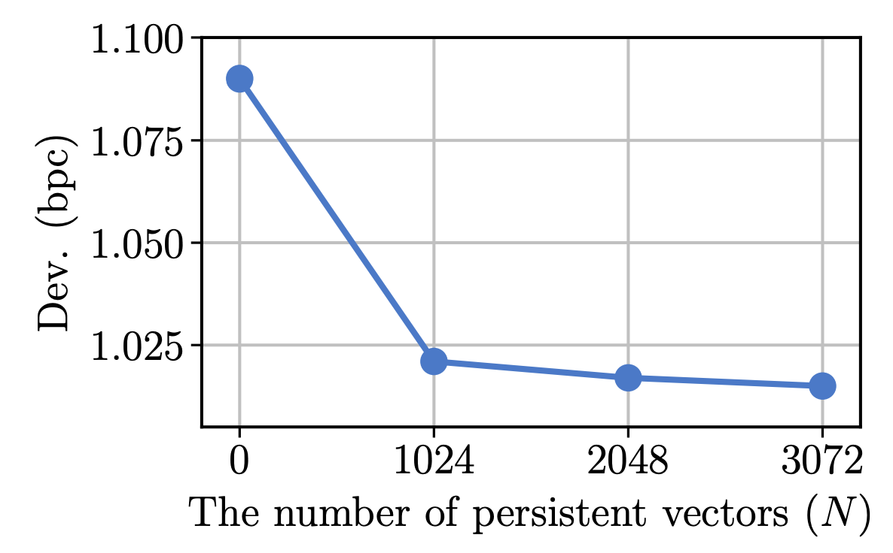

其他的合并方式的对比如下：

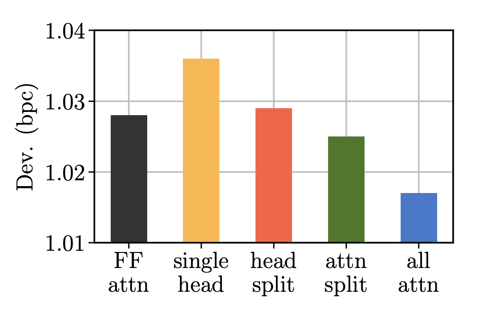

其中，

- all attn: 论文提出的方法
- att split: 原有的attention和新设计的attention分别计算权重和做加权
- head split: 一半的头用来计算原有的attention，一半来计算新加的。
- single head: 新设计的attention只有一个头
- FF-attn: 保持原有的全连接结构，只把relu替换为softmax。

## 参考文献

- [1]. Sukhbaatar, Sainbayar, et al. "Augmenting self-attention with persistent memory." arXiv preprint arXiv:1907.01470 (2019).
- [2]. Transformer技术讲解. [英文链接](http://jalammar.github.io/illustrated-transformer/) [中文链接](https://zhuanlan.zhihu.com/p/48508221)
