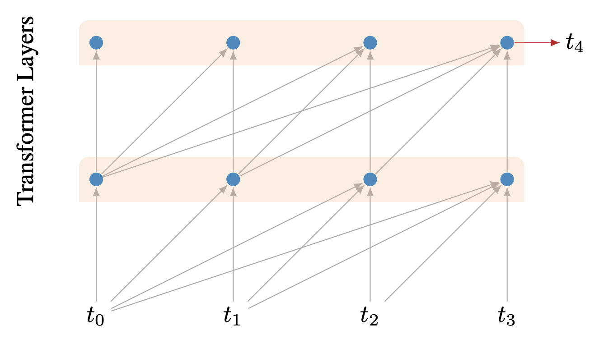
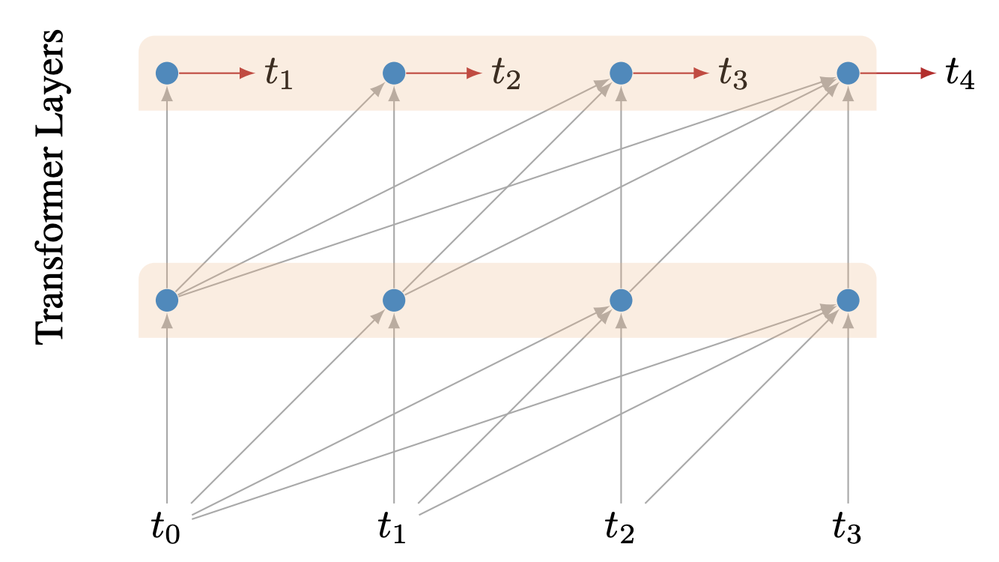
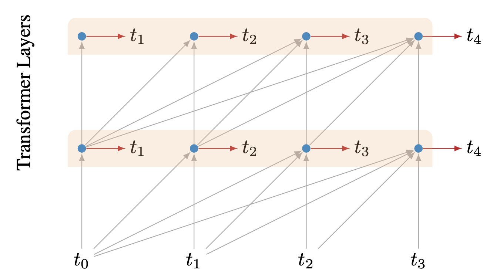
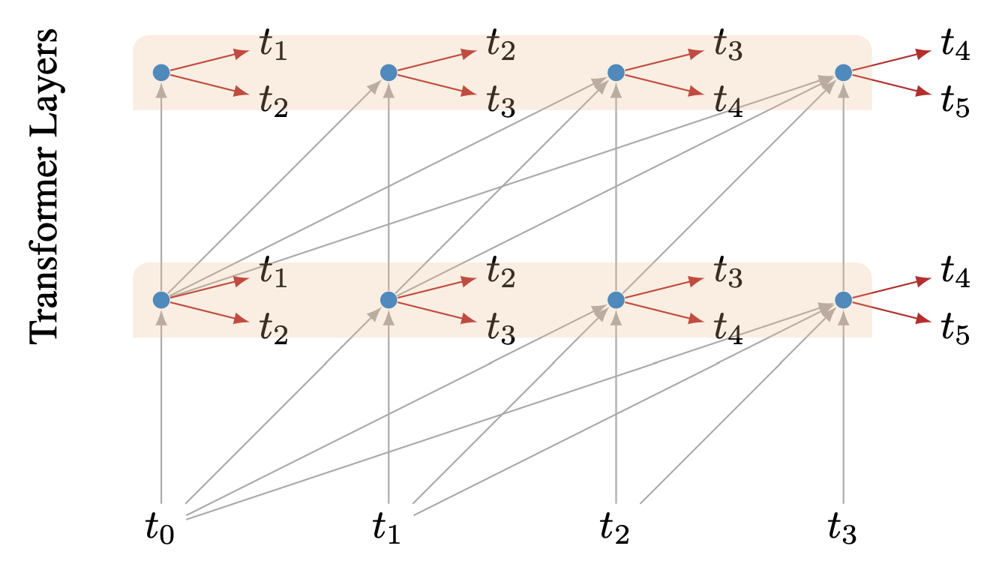
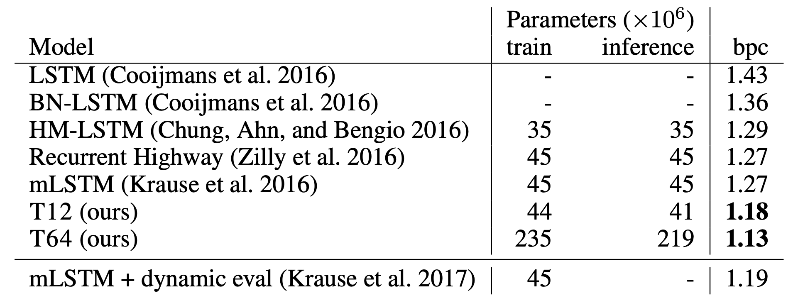
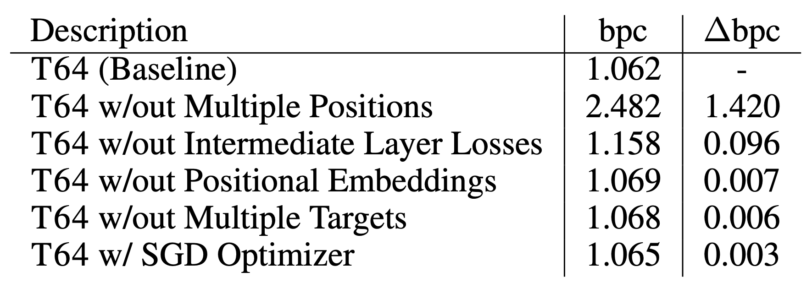

# 深度Transformer构建字符级语言模型

本篇是参考论文[1]的阅读笔记。

## 背景

LSTM称霸语言模型界有一段时间了，是时候退位让贤了。
有研究表明，word-level的LSTM语言模型大概只能用到最近的50个token，再长的context效果只存在于理论中。
Transformer作为后起之秀，一般会被认为能够胜任LSTM做的大部分事情。是因为它获取任意距离的信息的能力。

## 技巧

在论文中，训练了一个64层的char-level的Transformer模型，如此深的Transformer，恐怕在论文出来之时还是绝无仅有。因为训练一个深度的transformer太难了，收敛的会很慢。论文的贡献就在于提供了很多技巧可以使得模型的训练变得可行和稳定。

如下图所示，对于一个char的prediction任务来说，transformer模型会把所有的context都输入进来，然后再去做prediction。注意，这里在做inference的时候，transformer每次会重新计算所有的context，这点上比不过lstm，lstm可以做增量。

但在训练的时候，我们可以同时对多个位置去做prediction，这样可以加快收敛。如下图

除了最上层的损失之外，还有一个技巧就是给中间层也去计算损失。如何做呢？那就是在中间层的时候，也添加一个softmax去做预测任务。但是中间层的softmax在inference的时候是不需要的。如下图：

在这里，随着训练的进行，网络在一直收敛，这时底层的loss会变得越来越不重要。在论文中，如果有n层，那么第l层将会在训练步数的l/2n处不再起作用。这种设置将会使得在训练到一半的时候，中间层上的损失就不再起作用了。

另外一个技巧就是预测多个目标，除了预测下一个字符之外，还给模型添加了一个任务，那就是预测下下个字符，当然，这两个预测是用的不一样的softmax层次。而且论文中还设置了下下个字符的预测的权重是下个字符预测的一半。如下图

最后一个技巧则是关于位置编码的。由于层次太深，可能会导致位置编码信息在层次的传递中消失。因而，论文中针对每一层，都设置了一个可学习的长度为512的位置编码信息，会在数据输入给transformer前加到数据上。因而embedding的参数一共是L x N x 512。

## 实验结果

跟其他模型的实验结果如下图：

如果不用某种技巧的话，那么会有什么损失呢？见下图：

可以看到，不用多位置训练带来的损失试最大的。

## 参考
[1]. Al-Rfou R, Choe D, Constant N, et al. Character-level language modeling with deeper self-attention[C]//Proceedings of the AAAI Conference on Artificial Intelligence. 2019, 33: 3159-3166.
