# Darts: 可微结构搜索

本文是参考文献[1]的阅读笔记

之前给大家介绍过基于RL的网络结构搜索，基于遗传算法的网络结构搜索。这些方法有一个问题，那就是训练时间太长。因而诞生了许多以节省时间为目的，同时保证效果的算法，比如共享参数的ENAS，比如使用了超网络的SMASH（算是隐式的共享参数），比如performance predictor（通过预估来把不必要的训练给放弃掉）等。本文所介绍的Darts也是其中的一种。

基于遗传算法还有基于RL的算法之所以耗时比较长，是因为在这两种算法中，网络结构跟网络结构对应的参数是两回事，网络结构是离散的，要先确定网络结构，然后再去训练网络结构所对应的参数。因而耗时就长了。

Darts则不然，在Darts中，网络结构的确定是可微的，即可以把梯度传递下去的，这样，就使得网络结构的学习跟网络结构对应参数的学习在一起了。其实，在读了下文中的算法细节后，大家会发现，Darts也做到了不同结构间的参数共享。

## 可微结构搜索

### 搜索空间

在Darts中，网络结构单元被表示成一个有向图，节点表示数据，而边表示在数据上的操作。每个单元有两个输入还有一个输出。然后把若干个单元叠加起来就组成了一个完整的网络。

对于卷积网络而言，每个单元的输入可以是之前的任意一个单元的输出。而对于循环网络而言，每个单元的输入则是当前步的输入还有上一步的输出。每个单元的输出则是把单元中每个中间节点的输出都聚合起来（一般是拼接）。而每一个中间节点则是计算它所有的父节点上得到的值。

如下图中的a图所示，a图中每个边还没确定，我们可以先假设它已经确定了，那么可以看到，节点2是从0节点和1节点上分别做一个操作得到的。

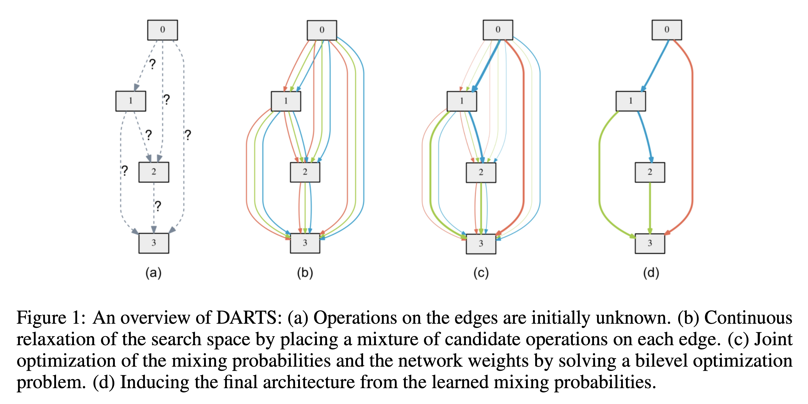

那么，Darts是如何做到在结构搜索上可微的呢？这一点是通过把选择概率化做到的，即在之前的很多算法中，选择一个操作就是选择一个操作，但在Darts里，选择是一个可以通过softmax进行计算的概率，如上图中的b图，节点之间可以有多个操作，这些操作通过概率聚合起来。概率公式如下：

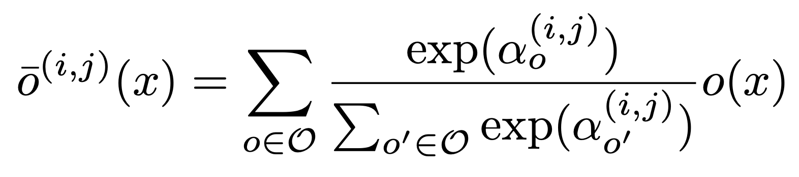

在公式中，可以看到，对于每一个边上的经过操作后的值o(x)，都会用Softmax得到一个概率，然后它们的加权平均就是训练时节点上的值。

在经过训练后，节点见的这些边就会有概率的大小之分，如上图中的c图所示。此时，概率大的边就是我们需要的边，把其他的边砍掉，再重新训练，就得到了最后的网络结构，即上图中的d图。

### 损失函数与优化

在这样的方法下，有两类参数，一类是与操作相关的参数，比如各种卷积操作等，一类是与边选择相关的参数，即计算边的概率的alpha，因而，我们的问题就变成了：

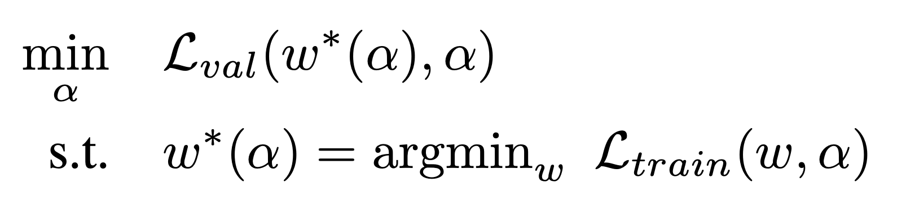

即在训练集上找到最优的参数w，然后在测试集上找到最优的参数alpha。

但是，完美的解决这个损失函数是不现实的，因为内层寻找最优w的操作是非常耗时的，因而，Darts算法做了一个近似，即循环学习alpha和w：

- alpha保持固定，优化w
- w固定，优化alpha

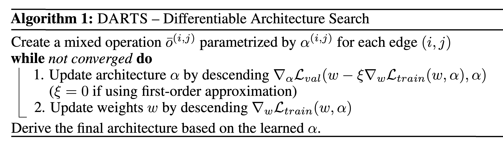

其中，优化alpha的公式可以展开：

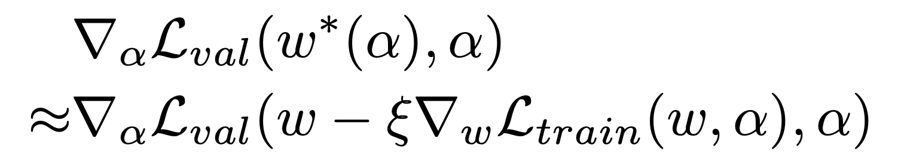
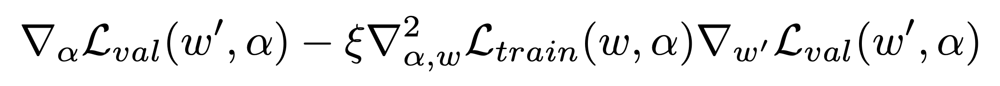

其中，

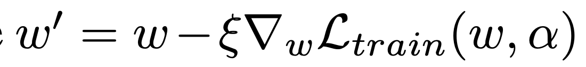

然后，二阶项可以被近似：

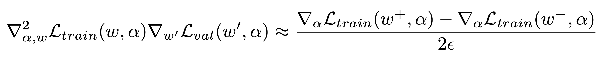

此时，如果ξ = 0，那么此时二阶的导数不起作用，此时实验结果表明，速度变快但是效果变差。

## 实验

在Cifar10， ImageNet的实验效果如下：

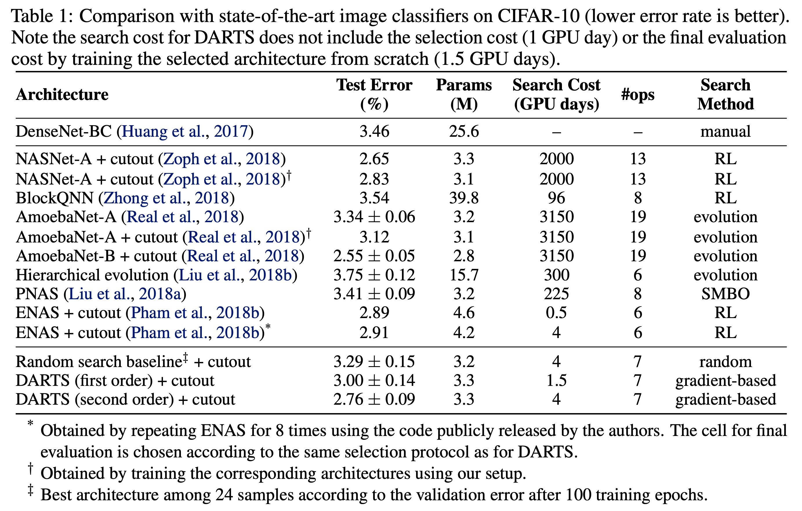
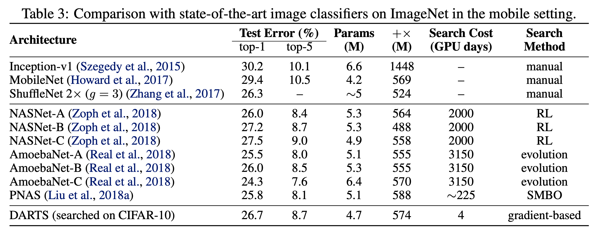

在PTB和WT2数据上的实验效果如下：

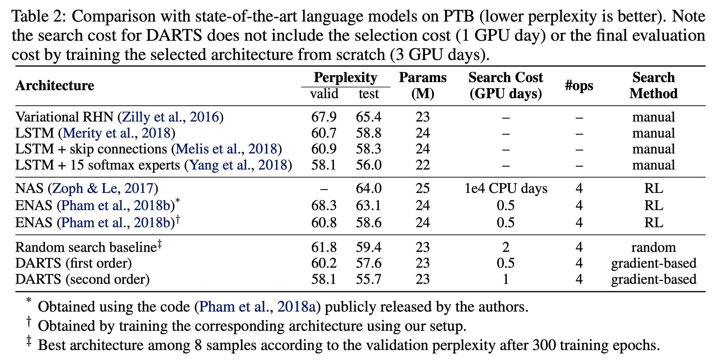
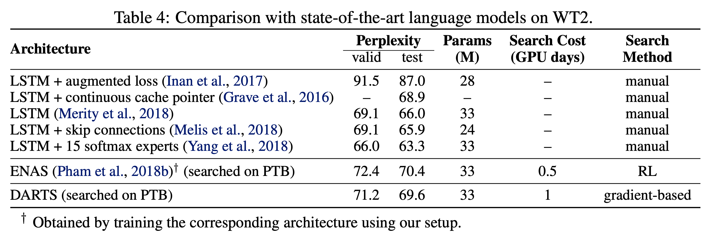

给CNN和RNN学到的网络结构如下

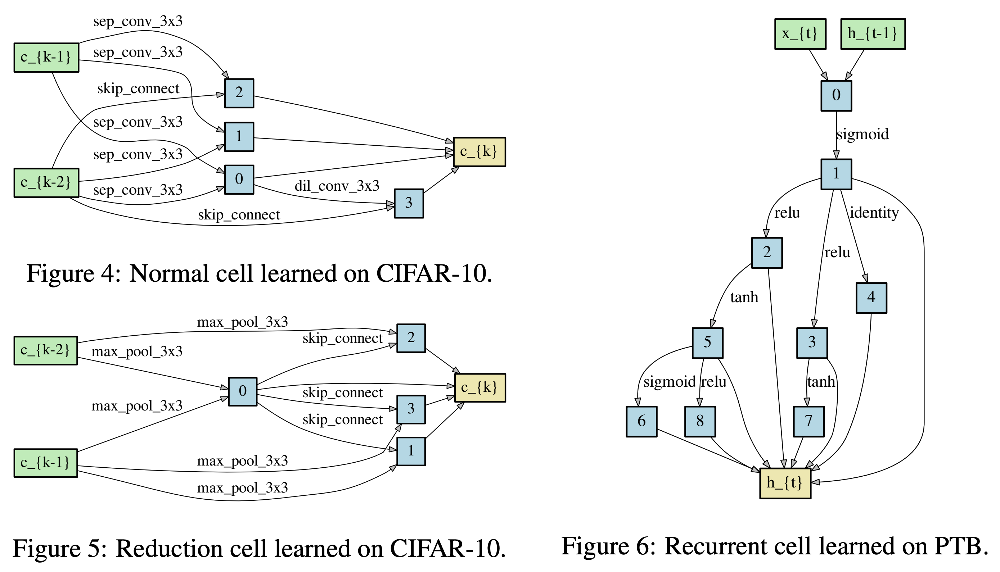

## 参考文献

[1]. Liu H, Simonyan K, Yang Y. Darts: Differentiable architecture search[J]. arXiv preprint arXiv:1806.09055, 2018.
