# 无数据知识蒸馏

本文是参考文献[1]的阅读笔记。

目前，很多模型上的工作都在使用知识蒸馏来压缩模型，但是，很多情况下，我们得到了大模型后，却很难拿到相应的数据。比如，如果数据有保密要求，或者数据量比较大，无法传到服务器等。那么这种情况下，还可以使用知识蒸馏来压缩模型吗？

当然可以，论文提出了一种基于对抗生成网络的方法来重构数据，然后再去做知识蒸馏。

## 对抗生成网络

关于对抗生成网络，我在博客中有相应的笔记（[传送门](https://blog.csdn.net/stdcoutzyx/article/details/53151038)打开），或者大家可以直接去参考文献[2]上去读原始论文。这里简要的解释一下，那就是网络分成生成器和判别器两个部分，生成器用来生成假数据，判别器用来判断数据是真的还是假的。生成器和判别器轮流学习，从而使得我们在最后得到一个较好的生成器。

对抗生成网络的损失函数如下，这个损失函数的目标是判别器把真数据和假数据区分出来的能力。

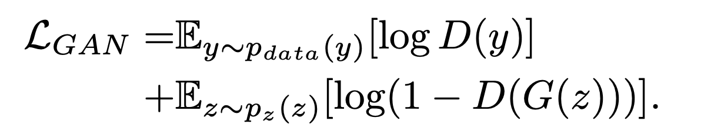

而训练GAN的目的则是找到一个生成器G，使得判别器无法区分真假。

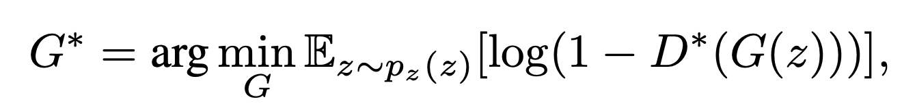

## 知识蒸馏

传统的知识蒸馏就是让student模型的输出尽可能的和teacher模型的输出一致。如下图

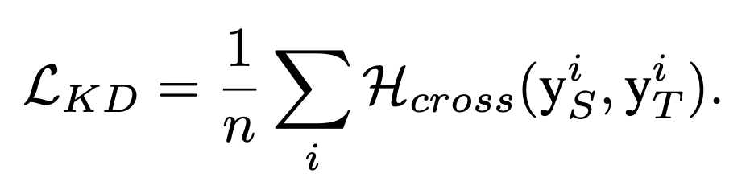

## 对抗生成网络 + 知识蒸馏 = 无数据知识蒸馏

基本的框架如下：

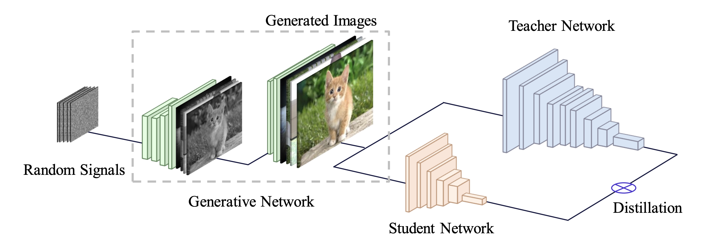

框架虽然明晰，但里面的细节问题却不少：

a. 如何能生成真实的图像？
b. 如何保证生成的数据集分布与原始数据集一样？

对于问题a，论文中提出了两个损失项，

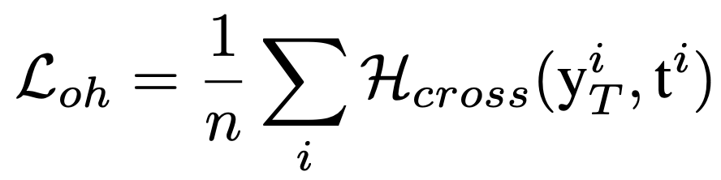

Loh代表的是，生成的图像经过判别器之后得到的概率分布要尽量贴合one-hot编码。在这里的隐含假设是判别器很强大，可以对每张图像都有一个很强的分类结果。

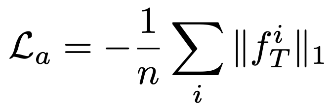

La则代表的是对于生成的图像，经过某个卷积提取特征后，要有比较强的激活值。这里的隐含假设是判别器中的每个特征提取器都是很有效的，真实图像在经过特征提取器后应该能得到很高的激活值。

而对于问题b，则是将输出的概率聚合之后去算熵值，来使得从类别上的样本分布符合原始数据集。这里拟合的是均匀分布，即每个类上的样本数目一样。

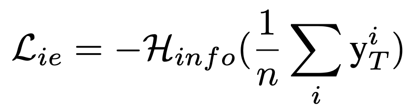
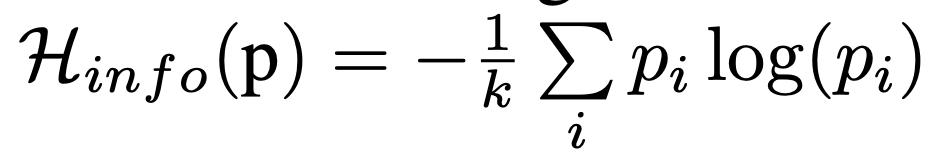

而总的损失函数是：

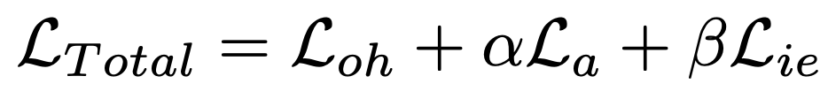

## 训练流程

有了损失函数后，整个训练就分成了两部分，第一，基于teacher去训练生成器，第二，基于teacher和生成器去做知识整理。如下图所示：

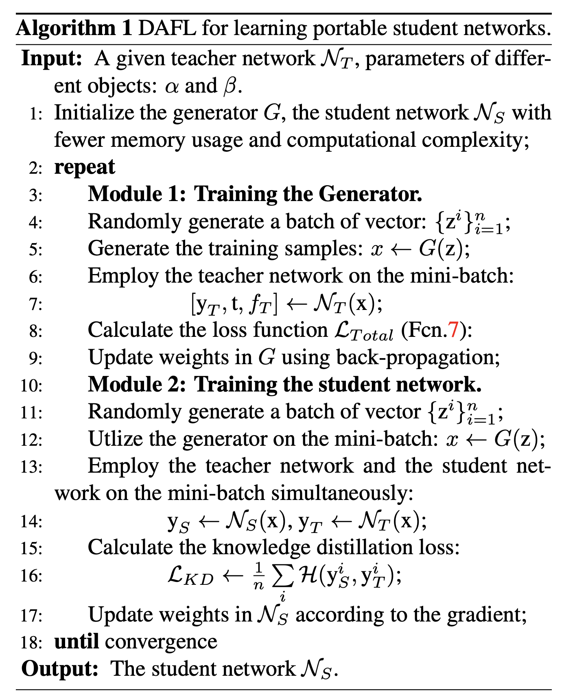

## 实验结果

实验结果如下图，可以看到，在没有数据的情况下，论文提出的方法可以和有数据的情况下相当接近。

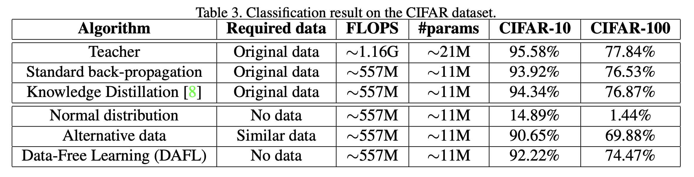

## 参考文献

[1]. Chen, Hanting, et al. "Data-Free Learning of Student Networks." arXiv preprint arXiv:1904.01186 (2019).
[2]. Ian J. Goodfellow. Generative Adversarial Nets.
