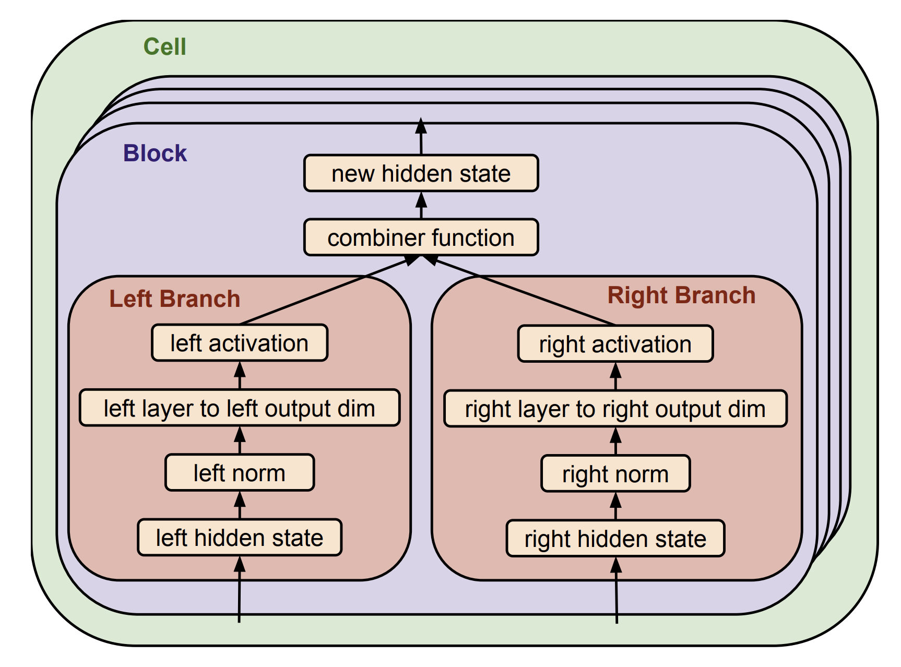
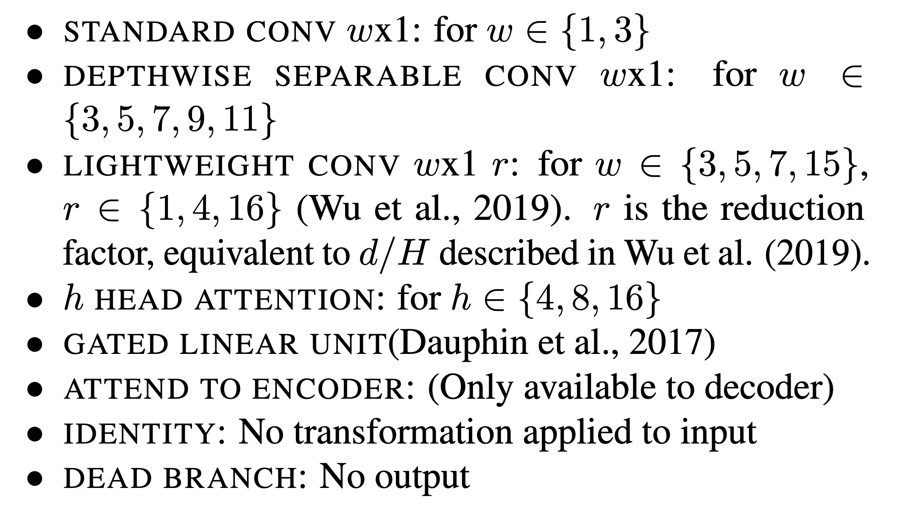
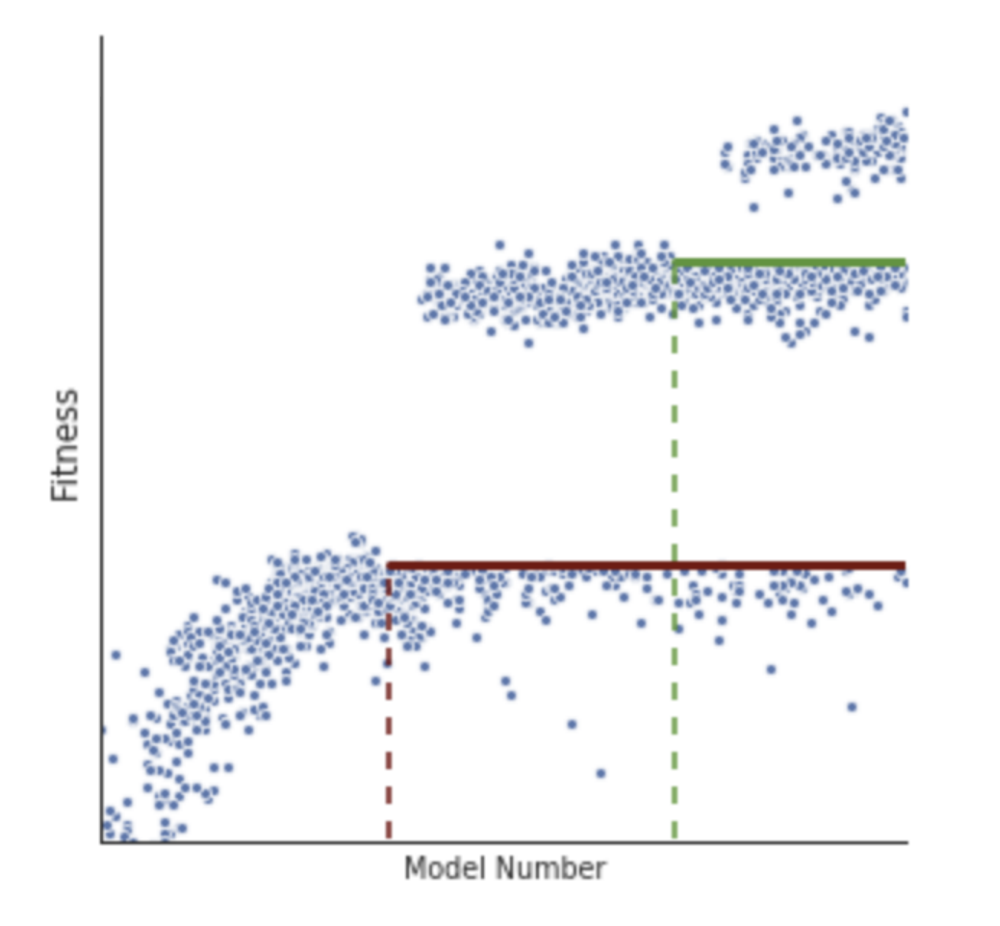
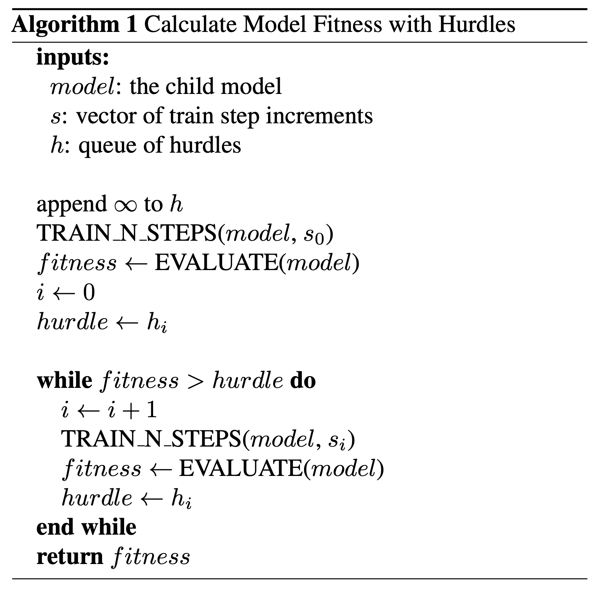
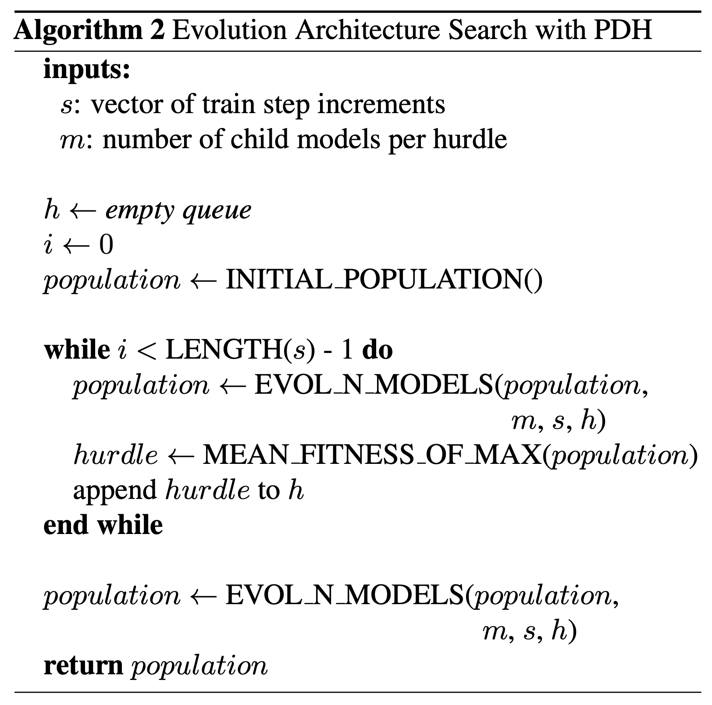
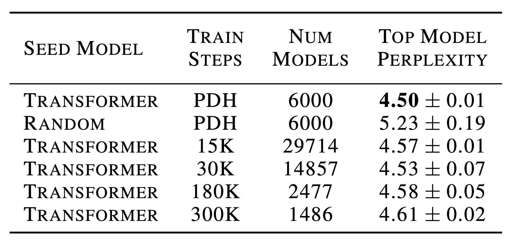
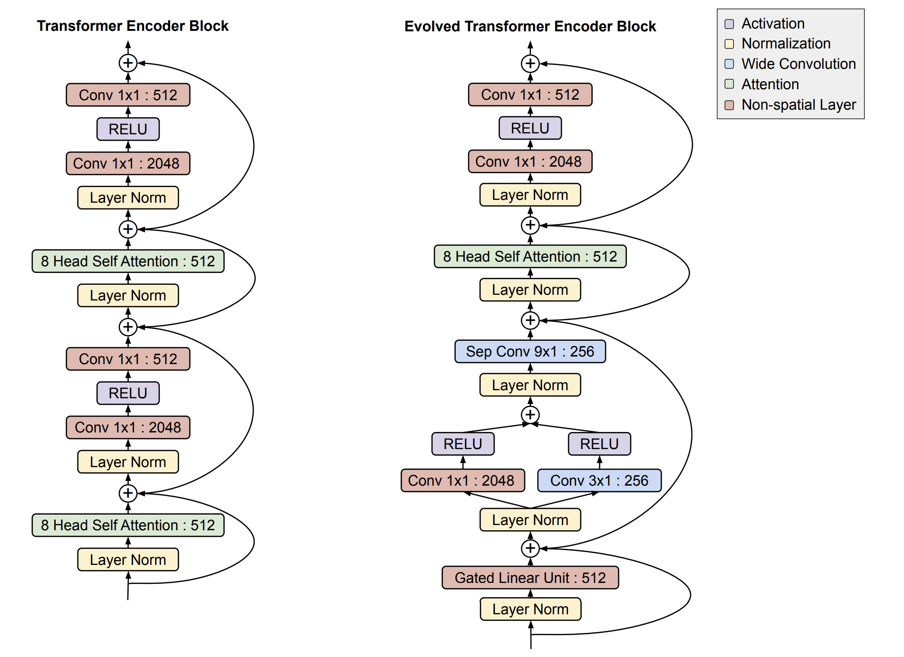
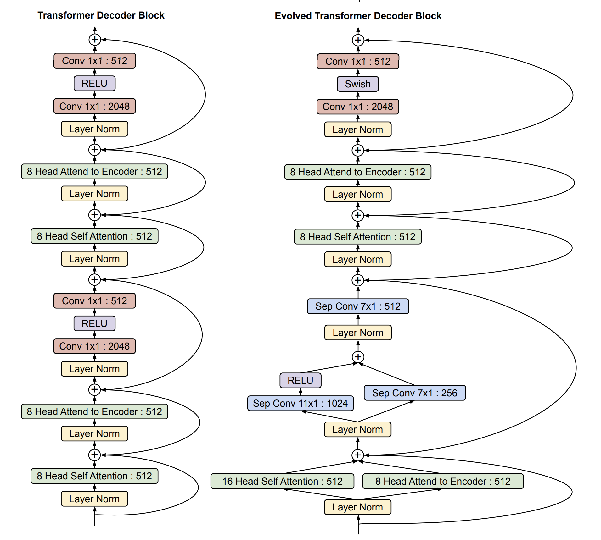
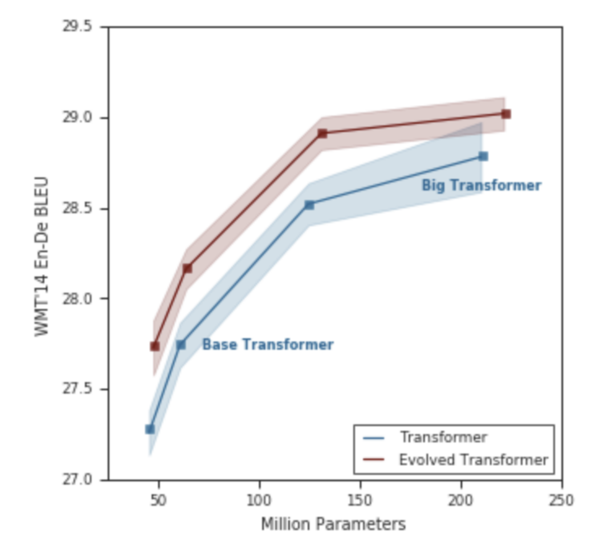

# 进化的Transformer

本文是参考文献[1]的阅读笔记。

## 背景

- 有许多的网络结构搜索(NAS)算法，基于RL的，基于遗传的。但是这些算法大部分都是在计算机视觉领域上进行的验证，在NLP任务上的网络结构搜索少之又少。
  - 基于RL和遗传算法的网络结构搜索之前给大家介绍过。[进化搜索](https://zhuanlan.zhihu.com/p/89817058), [RL搜索](https://zhuanlan.zhihu.com/p/36301731)
  - 上述两种方法都比较耗时，所以有一些节约时间的方法，比如DARTS，ENAS， SMASH，SNAS等
- LSTM在序列式问题上霸屏已久，或许是因为LSTM待得太久了，导致NAS没有太大的用武之地。但是三十年河西到了，基于卷积的网络，基于transformer的网络纷至沓来，LSTM江山难保。
  - 基于卷积的网络包括WaveNet，Gated Convolutional Networks，Conv Seq2Seq。
  - 基于Attention的网络包括Transformer。
  - 还有一类火的方向是基于Pre-train的Transformer网络，包括Bert，GPT，XLNet等，不过这几个跟本文关系不大。
- 论文首次尝试了在序列式问题上进行网络结构搜索，一方面是弥补这个空白，说的白话点就是填坑；另一方面就是通过大量的实验来看在序列式问题上做结构搜索跟在视觉上做有什么区别。

因为Transformer模型在序列式问题上表现最优，因而论文以Transformer为蓝本进行结构的搜索。这就有几个挑战：

- Transformer本身结构已经相当复杂：
  - 如果随机开始搜索的话，那么可能连Transformer的性能都达不到。
  - Transformer及其体型差不多的模型比视觉上在cifar10上训练的卷积模型要大很多，更耗资源。
  - ENAS和DARTS之类的算法在Transformer上消耗的内存太大。

## 算法细节

### 算法流程

论文采用的方法跟[进化搜索，参考文献[2]](https://zhuanlan.zhihu.com/p/89817058)类似，但是算法中没有age信息。算法流程如下：

- 随机产生一个集合，集合中的每个元素对应一种网络结构。
- 每个网络结构都去训练和评估，采用的训练任务是WMT'14 En-De的翻译任务，指标是perplexity。
- 从这个集合中选择较好的模型结构作为基本去进行修改，得到新的模型加入集合，同时集合中的较差的结构被删除。
- 这个流程最后会得到一组有较高评分的模型结构集合，就是我们需要的结构了。

### 搜索空间

对于任何搜索问题来说，搜索空间是必不可少的，对于论文中的任务来说，搜索空间需要保证一点，即当前的Transformer模型在搜索空间中。

搜索空间的结构如图：

这个结构单元跟CV下的NAS类似，都是任选输入，经过操作去合并。但是这里只有一次这样的操作，而CV上的操作则进行五次组成一个block。但在这里跟CV里不一样的是，CV中block学完后重复几次就成了整个网络，而这里则是每个Block都不一样，因而需要学习14个block。其中6个是Encoder的，8个是Decoder的。所以论文的搜索空间是：

[left input, left normalization, left layer, left relative output dimension, left activation, right input, right normalization, right layer, right relative output dimention, right activation] x 14 + [num of cells] x 2。

考虑到每个项的扩展，搜索空间大概有7.3x10^115大小。

关于layer项，本文可以用的层次类型如下图，其他项的空间大家可以去看原始论文的附录。

如此大的空间，显然会有很多没有用的网络结构，因而，论文做了进一步的空间约束：

- 为了使模型之间具有可比性，把模型的参数量限制在59.1M~64.1M之间，base Transformer有61.1M，因而这个参数区间就是base transformer的参数量的3M区别之内。参数量在这个区间之外的模型被排除掉。
- 在没有限制的时候，发现了几个会对模型有明显伤害的操作，也被禁止：
  - 如果decoder的block没有到encoder的attention，排除
  - layer normalization变成None这个操作被禁止
  - 好的模型会有一条残差连接，一路从输入连到输出，不符合这个特性的结构被排除。

### 暖启动

为了使得搜索算法运行的更快，论文的一个trick就是用已有的Transformer作为起点。即Transformer在最开始的集合中，这样，保证了初始集合中肯定有一个比较好的模型。

### 提前结束训练

之前说过，Transformer训练时间很长，比cifar10长很多，为了使得模型更快的训练和评估，采用了很多手段：

- 使用部分数据
- 提前结束一个结构的训练。

而对于提前结束训练，采用了一种渐进式动态阈值的方法，这种方法使得没有希望的模型被尽早停掉。算法如下：

- 对于初始的结构状态集合，比如有m个模型，让它们分别训练s0步，这样，每个模型都有一个评估值。
- 所有在s0步的评估值的平均值就是阈值，低于这个阈值的停止训练，高于这个阈值的则继续训练s1步。对于变异产生的新模型，也要符合这个条件，即训练到s0步时必须超过阈值才能训练到s0+s1步。
- 对于训练到s0+s1步的模型，也同样会计算这个均值作为阈值。高于阈值才能继续训练。这样，又有一大批模型止步于此了。

有一张图可以很直观的解释这个流程：

还有两段伪代码来说明这个过程：

为什么这个方法有效？这是因为在这里是做了一个假设：那就是所有的模型不会过拟合，同时效果随着训练步数的增长而变好。这样，两个模型最终结果的比较才能被替换为两个模型在某个训练步数上的比较。虽然不严格，但是因为阈值只是均值，其实很松，所以潜在的好模型还是大概率会被留下。因而方法很实用。

这样的好处也很明显，大量的没有希望的模型的计算资源被节省了出来。

## 结果

### 技巧对比

论文的方法跟Random启动方法和没有渐进式动态阈值的方法相比，效果如下：

在最后四行中，可以看到，训练步数越大，模型数目越小，这是因为比较的条件是消耗的资源不变。

可以看到，random启动方法非常差。而没有动态阈值的方法，得到的模型方差比较大，且最终的模型效果也不如渐进式动态阈值的方法好。

对于把训练步数平均分的方法，虽然没有动态阈值那样的把好模型丢掉的风险，但是因为训练步数少，所以最优模型的断定会有风险，这也是为什么第三行比第四行差的原因。

### 模型结构

最后搜索得到的模型结构如下：

可以看到，最后的模型跟transformer的区别则是在encoder和decoder的底部，会倾向于使用depth-wise separable convolutions。

### 模型大小和性能

如果尝试通过调整embedding和hidden state的大小把模型参数量调整到同一水平，那么效果如何呢？见下图：

可以看到，在同等效果下，evolved transformer的参数量要少很多（37%）。

## 参考文献

- [1] So, David R., Chen Liang, and Quoc V. Le. "The evolved transformer." arXiv preprint arXiv:1901.11117 (2019).
- [2]. Real E, Aggarwal A, Huang Y, et al. Regularized evolution for image classifier architecture search[C]//Proceedings of the AAAI Conference on Artificial Intelligence. 2019, 33: 4780-4789.
