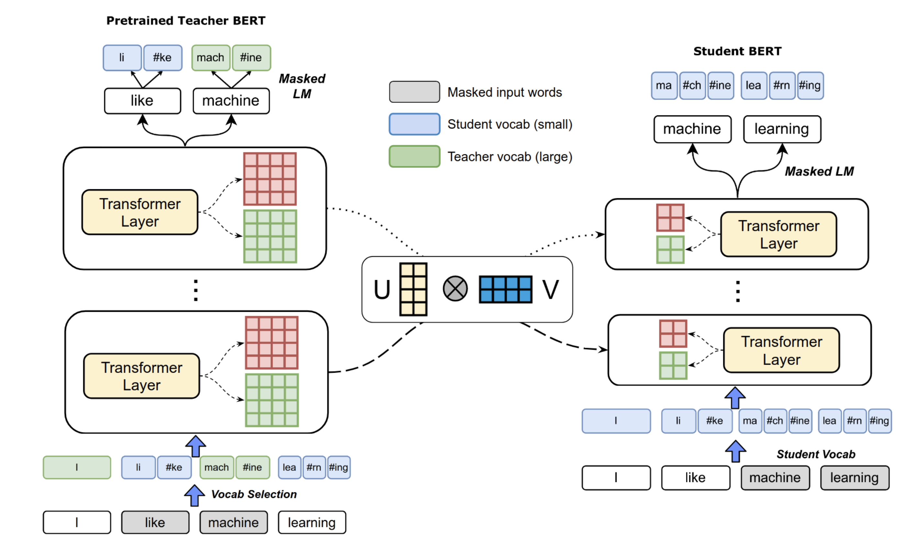
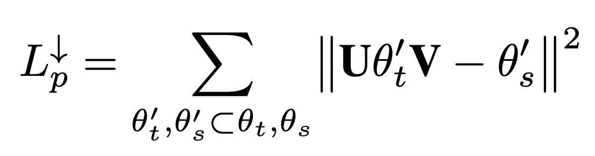
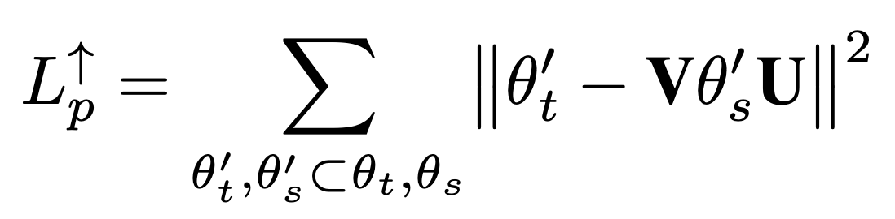
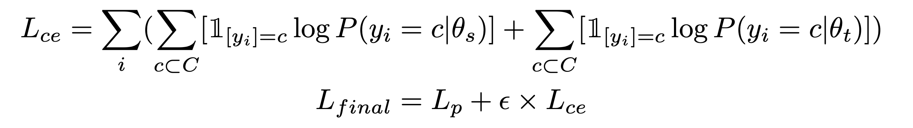
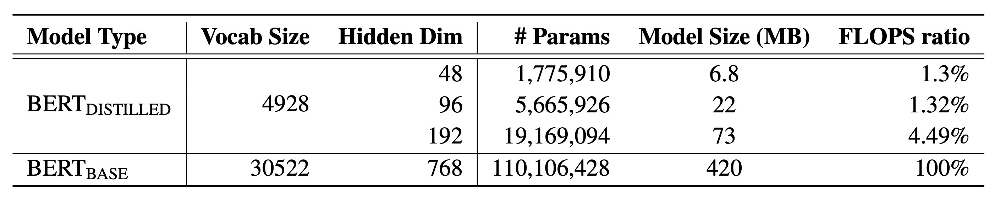

# 语言模型的极致压缩

本文是参考论文[1]的阅读笔记。又是好久没有总结过了。

## 背景

近年来，预训练的模型如火如荼，ELMo, GPT, Bert, XLNet层出不穷。已经远远的把之前的简单版的预训练模型如Word2Vec, GloVe等丢在了身后。但是这些模型都是大体量的模型，在移动端设备上实际状态下处于不可用状态。

要使得这些模型在移动端可用，必须做模型压缩。

在神经网络的语言模型中，词表的大小其实很大程度上决定了模型的大小。在LSTM的语言模型上，假设使用的word embedding长度是256，使用的是2层256的LSTMCell，此时忽略全连接中的偏置的话，第一层LSTM的参数数目是4 x 256 x 256 = 2 ^ 18， 第二层LSTM参数数目是4 x 256 x 256 = 2 ^ 18, 所以一共是2 ^ 19个参数，而如果词表是2^13 = 8192个的话，词语的embedding的参数量则是 2^13 x 256 = 2 ^ 21，然后LSTM输出后到预测的全连接也是256 x 2^13 = 2 ^ 21, embedding和输出全连接加起来是2 ^ 22，比2^19多出8倍。占据了多数的参数。

而在Bert中，embedding的参数据计算占据了整个模型的21%，虽然因为模型层次比较深使得模型部分的参数变多了，但是词语embedding仍然占据着很大一部分。

所以，想做模型压缩，词语embedding是一个不得不考虑的因素。

## 常用的压缩技巧

关于神经网络的模型压缩，有如下几种常用的技术：

- 矩阵近似，把比较大的参数矩阵进行分解，比如SVD，然后去除一些对最后结果影响较小的部分。达到降低参数的效果
- 参数剪枝，把对最后结果影响不大的参数直接去掉。
- 参数共享，有些矩阵可以共享，比如上面所提到的词语embedding和输出层。
- 权重量化，用8bit整数替代float类型，将模型size直接变为原来四分之一。这点tensorflow直接支持。
- 知识蒸馏，一种知识迁移策略，可以用大模型的结果去提升小模型，用最后的小模型去做部署。

论文中所涉及的主要是对知识蒸馏的改进。

## 论文亮点

知识蒸馏[2]被提出以来, 大家发现它在模型压缩上的应用前景巨大。但是原始的方法有一个问题，那就是需要保证词表一样才可以去做大模型到小模型的知识迁移，因为这样，输入和输出空间都一样。论文中提出了一种对偶训练的方式来解决这个问题。

### 对偶训练

如下图所示，左面是一个30522 wordpiece词表的Bert模型，大小是12-layer, hidden-state和embedding都是768，是一个已经预训练好的模型Bert-base，在这里被用作Teacher模型。
右面是一个4928 wordpiece词表的模型，是student模型，需要注意的是，student模型中的词表不是teacher模型词表的子集，而是互有交叉的关系，student模型的词表中的93.9%的词语在teacher模型的词表中。

因为词表不同，所以teacher模型和student模型对一个词的切分可能是不同的，而且，Bert训练时的output可能也是不同的。这样原始的知识蒸馏的方法就不能直接使用了。这就需要有对偶训练。

对偶训练的思想也很简单。首先，teacher模型的参数不再是不变的，而是需要再做一些fine-tune的。对于teacher模型来说，输入本来应该用teacher模型的词表去做切分。但在对偶训练中，我们使用概率p随机从序列中选取一些token，用student的词表去做切分，然后其他词还是用teacher模型的词表来切分。如上图中所示，上图左图的输入中，绿色部分I 和machine是用teacher的词表切分，蓝色的like和learning用student的词表做切分。这样，teacher模型就可以完成两件事情：

- 当context是teacher词表切分的时候，可以预测student词表中的词语。
- 当context是student词表切分的时候，可以预测teacher词表中的词语。

需要注意的一点就是，teacher模型虽然既可以预测student词表中词语，也可以预测teacher词表中词语。但在预测mask的词语的时候，student和teacher词表中的词语是用不同的softmax layer的。

### 共享映射

在知识蒸馏时，只用teacher的输出作为要学习的知识给student可能还不够，在论文中，提出了一种共享映射的方式，在这种方式中，给teacher模型中的参数乘以两个矩阵U和V，使得这个参数和student模型中对应位置上的参数有一样的维度。此时再用L2损失去计算参数之间的距离。示意图如上图，公式如下图。

这种方式还可以反向，即给student模型中的参数乘以两个矩阵，去和teacher模型中的参数做L2 loss。如下图：

当然，这种方法中，U和V在inference的时候是不需要的。它们只是做蒸馏用的桥梁。而且有这个损失的话，模型层数就需要跟teacher一样了。

### 损失函数

损失函数的部分包括：

- 映射参数的L2损失
- student的masked LM交叉熵损失
- teacher的masked LM交叉熵损失（因为需要混合词表，所以teacher还需要训练）

所以总的损失函数为：

## 实验结果

不同的小模型的参数量和计算量如下：

在下游任务上的结果如下：

从结果中看， 对偶训练可以一直带来提升。 ShardProjDown比ShardProjUp更有优势一些。

## 参考
[1]. Zhao S, Gupta R, Song Y, et al. Extreme Language Model Compression with Optimal Subwords and Shared Projections[J]. arXiv preprint arXiv:1909.11687, 2019.
[2]. Hinton G, Vinyals O, Dean J. Distilling the knowledge in a neural network[J]. arXiv preprint arXiv:1503.02531, 2015.
