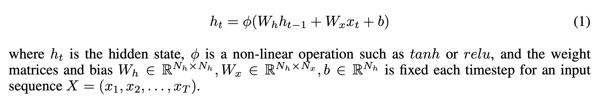
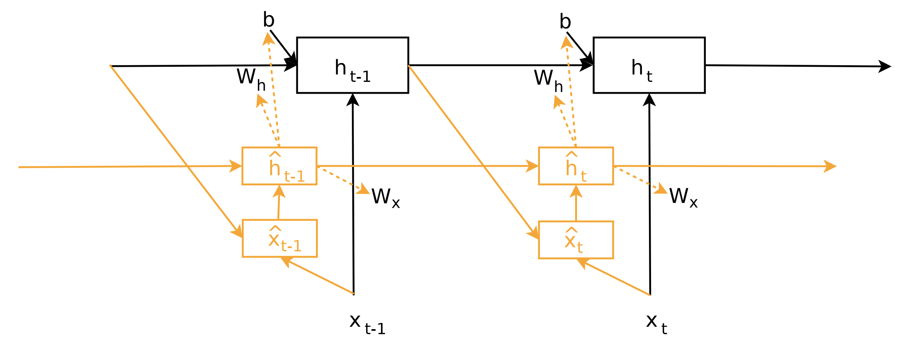
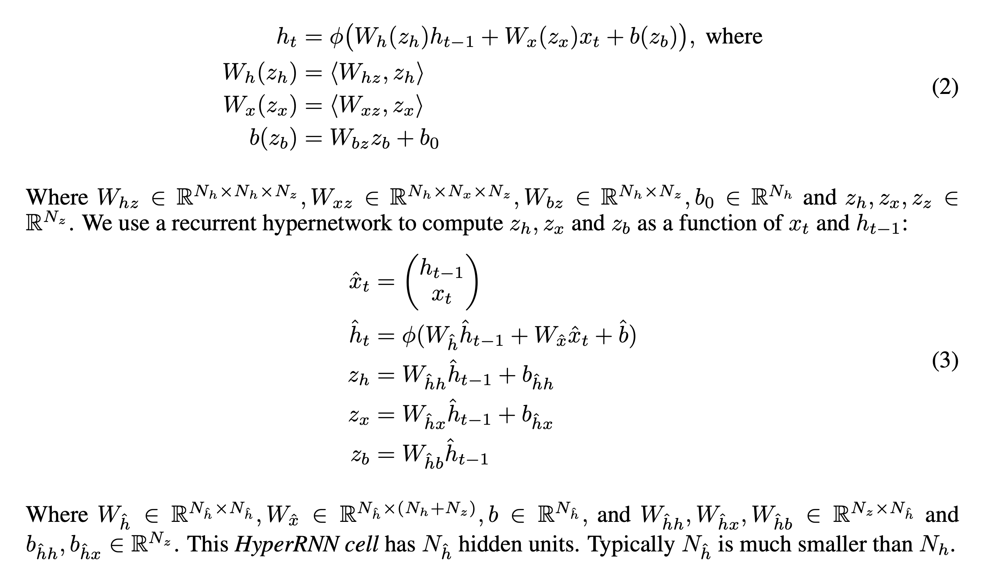
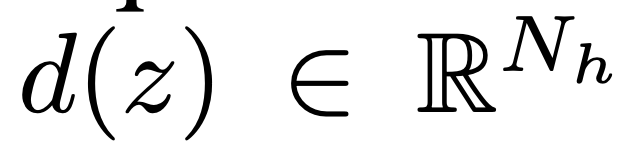
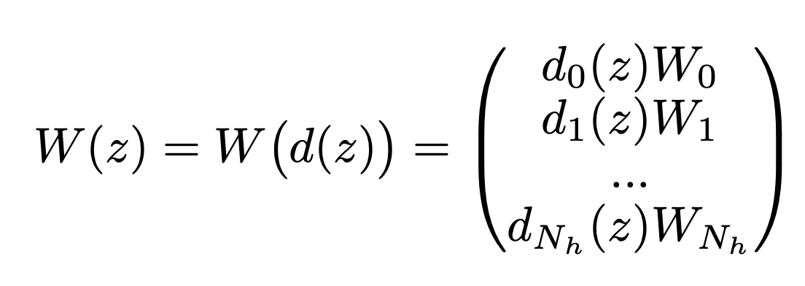
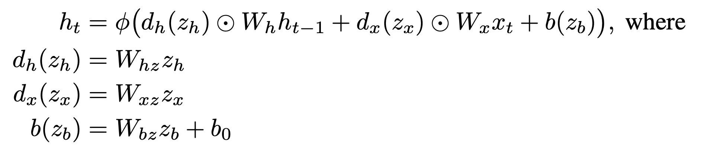
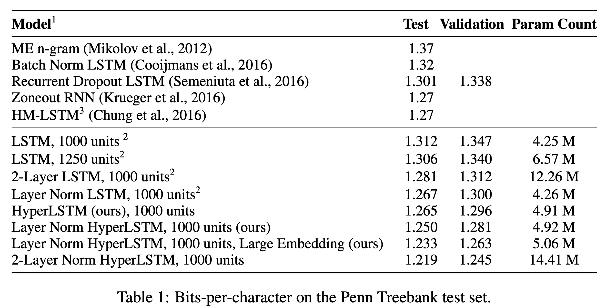
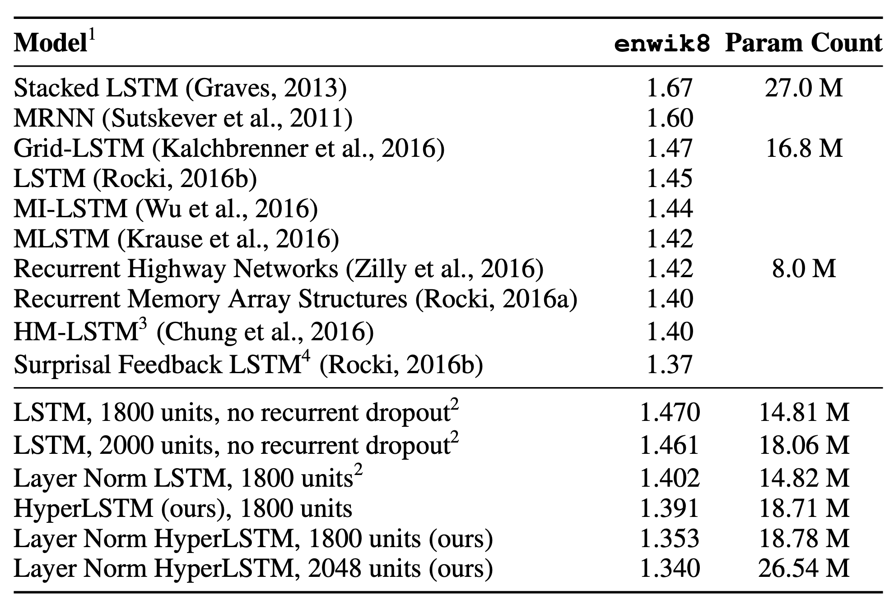
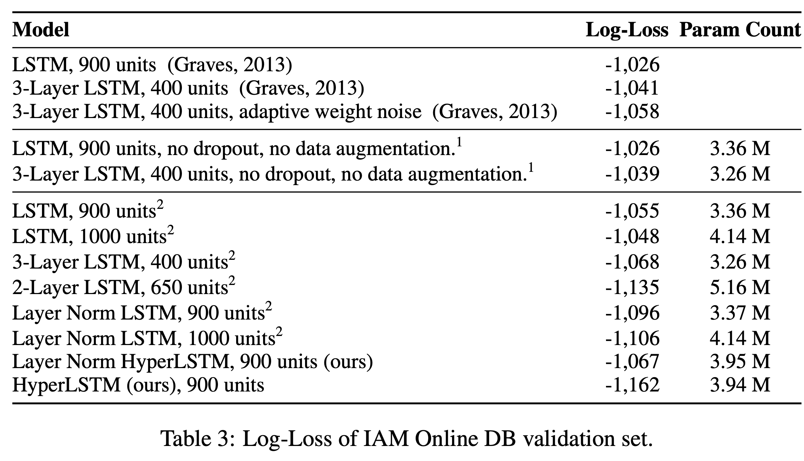

# 超网络

本文是参考文献[1]的阅读笔记。

## 网络生网络

今天读的这片论文很有意思，是网络生成网络的一篇论文。具体来说，就是用一个RNN或者LSTM生成另外一个RNN或者LSTM，然后生成的LSTM再去完成各项任务。

这样做有什么作用？这样做的话，一般来说元网络比生成的网络要小。所以：
- 对于生成网络来说，相当于一种松散的参数共享，有点网络压缩的意味。
- 元网络小，说明空间小，可以用来做高效的网络结构搜索。

## HyperRNN

对于原始的RNN来说，公式如下：

而变成HyperNetwork后，Wh和Wx以及b都不是独立的参数了，而是由元网络生成的。如下图所示：

因而，此时，公式变为：

## 优化

但是，我们注意到Whz是一个三维矩阵，这就使得参数量急剧增加了。参数量暴涨之后反而学不到什么东西。论文中提出了一种方法来解决这个问题，那就是改变生成参数的方式，在上面的方法中，在得到z之后，我们会使用一个三维矩阵来乘以这个向量，得到一个二维矩阵。而在新的方法中，添加了一个中间层d，如下图所示：

这个中间层会把z的维度从Nz变成Nh，在做了这个操作之后，再添加一个要学习的二维矩阵Wh，让d(z)去按行去缩放Wh，如下图所示：

用这个操作之后，我们失去了生成整个权重矩阵的能力，但是我们仍然可以使用元网络的输出去修改参数矩阵（按行缩放），这是一种妥协。

而这样操作，与d(z)和Whht-1做element-wise的乘积是等价的。所以公式变为：

类似的HyperNetwork也可以用来生成LSTM。

## 实验效果

跟普通的Lstm相比，HyperNetwork在character-level的语言模型上以及机器翻译上都能达到类似的效果，在手写序列生成上，达到了比LSTM要好的结果。

后面，我还会介绍基于HyperNetwork的网络结构搜索(autoML)。

## 参考文献

[1]. Ha, David, Andrew Dai, and Quoc V. Le. "Hypernetworks." arXiv preprint arXiv:1609.09106 (2016). [论文下载](https://openreview.net/pdf?id=rkpACe1lx)
