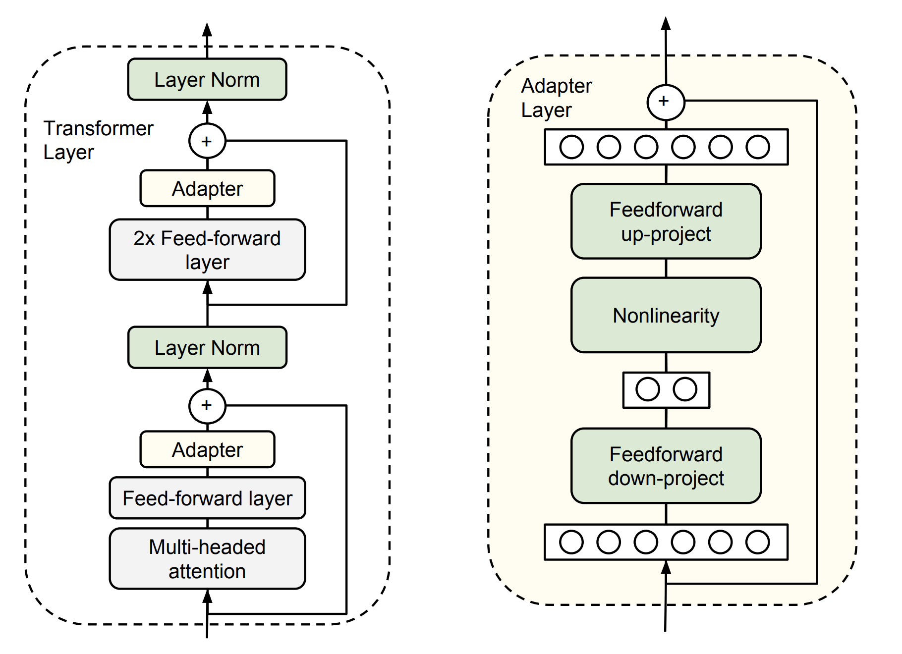
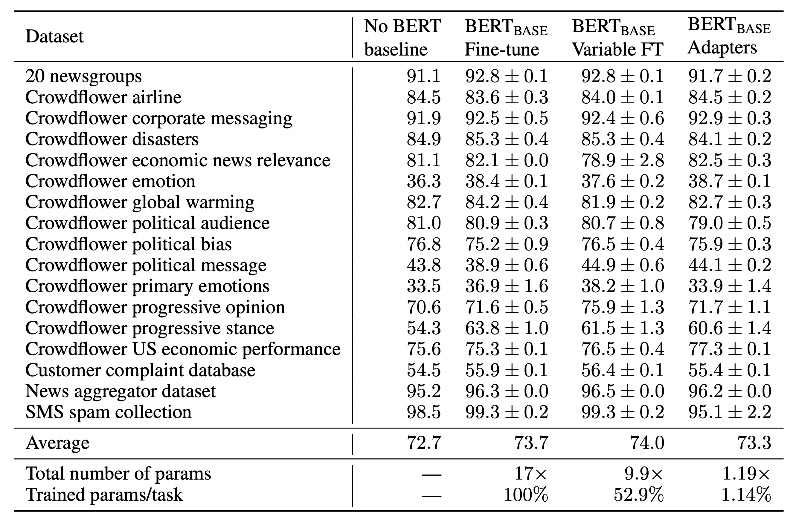
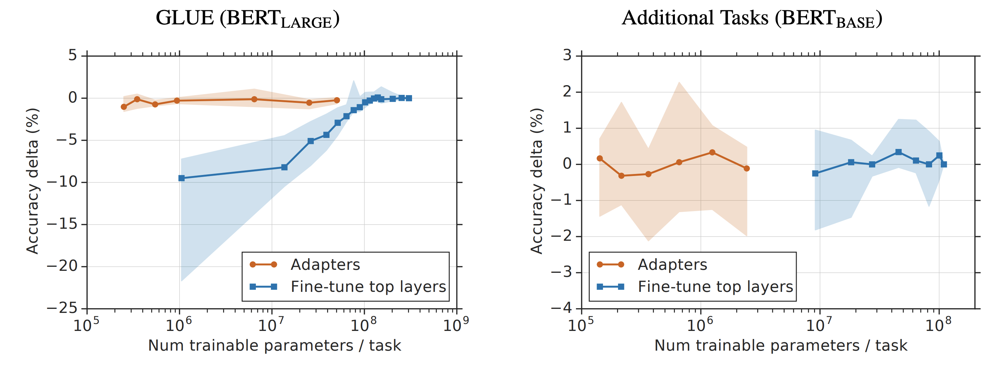
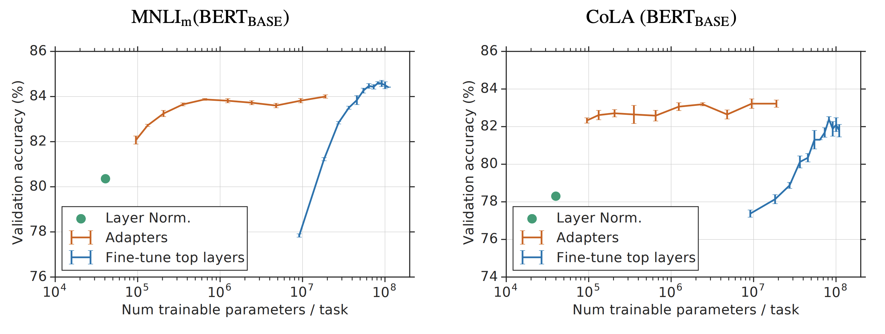
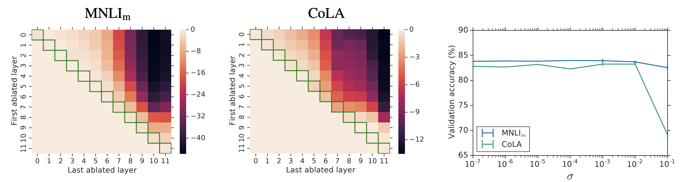

# Bert的高效参数迁移学习

本文是参考论文[1]的阅读笔记。

## 背景

迁移学习在NLP领域里是非常常用的技术。最近两年，由于pre-train模型比如Bert，GPT的崛起。迁移学习仿佛已经成了一种必备技术。那么迁移学习是什么呢？

迁移学习分为两种，一种是基于feature的迁移学习，即我们从现有的模型中学习到embedding，然后用embedding来作为新模型的底子去进行训练。另外一种则是模型的迁移学习。而所谓的模型的迁移学习，原始的方法就是保证已经在其他数据集上训练得到的模型的一部分参数不变，调整另一部分参数。不变的参数一般是底层参数，变化的参数则一般是高层参数。

而这样做模型调参就会遇到一个问题，那就是调整的层次少了，效果不好，调整的层次多了，又会使得计算量很大，很低效。

于是本文中的方法就华丽出场了！

## 基于调整器的模型fine-tune

论文借鉴了在CV上的一种adapter的方法（见参考文献[2]），引入adapter，也就是调整器模式，在已经训练好的模型中间添加一些层次，在fine-tune的时候只调整这些参数，由于新加的层次参数量相对于原始的模型来说，参数量非常的少。因而训练会很快。

那么，具体这个调整器要有什么性质呢？随随便便加一个就是调整器？

当然不是的，调整器要满足两个条件：

- 参数量少。要求这点是为了效率。
- 初始状态要是identity映射。要求这点则是为了在初始状态下，预训练的模型效果不变。这样我们从一个较好的状态开始，才能快速收敛。

具体的模型结构就如下图所示，左图是adapter插入在模型的位置，即在transformer块的两个全连接层的后面。右图是adapter的结构。为了使得参数数目少，会先做一个全连接层把维度从d变成m，然后最后在变回来。这样，参数数目就是2md + d + m, 其中d + m是偏置参数数目。为了使得adapter具有identity映射的性质，模型还有一个残差连接，这样，中间的模型只要预测出0就能保证identity性质了。

另外需要注意的是，两个adapter分别插入在layer normalization之前，所以，layer normalizaiton层的参数尽管在预训练的模型中，但是还是需要在fine-tune的时候被调整的。

## 效果

不同的fine-tune方法的对比如下：

其中，No Bert Baseline是没有Bert参与的，它的模型是用AutoML学习到的。第二列则是调整全部的模型，第三列则是调整一部分模型，第四列则是adapter的方法。

adapter方法与调整top-N层还有只调整layer normalization的对比。

可以看到，top-N的N较小的时候，是无法跟adapter相提并论的。

如果去掉一些adapter层的话，那么会不会降低效果呢？可以看下图

左图和中图是不同的两个任务上的去掉某些adapter层次的效果。纵坐标是起始层次，横坐标是终结层次，所以上三角的每个点都是去掉(y, x)这个区间上的adapter层次后的性能损失。

可以看到，只去掉一个层次以及靠前的层次的话，不会引发较大的损失。说明在高层的adapter比较重要。

## 参考文献

[1]. Houlsby N, Giurgiu A, Jastrzebski S, et al. Parameter-Efficient Transfer Learning for NLP[J]. arXiv preprint arXiv:1902.00751, 2019.

[2]. Rebuffi S A, Bilen H, Vedaldi A. Learning multiple visual domains with residual adapters[C]//Advances in Neural Information Processing Systems. 2017: 506-516.
