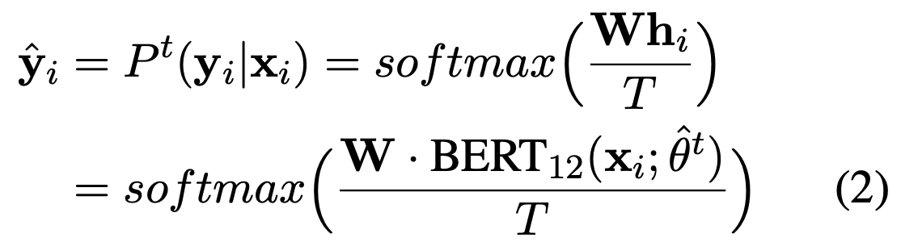
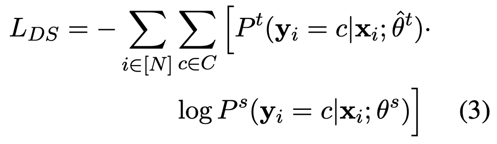
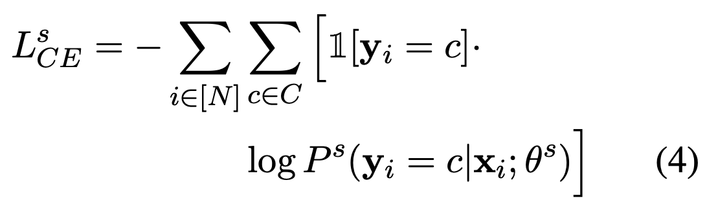
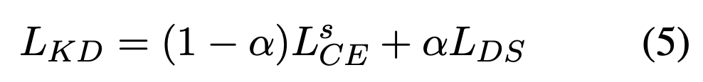
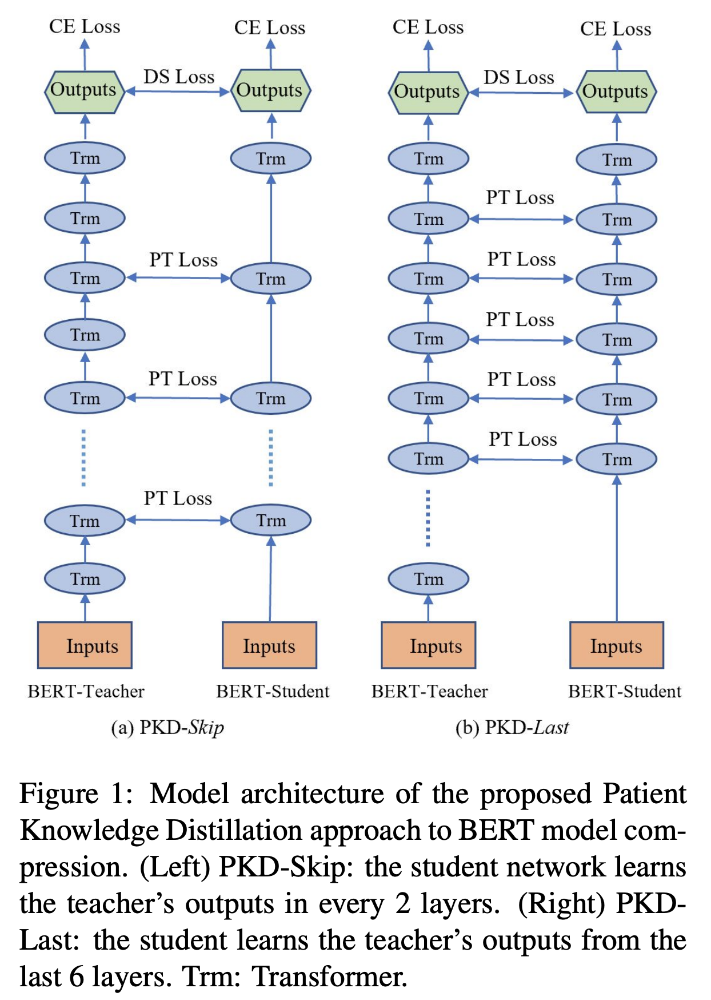
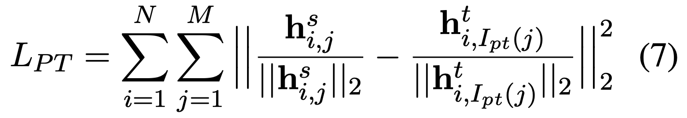
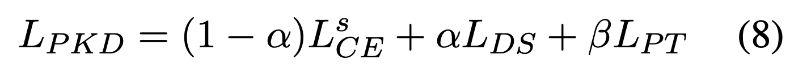
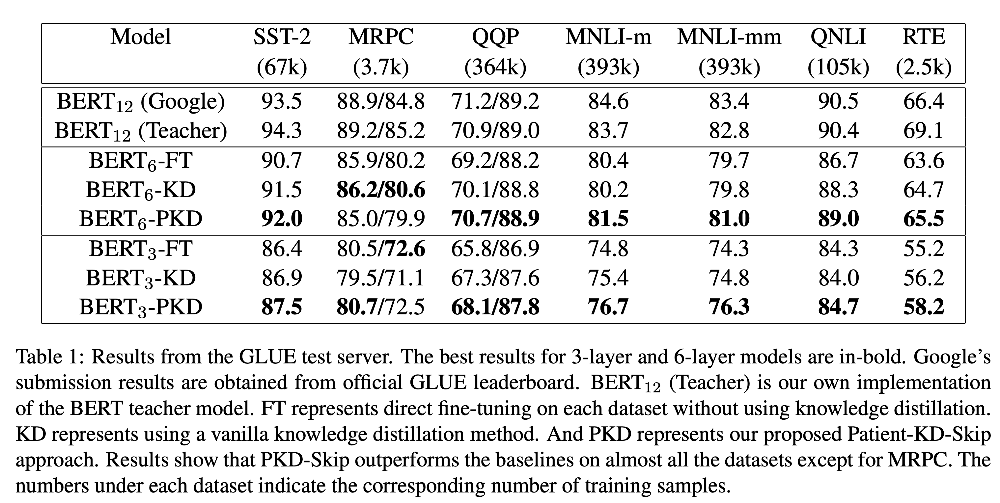
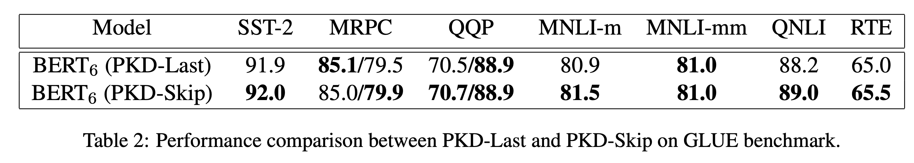
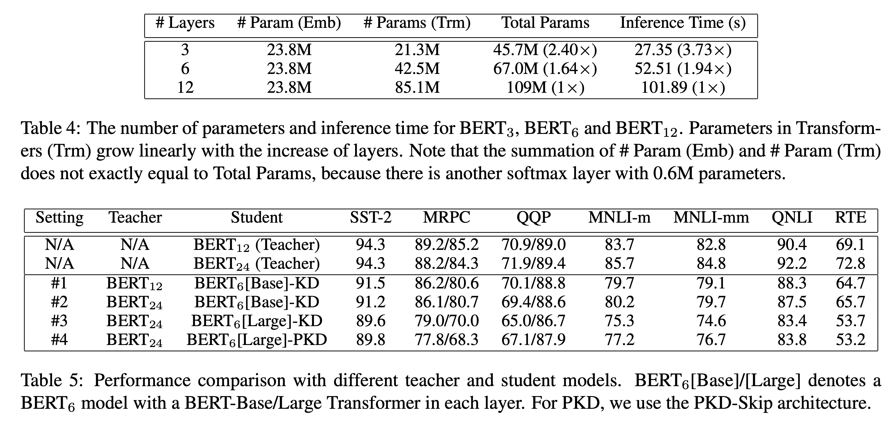

# Bert之多层知识蒸馏

本文是参考文献[1]的阅读笔记。

Bert模型虽然很火，但是模型太大，要想更好的使用的话需要让模型变小。

最原始的知识蒸馏当然可以直接应用在Bert上，但是原始的方法是让student模型去学习teacher模型输出的概率分布。而作为一个深层模型，在中间层次上的信息也很丰富，如何利用这部分的信息呢？这就是论文所提出的方法。

## 知识蒸馏

首先，我们先来回顾一下知识蒸馏，对于最初的知识蒸馏方法而言，会让student模型去尽量拟合teacher模型的概率输出，在这个过程中，引入了温度的概念，即teacher和student的logits先除以一个参数T，然后再去做softmax，得到的概率值再去做交叉熵。得到LDS

然后student模型除了向teacher模型学习外，还需要向ground truth学习，得到LCE

然后再让两个损失去做加权平均。得到：

## 多层蒸馏

论文所提出的多层蒸馏，即student模型除了学习teacher模型的概率输出之外，还要学习一些中间层的输出。论文提出了两种方法，第一种是skip模式，即每隔几层去学习一个中间层，第二种是last模式，即学习teacher模型的最后几层。如下图所示：

如果是完全的去学习中间层的话，那么计算量很大。为了避免这个问题，我们注意到Bert模型中有个特殊字段[CLS]，在蒸馏过程中，让student模型去学习[CLS]的中间的输出。

而对于中间层的学习，使用的损失函数是均方差函数：

最后的损失函数如下：

## 实验结果

在GLUE上的实验结果如下：

可以看到，多层的方法在除了MRPC之外的任务上都能达到比较最好的效果。而究其原因，可能是因为MRPC的数据较少，从而导致了过拟合。

而last和skip模式的对比如下：

可以看到，Skip一般会比last模式要好。这是因为，skip方式下，层次之间的距离较远，从而让student学习到各种层次的信息。

那么student模型的计算量和参数数目是如何的呢？如下图所示：

由于需要每层计算损失，student和teacher模型每层的宽度都是一样（这其实是一个限制），student模型的参数量主要少在层次少。

而更好的teacher模型会带来增长么？答案是不会的，可以看上图，把12层的Bert模型换成了24层的Bert模型，反而导致效果变差。究其原因，可能是因为在实验中，我们使用teacher模型的前N层来初始化student模型，对于24层模型来说，前N层更容易导致不匹配。而更好的方法则是student模型先训练好，再去学teacher模型。

## 参考文献

[1]. Sun S, Cheng Y, Gan Z, et al. Patient knowledge distillation for bert model compression[J]. arXiv preprint arXiv:1908.09355, 2019.
