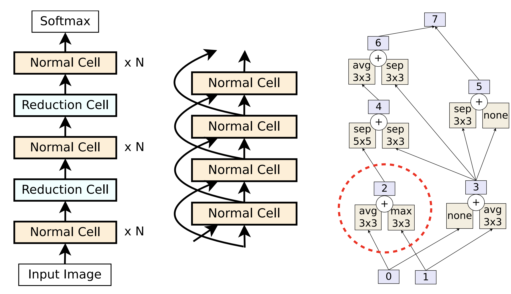
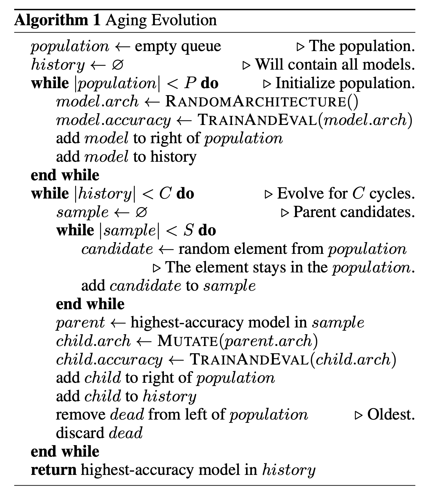
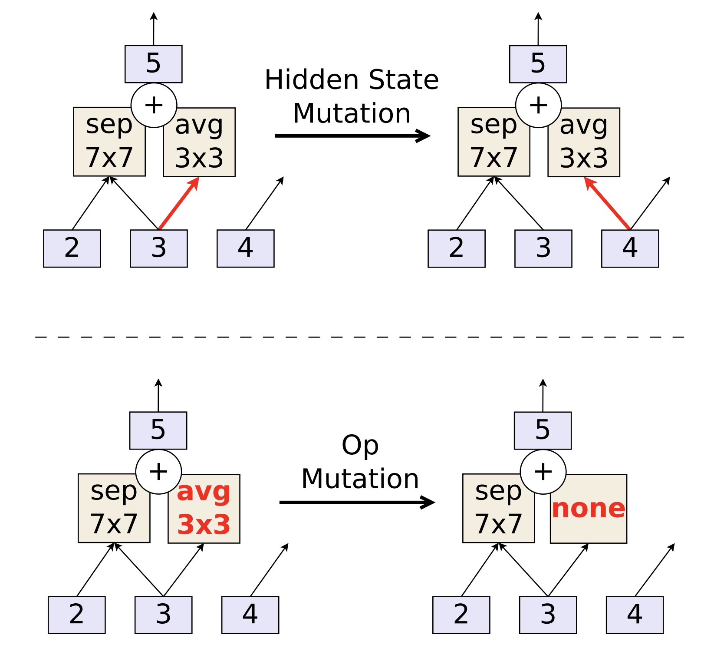
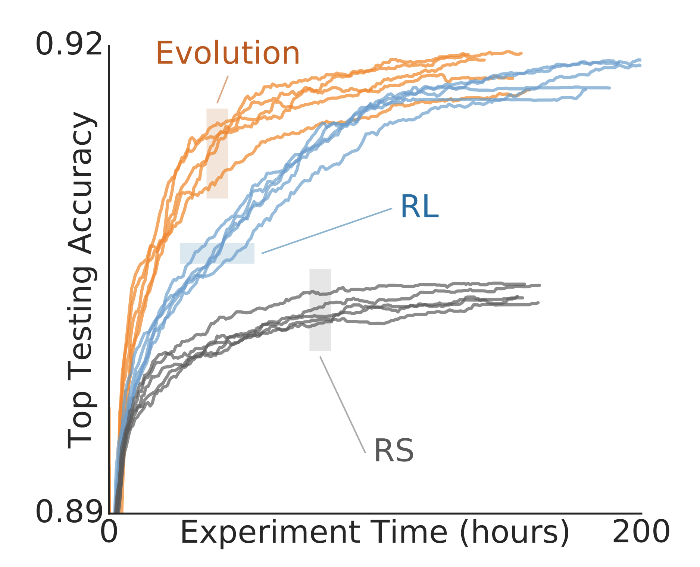
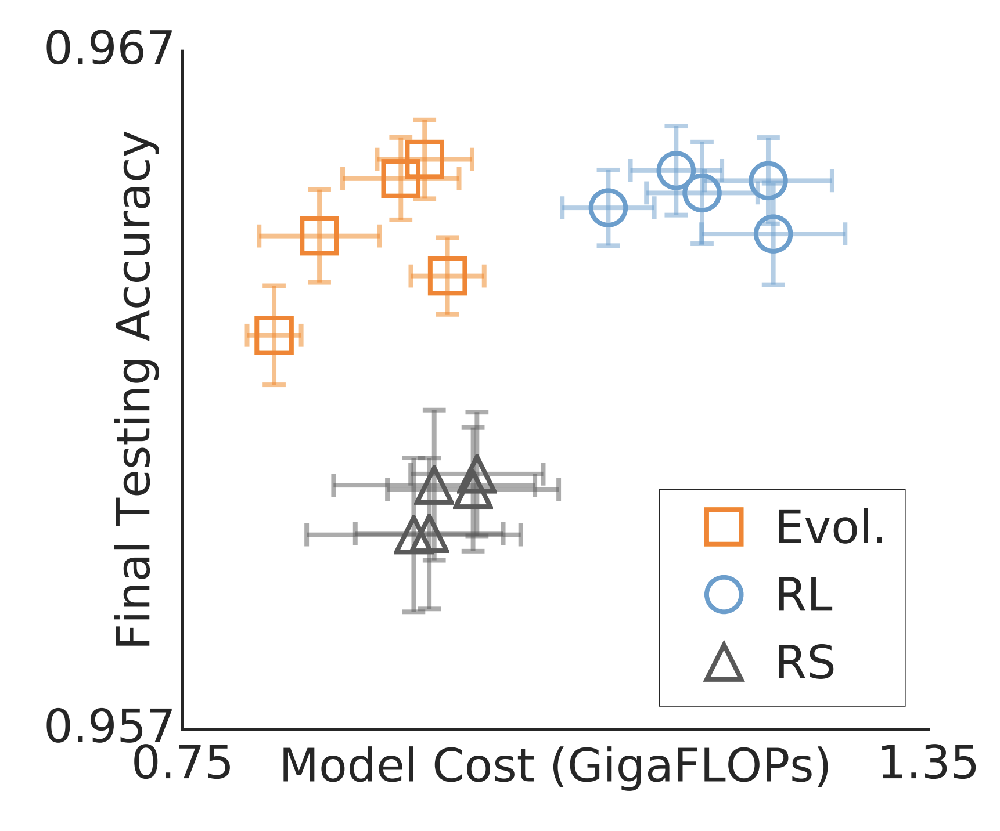
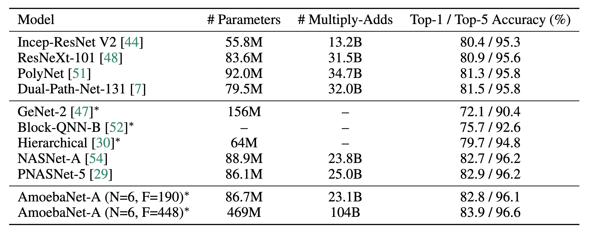

# 炼丹术的终结 —— 进化算法搜索网络结构

本文是参考文献[1]的阅读笔记。又是好久没写总结，一年一年复一年啊。

## 进化算法

关于进化算法，也称为遗传算法。是一种解决最优化的搜索算法。具体细节可以参考[维基百科](https://zh.wikipedia.org/wiki/%E9%81%97%E4%BC%A0%E7%AE%97%E6%B3%95)

那么既然是搜索算法，当然也能够用到网络结构搜索这个问题上来了。

## 搜索空间

对于搜索问题，首先我们要关注的就是搜索空间，在论文中使用的搜索空间跟[炼丹术的终结——神经网络结构搜索之二](https://zhuanlan.zhihu.com/p/36301731)是一样的，我们再来简单回顾一下：

如下图所示，

- (左图)大模型是由多个Normal Cell和Reduction Cell组成的，其中Reduction Cell会使得输出的size变小为原来的1/2。
- (中图)Normal Cell之间还可能会有skip connection。
- (右图)一个具体的Normal Cell或者Reduction Cell。输入有两个0和1，分别来自于上一个Cell的输出还有skip connection。一个Normal Cell的构建过程则是：
  - 从当前状态集(初始为0，1)中选出两个(可以重复选择)，
  - 然后对于每个状态，选择一个操作。
  - 对于两个状态经过操作的输出，选择一个合并操作。
  - 输出加入到状态集中以供选择
  - 以上步骤重复五次，虚线框出来的是一次步骤。

另外，控制一个网络结构中有多少个Normal Cell和Reduction Cell的参数变量是超参数。

## 进化算法之结构搜索

论文提出的在结构搜索上的进化算法流程如下：

有三个超参数，P，C，S。其中P是初始的不同网络结构的集合。S是每次从P中选择出来的个数。C是所有训练过的模型的数目。C的大小其实和时间很相关，训练时间长，C就会大。

- 在开始的时候，随机的方式生成P个Normal/Reduction Cell结构
- 然后每次从集合中拿出来S个，
- 找出S个中最好的模型进行修改
- 训练修改后的新模型
- 把新模型加入到集合中
- 从集合中移除最老的一个结构
  - 这里有论文的创新点，如果是移除掉最差的模型，那么就是普通的遗传算法。
  - 相对于普通的遗传算法，本算法没有交叉操作。

在训练完成后，选择最好的模型。

## 进化算法之模型修改

在这个算法中，模型的修改分为两个部分，状态修改和操作修改。如下图所示：

状态修改就是修改状态输入给哪个操作。操作的修改就是去更改一个操作。当然，这两个操作都需要先选择是Normal Cell还是Reduction Cell，然后再选择是构建Cell的五个步骤中的哪一个。然后再选择状态或者操作。

### 为什么要用移除最老的模型？

- 在网络搜索过程中，往往训练的时间越长，效果会越好，如果每次去除最差的，那么可能比较新的模型会被去除掉，这样就限制了算法的探索能力。
  - 如果去掉的是差的模型，那么会导致lucky noise的出现，即有一个结构表现较好，所以会一直存在于集合中
- 在使用去除最老模型的方法之后，一个模型想要长期存在集合中，就必须具有可扩展行，即在模型上做几次修改仍然是好的模型。这样就使得搜索算法专注在结构上。而不会过拟合在lucky noise上。
- 另外一个附加影响则是，这样做了之后，因为每个模型训练时间相当于就是固定的了，这样，收敛速度快，或者说比较高效的模型就容易。

## 实验

在实验过程中，为了加快速度，会先在小模型上训练，然后在大模型上训练。小模型指的是Normal Cell和Reduction Cell的个数少。

不同方法的训练时间和达到的最好效果如上图，可以看到，进化算法比RL算法要快。

而得到的模型的计算量和准确率如下图。

可以看到，进化算法倾向于得到计算量小的模型。
最后得到的网络如下图：

在imageNet数据上的效果如下：

## 参考文献
[1]. Real E, Aggarwal A, Huang Y, et al. Regularized evolution for image classifier architecture search[C]//Proceedings of the AAAI Conference on Artificial Intelligence. 2019, 33: 4780-4789.
