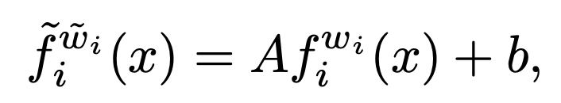
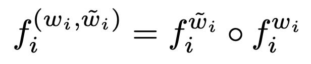
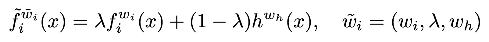
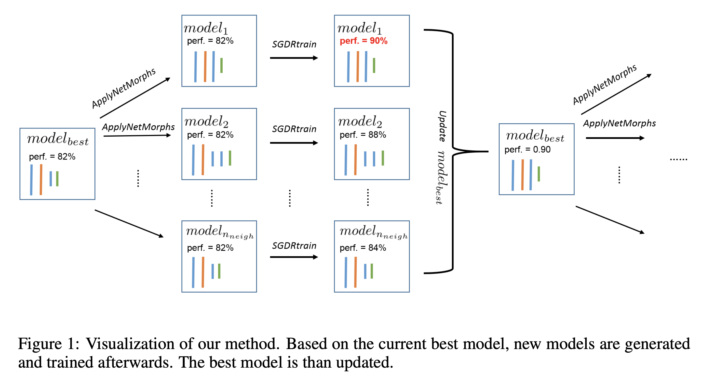
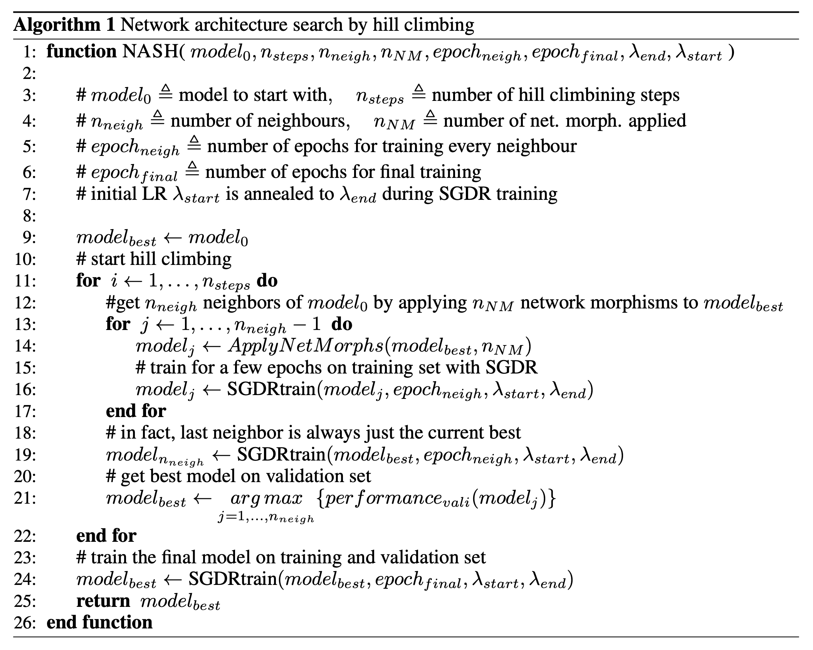
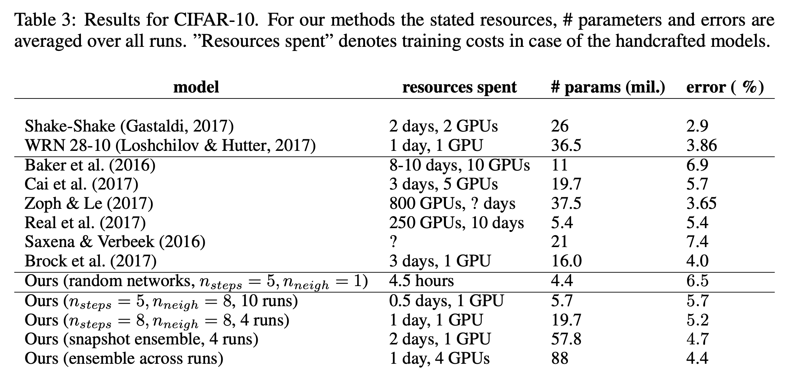
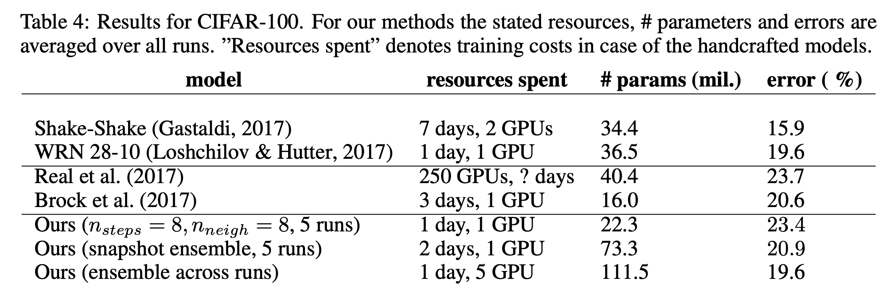

# 炼丹术的终结——模型“变形”记

本文是参考文献[1]的阅读笔记。该文献一片比较老的论文，不过里面的思想倒是简单直接。

目标还是为了解决在模型结构搜索过程中的耗时问题。论文提出了一种更为直观的参数共享的方法。

## 模型的变形术

论文中总结了四种模型的变形方法，下面一一介绍：

第一种如下图公式所示，这个变换可以用来在原有层的基础上再添加一个全连接层或者卷积层。当A=1, b=0时，这个变换是恒等变换。在公式中，新的w中有一部分是原有的参数。显然，这个公式是用来加深网络的。

第二种如下图公式所示，这个公式把某一层变宽，同样的，新的w中有一部分是原来的w。

第三种是幂等变换，即如果参数矩阵是幂等矩阵的话，那么直接叠加两层后的结果和一层结果一样，可以用来加深网络。

第四种是加权平均，如下图所示。这种方式可以用来做残差连接。

## 结构搜索

上面所讲的四种变换，每一个都是基于变换前的参数的，因而已经训练的参数就可以被重复利用，也就有了一种非常直观的模型结构搜索方法。

如下图所示，假设有一个初始的模型，那么可以尝试在模型上随机做一些变换操作，生成新的模型，然后每个新模型训练一定次数，再从新模型中找到最好的模型。以此类推。这种方法被称为爬山式网络结构搜索。

算法流程如下图所示。

## 实验效果

在cifar10和cifar100上的效果如下面两图所示。

可以看到，效果上只能说尚可，但是速度上很快。效果上差主要是因为搜索空间太小。

## 参考文献

[1]. Elsken, Thomas, Jan-Hendrik Metzen, and Frank Hutter. "Simple and efficient architecture search for convolutional neural networks." arXiv preprint arXiv:1711.04528 (2017).
