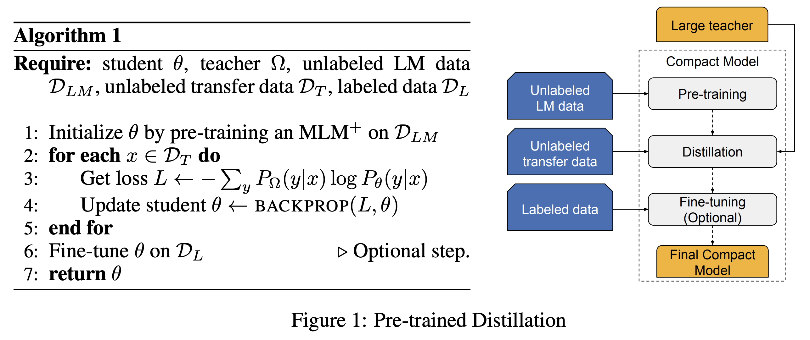
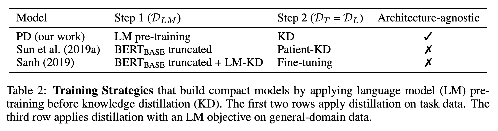
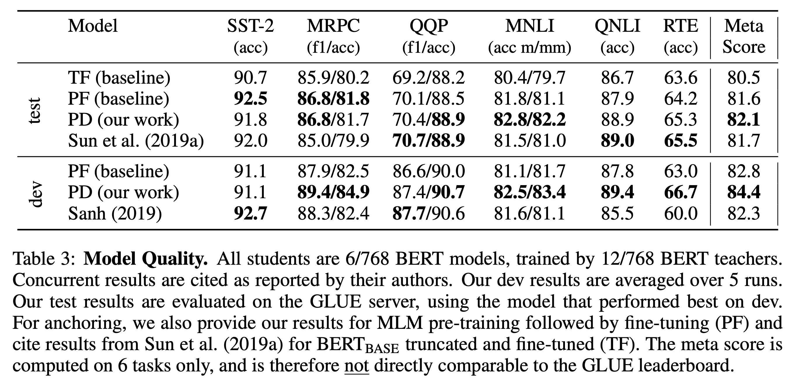
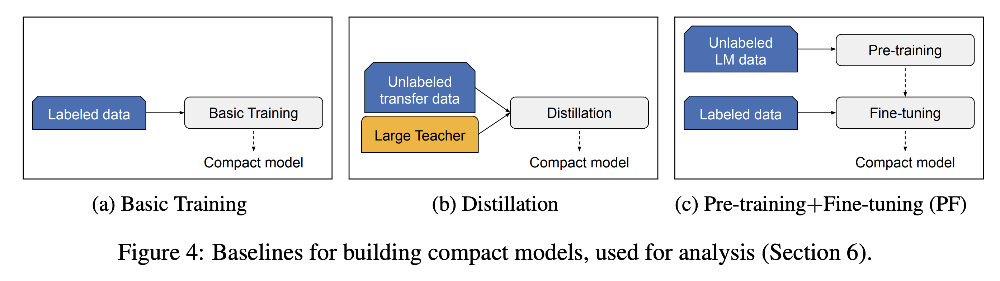
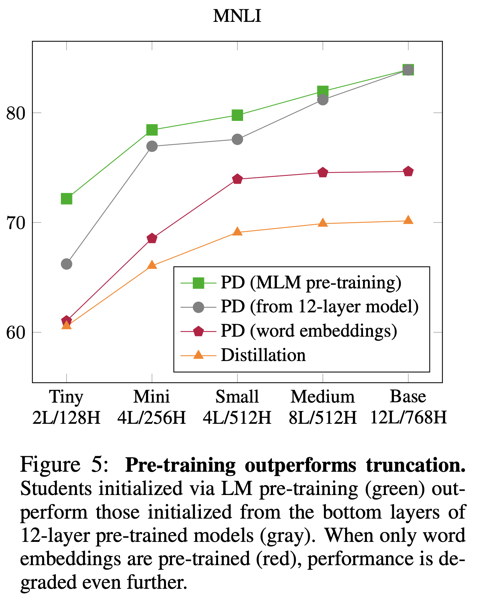
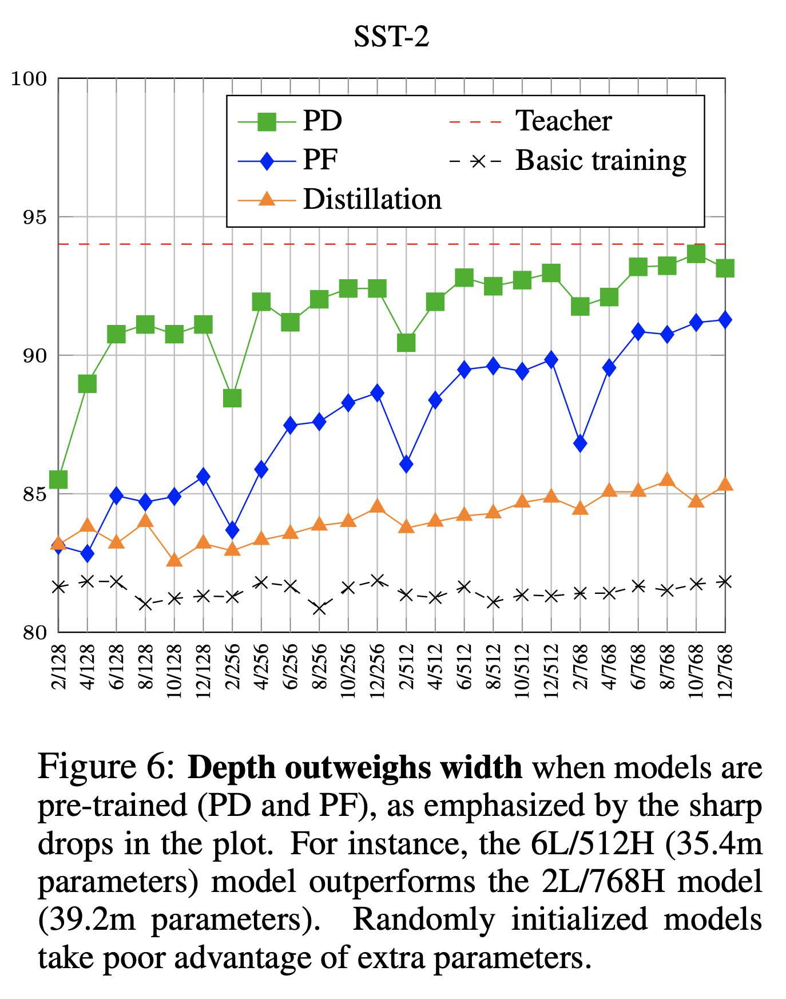
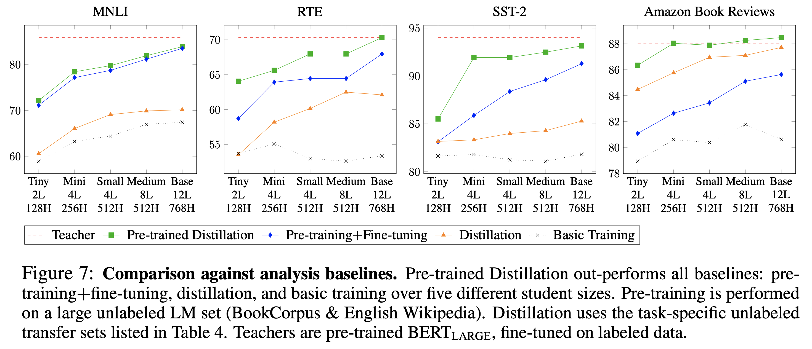
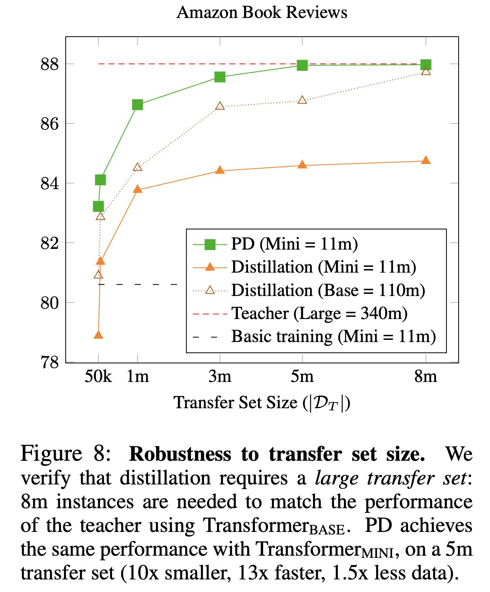

# 模型蒸馏之Bert

最近看了一些Bert压缩和加速的论文，本篇是模型压缩中的蒸馏方法在Bert的应用。
本文是论文[1]的阅读笔记。

## 背景

自然是现在的Bert太大，投入在应用中有点不太实际，目标则是在有限的memory和latency上，找到最优的小模型。

## 算法

论文是一片实验性的文章，得到了很多很实用的技巧。在模型蒸馏的流程上提出了几点改进。如下图所示：

在给做模型整理蒸馏的时候，
1. Pre-train: 我们将小模型在Unabled LM data上进行预训练。
2. Distillation: 得到的模型去和teacher模型在Unlabeled transfer data上做知识蒸馏。
3. (可选)Fine-tune: 然后再Labeled data上做fine-tune.

这里与前人的工作的不同之处是预训练小模型，之前做蒸馏的方法是直接去给小模型做蒸馏训练。
只有前两步的模型缩写为PD，三步都有的缩写为PDF。
Unlabeled LM data用来训练Bert，Unlabeled transfer data和Labeled data用来在下游任务上进行训练。

这里跟[2]中不同的是，Bert的蒸馏不在训练LM的时候，而是在下游任务上，这样做的目的主要是在LM上进行蒸馏代价比较大，因为要在整个词表上计算损失。另外提一点跟[2]不同的点，那就是[2]中会使用大模型的前几层作为小模型的初始值，即使模型变浅。这点在论文[1]中没有做。

上表中就是最近的几篇Bert蒸馏的方法对比，Bert truncated就是使用Bert的前几层去初始化小模型。

## 实验

### 跟现有的方法的对比

效果如下：

### 算法分析

设置了三个baseline来对比，看哪种技巧带来的提升更大。三个baseline分别是

得到的结论如下：
- a. 只训练word embedding是不够的
- b. 用大模型的前几层来初始化时不够的
- c. 参数量一定的情况下，要让模型更深而不是更宽。

下图的结果可以推出a和b，

下图的结果可以推出c。

新方法和三个baseline的对比：

新方法比三个baseline都要好，但有个点需要注意，那就是在数据量较小的时候，Pre-train + fine-tune比其他的baseline要好，而在transfer set数据量较大的时候，则反之。所以，论文又做了一个transfer set大小的实验。

新方法在5M的时候就达到了跟teacher类似的效果。

还有一些其他的小结论，这里就不一一列举了。

## 参考文献

- [1]. Turc, Iulia, et al. "Well-read students learn better: The impact of student initialization on knowledge distillation." arXiv preprint arXiv:1908.08962 (2019).
- [2]. Sun, Siqi, et al. "Patient knowledge distillation for bert model compression." arXiv preprint arXiv:1908.09355 (2019).
