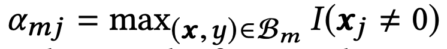
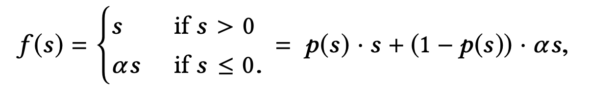

# 阿里点击率预估之深度兴趣网络

本文的知识点来源于参考文献[1]，是阿里巴巴2018年在KDD上的论文。

正如我们在[百度凤巢之分布式层次GPU参数服务器架构](https://zhuanlan.zhihu.com/p/115187253)所提到的，如今深度学习在推荐系统和广告点击率预估上应用广泛，普遍采用的模式是Embedding + MLP的形式。

在这种Embedding + MLP的模型下，有许许多多的特征工程上的技巧。在阿里这个场景下，可以分成这么几个大类，比如用户画像，用户的操作行为，上下文特征，广告特征等等。如下图所示。

而对应的模型结构则如下图

可以看到，不同种类的特征在形成向量后是拼接起来的。

## 用户兴趣多元化

上述模型结构和特征工程已经能达到一个较好的结果了，但是要想精益求精，还是需要对业务有更加深刻的了解。而在阿里的这个场景下，那就是用户购物需求的多元化。在上面的模型中，用户的行为被压缩到了一个特征向量中，就相当于是把所有的兴趣爱好的信息做了平均。但这样做是不精准的。

比如说，一个女性游泳爱好者，可能既会关注包包，又会关注游泳类产品。那么她在浏览包包的时候，对游泳类产品的兴趣其实是与CTR的估计相当无关的事情。

那么如何解决这个问题呢？解决的方法就是对于一个<用户，商品>对来说，不同的商品，要去触发用户不同的兴趣点才合理。这样的操作在NLP问题中其实是非常常见的，比如翻译问题，目标语言句子上的不同位置的词语，对应的是源语言句子上的词语也是不同的，这种对应关系被Attention所解决。

类似的，在这篇论文中，这个问题被兴趣网络解决。

## 深度兴趣网络

深度兴趣网络结果如下图，在这个结构中，可以看到，候选广告需要去跟用户行为中的每一个商品去做权重的计算，然后用权重去做加权平均得到用户针对这个候选广告的兴趣向量。

举一个例子，如果用户的行为历史中有两类，衣服和电子产品，其中衣服占90%，电子产品占10%，那么给两个产品T恤和iPhone，那么计算得到的用户对T恤的兴趣很可能大于用户对iPhone的兴趣。之所以说很可能而不是肯定，是因为商品还要本身的性质，比如衣服可以换的很频繁，但iPhone不是，衣服的盈利远远不如iPhone的利润大等等。

大家注意到，这里用户行为历史中的操作是并行计算权重的。其实可以通过循环神经网络来把时间因素考虑进来。论文中尝试过，但是没有提升，可能的原因是兴趣本身就是共存的，时间的前后顺序影响不大。

## 训练技巧

模型结构本身并不复杂，但相对于阿里巴巴的业务量而言，这个模型的训练是非常难的，因为模型中的用户和候选广告都是以亿计的，而特征又是极其稀疏的。

比如，当上面第一张图中的goods_ids的特征在6亿的时候，如果没有正则化，那么模型在训练一个epoch后在训练集上的loss会迅速下降，导致在测试集上过拟合。如下图中的红线所示：

而如果采用传统的L2或者L1正则化又是不可能的，因为传统方法需要在所有非0的参数上进行计算，而对于这个问题来说，每次训练都在数以亿计的参数上去做正则化是不可行的。

论文提出了一种近似的办法，即Mini-batch aware的正则化，这种正则化的方法只考虑了在一个mini-batch中出现了的特征所对应的参数。因为稀疏特征的众多，网络中大部分的参数都分布在embedding层，论文以embedding层为例来讲解了正则化的操作。

上图公式中表明了在embedding层上只计算mini-batch上用到的特征所对应参数的L2正则话的方法，其中I(xj≠0)是指示器来表明xj特征是否存在，nj表示所有样本中xj不为0的样本数。wj代表特征j的embedding参数。

然后这个公式可以化简：

再近似

其中

表示的是特征j在mini-batch Bm中至少出现过一次。

这样，经过正则化的梯度就可以计算出来：

在激活函数上，论文提出了一种叫做Dice的激活函数，是PRELU的泛化版本。两种激活函数图示如下：

其中，论文上的PRelu的图画错了，其公式如下：

基于这个公式，大家可以自行画出正确的图。

而Dice的公式如下：

Dice是PRelu的泛化版本，当均值为0方差为1的时候，两者是等价的，之所以要改成这个形式，是为了要使激活函数适应数据分布。

## 实验

采用了三个数据集

- Amazon dataset
- MovieLens Dataset
- Alibaba Dataset

前两者是公开数据集。

不同的方法在前两个数据集上的对比:

正则化方法的对比

即便在BaseModel上，正则化方法也有效。

在阿里巴巴的数据集上

一个可视化效果。

## 参考文献

[1]. Zhou, Guorui, Xiaoqiang Zhu, Chenru Song, Ying Fan, Han Zhu, Xiao Ma, Yanghui Yan, Junqi Jin, Han Li, and Kun Gai. "Deep interest network for click-through rate prediction." In Proceedings of the 24th ACM SIGKDD International Conference on Knowledge Discovery & Data Mining, pp. 1059-1068. 2018.
