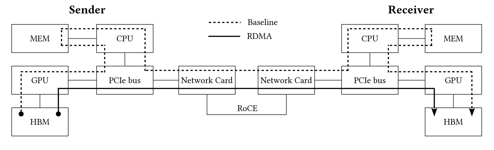

# 分布式层次GPU参数服务器架构

本文主要介绍在大规模深度学习广告系统中的分布式层次GPU参数服务器架构。知识点来源于论文[1].

在家工作了那么久，是该充充电了。

## 广告系统

在开始介绍架构之前，我们先来看看广告的算法系统。

众所周知，目前最赚钱的深度学习算法的应用是在广告系统的，而广告则是Google、Facebook、Baidu、头条等的主要营收渠道。因而，广告的收入是一大票AI视觉公司加起来都不可同日而语的，也是无人车等AI带来的新方向在未来的许多年内所望尘莫及的。论文中介绍的就是百度的广告系统。

从深度学习的算法角度来看，目前广告CTR预估的主流算法是Embedding + DNN的形式。对于每一个输入，样本都会被组织成query-ad-user的样本，基于这个样本，可以提取许许多多的特征，比如query-ad相关性特征、ads特征、用户画像等等。这些特征都被表达成one-hot或者multi-hot的二值特征。最后形成一个超级大的稀疏特征向量（~10TB），然后稀疏特征被embed成更密集的向量，再之后输入给DNN模型（<1GB）。下图可以清晰看到这个结构：

在2010年，百度采用了分布式LR的CTR预估模型。在2013年，升级成了基于MPI的深度学习模型(~150节点)，而论文中的这个模型，是一次新的升级。

在基于MPI的框架中，每个计算节点都从分布式文件系统中读取数据，然后从其他的节点中获得所需的参数，计算完梯度后通过MPI通信把梯度返回给这些参数的owner节点。这样的结构所需的资源浩大，有若干个缺点：

- 不易于快速迭代、实验
- 资源占用很大，很烧钱。
- 进一步提升训练速度的空间有限

## 参数放在GPU上？

目前的PS架构中一般是把参数放在CPU上，那么有没有可能放在GPU上呢？对于广告预估模型来说不会，因为模型的大小远在GPU的容量之上。

但是我们可以注意到，对于CTR预估模型，它虽然在稀疏特征层参数量巨大，但是激活量并不大。因为如果只是对于少量样本来说，那么所需要的参数量在GPU上完全可以放下，因为真正密集特征的参数是<1G的。

这点其实就跟计算机结构类似了，是真正需要的东西少但是全集大的情况。于是类似缓存-内存-硬盘的结构就诞生了，只不过在这个参数服务器架构中，使用的是HBM-MEM-SSD。这里HBM是指GPU的显存，MEM和SSD分别是内存和硬盘。

在这里，真正训练需要的参数，我们称之为working parameters。
在这个GPU架构的设计中，有三个难点：

1. 设计一个高效的分布式GPU哈希表来存储working parameters。
  - GPU是多节点，每个节点中有多个GPU。
  - 无论是节点内还是节点间。都实现了一个机制可以跨GPU快速通信。之所以叫快速通信是因为免除了CPU的参与。
2. 设计一个数据传输和缓存机制来使得working parameters都在内存中。
  - 设计了一个4-stage的并行机制来把节点间通信、SSD-IO、CPU/GPU数据传输、GPU计算并行起来，并行化之后I/O的latency就被隐藏了。
3. 在SSD中高效的组织参数。
  - 需要良好的组织参数来充分的利用I/O的带宽。（连续的读取比随机读取要快得多）

## 哈希方法压缩模型

对于广告CTR这样大的模型，其实还有另一个方向需要考虑，那就是压缩模型，因为特征是稀疏的，所以一个可选的方法就是把特征做hash，从而使的一个槽位对应多个特征，这样可以大大减少在特征层的参数量。

论文中尝试的方法是One permutation + one sign random projection。具体如下：

但是这样的方法会造成一定的损失：

可以看到，hash的方法可以达到比BaseLine LR要好的结果，但是比BaseLine DNN还是要有1%的损失的。虽然1%很小。但是对于广告来说，是巨大的收益损失。因而是不可承受的。所以压缩的方向宣告失败，不得不保持模型结构不变通过升级架构的方式来获得新的提升。

## GPU参数服务器总体架构

GPU参数服务器的总体架构如下图，从图中可以看到，服务器架构分为三层，HBM-PS在GPU上，MEM-PS在内存上，SSD-PS在硬盘上。

算法流程如下图：

具体解释如下：

- line2: 从HDFS上获得数据，基于获得数据，可以知道需要的参数都有哪些
- line3: 从本节点的MEM-PS和SSD-PS上获取所需要的参数
- line4: 从remote的MEM-PS和SSD-PS上获取所需要的参数
- line5-10: 数据被切分发往各个GPU
- line11-15: PS架构的常规操作，取参数，训练，返回梯度，这样每个HBM节点上都有了对应的参数的更新。
- line16: 获得本节点HBM-PS上的更新
- line17: 梯度更新回传到本节点MEM-PS
- line18: 新参数输出到SSD文件中

这里有一个例子：

## HBM-PS

HBM是High-BandWidth Memory的缩写，而HBM-PS是指在分布式GPU集群上的参数服务器。这个服务器相对于普通的PS来说，没有GPU-CPU通信，因为参数值本来就在GPU上。但是GPU上能存储的参数少，所以才需要三层架构来支撑。

在HBM-PS上，使用cuDF的concurrent_unordered_map来做哈希表。哈希表支持insert，get和accumulate三个分布式下的操作。其中insert和get就是PS中的Pull和Push操作。

而accumulate是用来计算梯度更新的，它的输入是一系列的<key, value>对，需要把这些value加到对应的key上去。

算法如下：

- line1: 首先切换到<key, value>对所在的GPU
- line2: 得到<key, value>对所对应的GPU
- line3-7: 发送数据
- line8: 等待到达目的地
- line9-12: 在目的地的GPU上做accumulate操作

而在GPU的通信上，使用了GPU的RDMA(remote direct memory access)来实现了zero-copy操作，避免了途径CPU。

不同节点间的同步则使用了All reduce的操作，可以在log(N)的时间内完成参数的同步：

## MEM-PS

MEM-PS就是使用内存来存储参数，需要注意的是，MEM-PS不需要向remote节点做push，因为这个通信在HBM-PS上就做完了。

## SSD-PS

主要要考虑的事情是如何在应该上组织文件，如何更新参数。

需要维护一个参数到文件名映射来确定在哪个文件上可以找到这个参数。文件的大小应该是能符合I/O带宽的最大值。

在更新参数的时候应该是把新参数全部连续的写入而非寻找对应文件再写。这个时候需要更新的是参数到文件名的映射。当一个文件中包含的过时的参数超过一定比例的时候，要做合并。

## 4-stage并行

这个并行可以把I/O的latency隐藏

## 实验

相对于MPI来说，能达到更快更好的效果。提取在1.8-4.8倍，性价比提升4.4-9.0倍。

各个层次的主要时间的分布，可以看到模型越大，主要的时间越用在模型训练上。Cache hit rate在46%左右。

## 参考文献

[1]. Zhao W, Xie D, Jia R, et al. Distributed Hierarchical GPU Parameter Server for Massive Scale Deep Learning Ads Systems[J]. arXiv preprint arXiv:2003.05622, 2020.
