# 莫比乌斯: 百度的下一代query-ad匹配算法

本文介绍的内容来自于百度在KDD2019上的论文[1].

众所周知，百度、头条乃至于Google、Facebook的主要营收点在广告。广告业务的成败关系着众多互联网公司的生死。

由于广告存量的巨大，目前的需求是平均每次query需要从上亿的广告中筛选出相关的出来。因而目前百度现在的广告匹配算法采取三层结构：

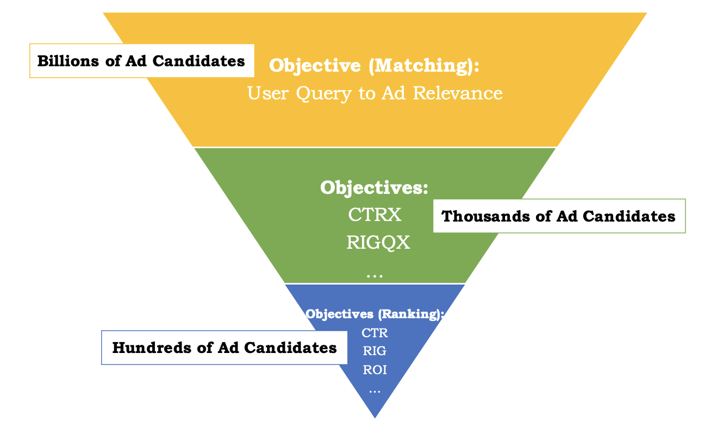

当用户进行查询的时候，跟Search类似，需要对query做后处理，包括query rewriting、query expansion和semantic matching。
然后使用快速查询的算法在上亿的广告中筛选出几千个candidate，即最上的Matching步所做的事情。

然后中间层使用部分CTR相关的指标和轻量级的CTR算法比如LR做进一步的筛选。得到几百个候选。

最后使用深度学习的模型做详细的排序。

这个架构从速度的角度考虑运行的完全没有问题，但是从目标的角度考虑，就有问题了，问题在于最前面的Matching算法跟最后的Ranking算法的目标不一致，这就会导致在最后排序的时候，可能最相关的广告并不在候选集合中，即便排的再好也无济于事。

## 莫比乌斯——目标合并的思想

莫比乌斯是一个项目名称，这个项目就是专门用来解决上述问题的，解决的方法自然是在Matching层就考虑到广告点击率相关的目标。即：

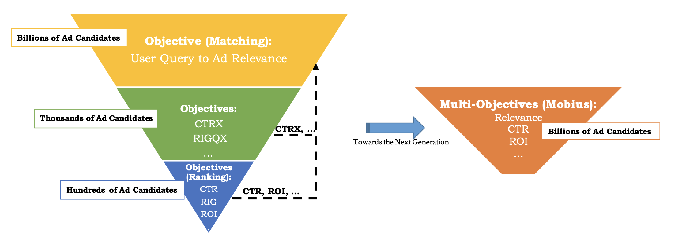

但是这样就会遇到两个问题：

- Insufficient click history，之前ranking层的模型是基于筛选后的query-ad对训练的，得到的模型对频繁的query或者ad的评分比较高，所以模型的问题是对于query-ad对，如果query或者ad有一个频繁出现，那么即使query-ad不相关，评分仍然会比都不频繁的query-ad对要高。

- 高计算量存储量需求，之前的三层架构就是为了性能所做的断舍离。CTR目标下沉之后就会对计算量和存储量产生大的需求。

为了解决上述两个问题，采用了如下几种方法：

- 将原来的Ranking的模型作为teacher，去训练一个student模型。通过主动学习的方式做数据增强，得到能够更准确判断稀疏数据的模型
- 采用目前最新的ANN(Approximate Nearest Neighbor)和MIPS(Maximum Inner Product Search)算法来加快计算速度。

## 问题表达

原来的Ranking层的目标是：

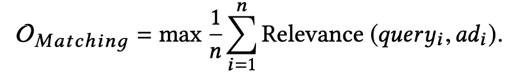

而莫比乌斯的目标是：

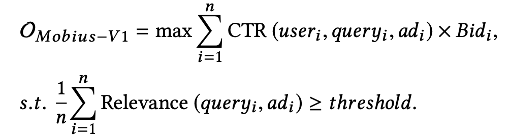

## 基于主动学习的CTR模型

无论是广告系统还是推荐系统，不可避免的会出现长尾问题和冷启动问题。这点会体现在稀疏数据的错误评分上，如下图

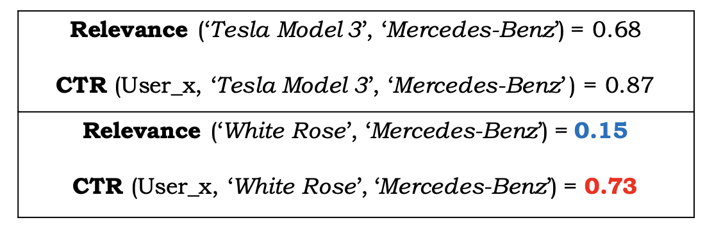

Tesla Model 3和Mercedes-Benz都是出现比较频繁的数据，White Rose
则不是。这里Tesla Model 3和Mercedes-Benz能够给出正确的相关度和CTR估计。但是对于White Rose而言，相关度确实很低，但是CTR评分却很高，导致了不正确的广告出现了。

为了解决这个问题，原来三层结构中的相关性模型被用来当做teacher模型来筛选query-ad对，流程如下图所示。分为两个步骤：

- 数据增强
- 点击率模型学习

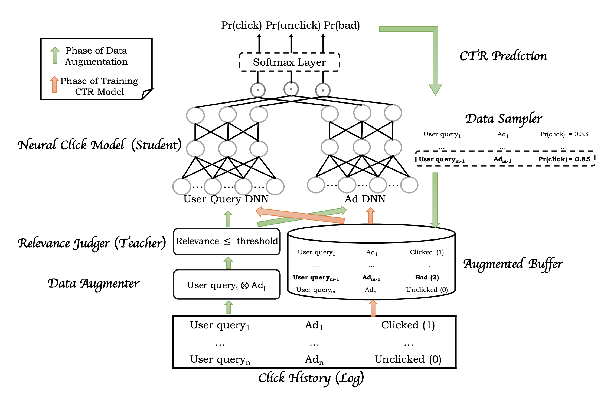

在数据增强这一步，首先，载入点击历史，得到ad-query对，然后找到ad的集合和query的集合，去做笛卡尔集。然后teacher模型给每一个query-ad对一个评分，用一个threshold来把低相关度的query-ad对找到。再把这些query-ad对fed给CTR模型，找到低相关度高CTR的数据作为bad case。

在模型训练这一步，点击历史中的click、unclick数据和数据增强中的bad case都被输入给模型，模型由两个子网络构成，左侧输入的是user history等信息，右侧则是广告信息，两个子网络分别输出三个长度为32的向量，然后三个向量分别去做内积，得到的三个结果输入给softmax层得到概率。

具体伪代码如下图：

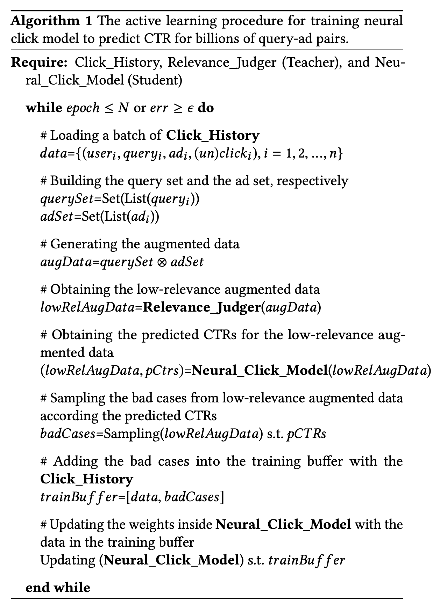

## ANN和MIPS加速查询

上面说到，三层结构是为了速度考虑，而变成莫比乌斯之后，去给上亿个广告去做点击率的估计是不现实的。

因而论文采用了ANN去做近似搜索，在上面的模型中，user query被embedding成三个向量，而ad也被embedding成三个向量，然后它们做内积再输入给softmax层，这就使得ANN搜索称为了可能，即直接使用embedding后的向量去做内积然后排序进行搜索。

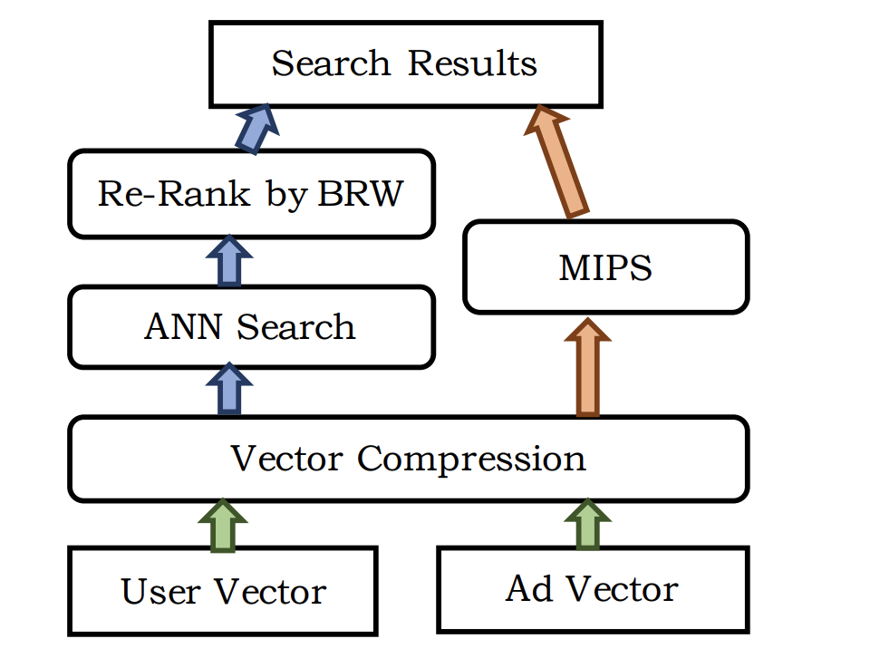

而在MIPS中，除了余弦相似度之外，还需要考虑一些商业上的权重，比如价格等等。

对于ANN和MIPS以及向量压缩的的优化内容，不在本文的介绍之内。但是大家可以预想到的是，这些优化可以使大规模搜索成为了可能。

## 实验

线下实验中：

可以保证AUC有些许损失的情况下，相关度大大提升。

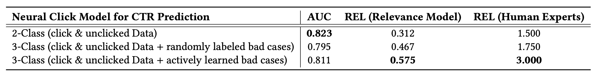

同时，响应时间也在可控范围内：

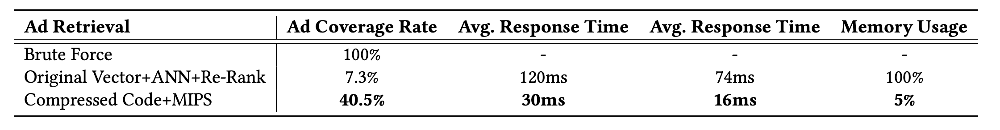

在线上实验中，提升CPM 3.8个点

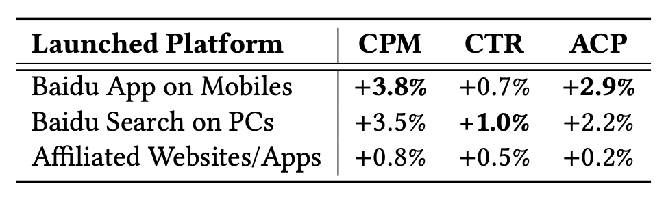

都是真金白银。

## 参考文献

[1]. Fan, Miao, et al. "Mobius: Towards the next generation of query-ad matching in Baidu's sponsored search." Proceedings of the 25th ACM SIGKDD International Conference on Knowledge Discovery & Data Mining. 2019.
